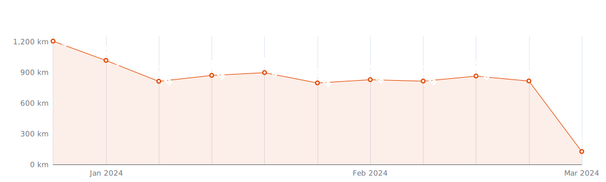
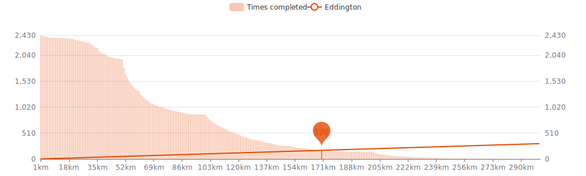
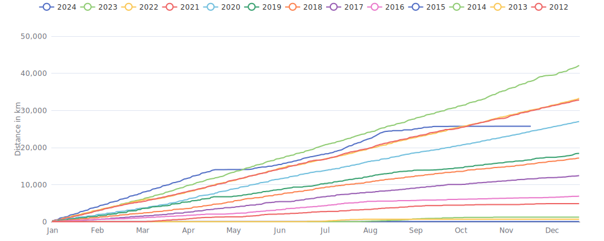

    

Since I began cycling `13 years and 4 months` ago on `06-03-2012`,
I had `2507 cycling days`. 
I recorded a total distance of `209 338 km`
(`5.22` trips around the world 🌍 and
`0.545` trips to the moon 🌕),
an elevation of `936 205 m`
(`105.8` times Mount Everest 🏔)
and a total time of `9mos 2w 3d 21h 6m` 🎉

That's a daily average of `47 km`,
a weekly average of `326 km` and a
monthly average of `1 414 km` 🐣

I burned `4622768 calories` doing so, that's about `17 121` pizza slices 🍕

---

<kbd><a href="#weekly-distances">Weekly distances</a></kbd> |
<kbd><a href="#activities">Activities</a></kbd> |
<kbd><a href="#monthly-stats">Monthly stats</a></kbd> |
<kbd><a href="#activity-intensity">Activity intensity</a></kbd> |
<kbd><a href="#stats-per-weekday">Stats per weekday</a></kbd> |
<kbd><a href="#daytime-stats">Daytime stats</a></kbd> |
<kbd><a href="#stats-per-bike">Stats per bike</a></kbd> |
<kbd><a href="#best-power-outputs-over-time">Power outputs</a></kbd> |
<kbd><a href="#eddington-chart">Eddington</a></kbd> |
<kbd><a href="#yearly-distances">Yearly distances</a></kbd> |
<kbd><a href="#distance-breakdown">Distance breakdown</a></kbd> |
<kbd><a href="#challenge-consistency">Challenge consistency</a></kbd> |
<kbd><a href="#completed-challenges">Completed challenges</a></kbd>

## Weekly distances

## Activities

<table>
    <tr>
        <th></th>
        <th></th>
        <th align="center"></th>
        <th align="center"></th>
        <th align="center"></th>
        <th align="center"></th>
        <th align="center"></th>
        <th align="center"></th>
    </tr>
            <tr>
            <td>20-06-24</td>
            <td>
                
<a href="https://www.strava.com/activities/11699668226" title="Kcal: 1531 | Gear: Canyon ">Bijna zomergevoel 🌻</a>
            </td>
            <td align="center">56 km</td>
            <td align="center">120 m</td>
            <td align="center">1:40:41</td>
            <td align="center">228 w</td>
            <td align="center">33.4 km/h</td>
            <td align="center">120</td>
        </tr>
            <tr>
            <td>19-06-24</td>
            <td>
                
<a href="https://www.strava.com/activities/11692465953" title="Kcal: 4114 | Gear: Canyon ">Warmup - WTC De bijna brui...</a>
            </td>
            <td align="center">144 km</td>
            <td align="center">346 m</td>
            <td align="center">4:01:19</td>
            <td align="center">260 w</td>
            <td align="center">35.8 km/h</td>
            <td align="center">142</td>
        </tr>
            <tr>
            <td>18-06-24</td>
            <td>
                                
<a href="https://www.strava.com/activities/11683759391" title="Kcal: 111 | Gear: Tacx Neo Bike Smart ">Pacer Group Ride: Flat Rou...</a>
            </td>
            <td align="center">8 km</td>
            <td align="center">57 m</td>
            <td align="center">16:41</td>
            <td align="center">115 w</td>
            <td align="center">29.9 km/h</td>
            <td align="center">100</td>
        </tr>
            <tr>
            <td>18-06-24</td>
            <td>
                                
<a href="https://www.strava.com/activities/11683592888" title="Kcal: 1272 | Gear: Tacx Neo Bike Smart ">Watopia</a>
            </td>
            <td align="center">67 km</td>
            <td align="center">105 m</td>
            <td align="center">1:49:41</td>
            <td align="center">202 w</td>
            <td align="center">36.5 km/h</td>
            <td align="center">124</td>
        </tr>
            <tr>
            <td>17-06-24</td>
            <td>
                
<a href="https://www.strava.com/activities/11675042768" title="Kcal: 1191 | Gear: Canyon ">Retourtje Brugge 🔋</a>
            </td>
            <td align="center">53 km</td>
            <td align="center">101 m</td>
            <td align="center">1:51:03</td>
            <td align="center">153 w</td>
            <td align="center">28.7 km/h</td>
            <td align="center">95</td>
        </tr>
        </table>

    
Older activities

    <table>
        <tr>
            <th></th>
            <th></th>
            <th align="center"></th>
            <th align="center"></th>
            <th align="center"></th>
            <th align="center"></th>
            <th align="center"></th>
            <th align="center"></th>
        </tr>
                    <tr>
                <td>16-06-24</td>
                <td>
                    
<a href="https://www.strava.com/activities/11667910968" title="Kcal: 855 | Gear: Canyon Grizl CF SLX 8 Di2 ">Gravelbike droogblazen na ...</a>
                </td>
                <td align="center">33 km</td>
                <td align="center">111 m</td>
                <td align="center">1:13:46</td>
                <td align="center">167 w</td>
                <td align="center">26.7 km/h</td>
                <td align="center">106</td>
            </tr>
                    <tr>
                <td>16-06-24</td>
                <td>
                    
<a href="https://www.strava.com/activities/11664076970" title="Kcal: 3548 | Gear: Canyon ">&quot;Zij die proper willen bli...</a>
                </td>
                <td align="center">132 km</td>
                <td align="center">327 m</td>
                <td align="center">4:01:51</td>
                <td align="center">219 w</td>
                <td align="center">32.8 km/h</td>
                <td align="center">129</td>
            </tr>
                    <tr>
                <td>15-06-24</td>
                <td>
                                    
<a href="https://www.strava.com/activities/11660295455" title="Kcal: 62 | Gear: Tacx Neo Bike Smart ">Pacer Group Ride: Volcano ...</a>
                </td>
                <td align="center">5 km</td>
                <td align="center">21 m</td>
                <td align="center">10:08</td>
                <td align="center">105 w</td>
                <td align="center">30.3 km/h</td>
                <td align="center">103</td>
            </tr>
                    <tr>
                <td>15-06-24</td>
                <td>
                                    
<a href="https://www.strava.com/activities/11660231493" title="Kcal: 1360 | Gear: Tacx Neo Bike Smart ">Race: Zwift Epic Race - Sh...</a>
                </td>
                <td align="center">50 km</td>
                <td align="center">791 m</td>
                <td align="center">1:21:05</td>
                <td align="center">291 w</td>
                <td align="center">37.3 km/h</td>
                <td align="center">149</td>
            </tr>
                    <tr>
                <td>15-06-24</td>
                <td>
                                    
<a href="https://www.strava.com/activities/11659696228" title="Kcal: 118 | Gear: Tacx Neo Bike Smart ">Watopia</a>
                </td>
                <td align="center">6 km</td>
                <td align="center">16 m</td>
                <td align="center">9:03</td>
                <td align="center">225 w</td>
                <td align="center">40 km/h</td>
                <td align="center">117</td>
            </tr>
                    <tr>
                <td>14-06-24</td>
                <td>
                    
<a href="https://www.strava.com/activities/11651848555" title="Kcal: 1518 | Gear: Canyon ">Droog gebleven 🤟</a>
                </td>
                <td align="center">56 km</td>
                <td align="center">163 m</td>
                <td align="center">1:45:43</td>
                <td align="center">214 w</td>
                <td align="center">31.8 km/h</td>
                <td align="center">125</td>
            </tr>
                    <tr>
                <td>13-06-24</td>
                <td>
                    
<a href="https://www.strava.com/activities/11645625901" title="Kcal: 1712 | Gear: Canyon ">De zomer mag gaan komen 😴</a>
                </td>
                <td align="center">71 km</td>
                <td align="center">190 m</td>
                <td align="center">2:16:55</td>
                <td align="center">183 w</td>
                <td align="center">31 km/h</td>
                <td align="center">108</td>
            </tr>
                    <tr>
                <td>12-06-24</td>
                <td>
                    
<a href="https://www.strava.com/activities/11638020958" title="Kcal: 3626 | Gear: Canyon ">Warmup - WTC &quot;Den tussensl...</a>
                </td>
                <td align="center">131 km</td>
                <td align="center">242 m</td>
                <td align="center">3:31:39</td>
                <td align="center">260 w</td>
                <td align="center">37.2 km/h</td>
                <td align="center">143</td>
            </tr>
                    <tr>
                <td>11-06-24</td>
                <td>
                    
<a href="https://www.strava.com/activities/11629378291" title="Kcal: 2314 | Gear: Canyon ">Garmin zegt: &quot;Te intensief...</a>
                </td>
                <td align="center">77 km</td>
                <td align="center">145 m</td>
                <td align="center">2:05:13</td>
                <td align="center">282 w</td>
                <td align="center">36.8 km/h</td>
                <td align="center">144</td>
            </tr>
                    <tr>
                <td>10-06-24</td>
                <td>
                                    
<a href="https://www.strava.com/activities/11621040914" title="Kcal: 369 | Gear: Tacx Neo Bike Smart ">Jurassic Coast in Watopia</a>
                </td>
                <td align="center">20 km</td>
                <td align="center">219 m</td>
                <td align="center">40:12</td>
                <td align="center">160 w</td>
                <td align="center">30.3 km/h</td>
                <td align="center">97</td>
            </tr>
                    <tr>
                <td>09-06-24</td>
                <td>
                    
<a href="https://www.strava.com/activities/11610336548" title="Kcal: 4361 | Gear: Canyon ">WTC Kruiskerke naar zee 🐓⛱...</a>
                </td>
                <td align="center">153 km</td>
                <td align="center">388 m</td>
                <td align="center">4:30:27</td>
                <td align="center">243 w</td>
                <td align="center">33.8 km/h</td>
                <td align="center">133</td>
            </tr>
                    <tr>
                <td>08-06-24</td>
                <td>
                    
<a href="https://www.strava.com/activities/11601797457" title="Kcal: 3689 | Gear: Canyon ">VP met Pascal 🌤️ + H/T 🏡...</a>
                </td>
                <td align="center">141 km</td>
                <td align="center">241 m</td>
                <td align="center">4:00:29</td>
                <td align="center">230 w</td>
                <td align="center">35.1 km/h</td>
                <td align="center">145</td>
            </tr>
                    <tr>
                <td>06-06-24</td>
                <td>
                    
<a href="https://www.strava.com/activities/11590426330" title="Kcal: 675 | Gear: Canyon ">Uurtje los 😎</a>
                </td>
                <td align="center">30 km</td>
                <td align="center">85 m</td>
                <td align="center">1:04:44</td>
                <td align="center">148 w</td>
                <td align="center">28.2 km/h</td>
                <td align="center">102</td>
            </tr>
                    <tr>
                <td>06-06-24</td>
                <td>
                    
<a href="https://www.strava.com/activities/11585478506" title="Kcal: 932 | Gear: Canyon ">🏡 -&gt; 🏢</a>
                </td>
                <td align="center">34 km</td>
                <td align="center">105 m</td>
                <td align="center">1:05:52</td>
                <td align="center">211 w</td>
                <td align="center">30.7 km/h</td>
                <td align="center">130</td>
            </tr>
                    <tr>
                <td>05-06-24</td>
                <td>
                    
<a href="https://www.strava.com/activities/11582874382" title="Kcal: 3726 | Gear: Canyon ">🏢 -&gt; WTC Ruyslee A ☠️ -&gt; 🏡...</a>
                </td>
                <td align="center">129 km</td>
                <td align="center">271 m</td>
                <td align="center">3:32:38</td>
                <td align="center">266 w</td>
                <td align="center">36.3 km/h</td>
                <td align="center">152</td>
            </tr>
                    <tr>
                <td>04-06-24</td>
                <td>
                    
<a href="https://www.strava.com/activities/11573765055" title="Kcal: 1085 | Gear: Canyon Grizl CF SLX 8 Di2 ">Offroad windontwijking 💨</a>
                </td>
                <td align="center">36 km</td>
                <td align="center">116 m</td>
                <td align="center">1:31:08</td>
                <td align="center">173 w</td>
                <td align="center">24 km/h</td>
                <td align="center">118</td>
            </tr>
                    <tr>
                <td>03-06-24</td>
                <td>
                    
<a href="https://www.strava.com/activities/11565473764" title="Kcal: 1216 | Gear: Canyon ">World Bicycle Day 🚴‍♂️...</a>
                </td>
                <td align="center">51 km</td>
                <td align="center">105 m</td>
                <td align="center">1:41:22</td>
                <td align="center">174 w</td>
                <td align="center">30.2 km/h</td>
                <td align="center">108</td>
            </tr>
                    <tr>
                <td>02-06-24</td>
                <td>
                    
<a href="https://www.strava.com/activities/11554536516" title="Kcal: 24 | Gear: Ridley Fenix SLX Disc ">Lunch Ride</a>
                </td>
                <td align="center">1 km</td>
                <td align="center">5 m</td>
                <td align="center">4:14</td>
                <td align="center">68 w</td>
                <td align="center">18.6 km/h</td>
                <td align="center">112</td>
            </tr>
                    <tr>
                <td>02-06-24</td>
                <td>
                    
<a href="https://www.strava.com/activities/11554537297" title="Kcal: 3937 | Gear: Canyon ">WTC Kruiskerke - Cadzand ⛱...</a>
                </td>
                <td align="center">142 km</td>
                <td align="center">320 m</td>
                <td align="center">4:18:02</td>
                <td align="center">228 w</td>
                <td align="center">33.1 km/h</td>
                <td align="center">143</td>
            </tr>
                    <tr>
                <td>01-06-24</td>
                <td>
                                    
<a href="https://www.strava.com/activities/11550187201" title="Kcal: 1434 | Gear: Tacx Neo Bike Smart ">Climb Portal: Mt Fuji at 1...</a>
                </td>
                <td align="center">55 km</td>
                <td align="center">1 226 m</td>
                <td align="center">1:48:37</td>
                <td align="center">230 w</td>
                <td align="center">30.4 km/h</td>
                <td align="center">149</td>
            </tr>
                    <tr>
                <td>30-05-24</td>
                <td>
                    
<a href="https://www.strava.com/activities/11534858519" title="Kcal: 811 | Gear: Canyon Grizl CF SLX 8 Di2 ">Los 🌳</a>
                </td>
                <td align="center">31 km</td>
                <td align="center">86 m</td>
                <td align="center">1:17:16</td>
                <td align="center">149 w</td>
                <td align="center">24.1 km/h</td>
                <td align="center">105</td>
            </tr>
                    <tr>
                <td>29-05-24</td>
                <td>
                    
<a href="https://www.strava.com/activities/11527652857" title="Kcal: 2850 | Gear: Canyon ">Voorritje + WTC Ruyslee + los</a>
                </td>
                <td align="center">121 km</td>
                <td align="center">294 m</td>
                <td align="center">3:39:22</td>
                <td align="center">191 w</td>
                <td align="center">33.1 km/h</td>
                <td align="center">133</td>
            </tr>
                    <tr>
                <td>28-05-24</td>
                <td>
                                    
<a href="https://www.strava.com/activities/11518528449" title="Kcal: 32 | Gear: Tacx Neo Bike Smart ">Pacer Group Ride: Tempus F...</a>
                </td>
                <td align="center">3 km</td>
                <td align="center">1 m</td>
                <td align="center">6:08</td>
                <td align="center">89 w</td>
                <td align="center">29.9 km/h</td>
                <td align="center">107</td>
            </tr>
                    <tr>
                <td>28-05-24</td>
                <td>
                                    
<a href="https://www.strava.com/activities/11518458639" title="Kcal: 866 | Gear: Tacx Neo Bike Smart ">Group Ride: 3R PedalPlay E...</a>
                </td>
                <td align="center">43 km</td>
                <td align="center">362 m</td>
                <td align="center">1:03:09</td>
                <td align="center">238 w</td>
                <td align="center">41.1 km/h</td>
                <td align="center">144</td>
            </tr>
                    <tr>
                <td>28-05-24</td>
                <td>
                                    
<a href="https://www.strava.com/activities/11517875935" title="Kcal: 30 | Gear: Tacx Neo Bike Smart ">Pacer Group Ride: Tempus F...</a>
                </td>
                <td align="center">2 km</td>
                <td align="center">4 m</td>
                <td align="center">3:44</td>
                <td align="center">136 w</td>
                <td align="center">33.3 km/h</td>
                <td align="center">98</td>
            </tr>
                    <tr>
                <td>28-05-24</td>
                <td>
                                    
<a href="https://www.strava.com/activities/11517834769" title="Kcal: 35 | Gear: Tacx Neo Bike Smart ">Pacer Group Ride: Tempus F...</a>
                </td>
                <td align="center">2 km</td>
                <td align="center">1 m</td>
                <td align="center">4:28</td>
                <td align="center">133 w</td>
                <td align="center">32.4 km/h</td>
                <td align="center">98</td>
            </tr>
                    <tr>
                <td>25-05-24</td>
                <td>
                    
<a href="https://www.strava.com/activities/11495713008" title="Kcal: 881 | Gear: Canyon ">&quot;Cédric heeft voor de eers...</a>
                </td>
                <td align="center">34 km</td>
                <td align="center">89 m</td>
                <td align="center">1:05:08</td>
                <td align="center">201 w</td>
                <td align="center">31.2 km/h</td>
                <td align="center">123</td>
            </tr>
                    <tr>
                <td>25-05-24</td>
                <td>
                                    
<a href="https://www.strava.com/activities/11490871010" title="Kcal: 684 | Gear: Tacx Neo Bike Smart ">Group Ride: 3R Endurance S...</a>
                </td>
                <td align="center">40 km</td>
                <td align="center">201 m</td>
                <td align="center">1:08:20</td>
                <td align="center">174 w</td>
                <td align="center">35.2 km/h</td>
                <td align="center">114</td>
            </tr>
                    <tr>
                <td>24-05-24</td>
                <td>
                    
<a href="https://www.strava.com/activities/11484343657" title="Kcal: 1315 | Gear: Ridley Fenix SLX Disc ">Morning Ride</a>
                </td>
                <td align="center">45 km</td>
                <td align="center">161 m</td>
                <td align="center">1:17:20</td>
                <td align="center">258 w</td>
                <td align="center">35.1 km/h</td>
                <td align="center">157</td>
            </tr>
                    <tr>
                <td>23-05-24</td>
                <td>
                    
<a href="https://www.strava.com/activities/11480613715" title="Kcal: 1436 | Gear: Canyon Grizl CF SLX 8 Di2 ">Afternoon Ride</a>
                </td>
                <td align="center">51 km</td>
                <td align="center">167 m</td>
                <td align="center">1:51:26</td>
                <td align="center">189 w</td>
                <td align="center">27.3 km/h</td>
                <td align="center">126</td>
            </tr>
                    <tr>
                <td>22-05-24</td>
                <td>
                    
<a href="https://www.strava.com/activities/11473676147" title="Kcal: 2482 | Gear: Canyon ">Afternoon Ride</a>
                </td>
                <td align="center">104 km</td>
                <td align="center">296 m</td>
                <td align="center">3:11:02</td>
                <td align="center">191 w</td>
                <td align="center">32.7 km/h</td>
                <td align="center">127</td>
            </tr>
                    <tr>
                <td>21-05-24</td>
                <td>
                                    
<a href="https://www.strava.com/activities/11465059099" title="Kcal: 349 | Gear: Tacx Neo Bike Smart ">Pacer Group Ride: Tempus F...</a>
                </td>
                <td align="center">21 km</td>
                <td align="center">30 m</td>
                <td align="center">35:28</td>
                <td align="center">172 w</td>
                <td align="center">35.9 km/h</td>
                <td align="center">106</td>
            </tr>
                    <tr>
                <td>20-05-24</td>
                <td>
                    
<a href="https://www.strava.com/activities/11453676362" title="Kcal: 2539 | Gear: Ridley Fenix SLX Disc ">Morning Ride</a>
                </td>
                <td align="center">126 km</td>
                <td align="center">290 m</td>
                <td align="center">4:04:07</td>
                <td align="center">148 w</td>
                <td align="center">31.1 km/h</td>
                <td align="center">117</td>
            </tr>
                    <tr>
                <td>19-05-24</td>
                <td>
                    
<a href="https://www.strava.com/activities/11445515233" title="Kcal: 3040 | Gear: Canyon ">Morning Ride</a>
                </td>
                <td align="center">127 km</td>
                <td align="center">230 m</td>
                <td align="center">4:00:55</td>
                <td align="center">185 w</td>
                <td align="center">31.7 km/h</td>
                <td align="center">134</td>
            </tr>
                    <tr>
                <td>18-05-24</td>
                <td>
                    
<a href="https://www.strava.com/activities/11439430231" title="Kcal: 1032 | Gear: Canyon Grizl CF SLX 8 Di2 ">Afternoon Ride</a>
                </td>
                <td align="center">34 km</td>
                <td align="center">126 m</td>
                <td align="center">1:06:17</td>
                <td align="center">233 w</td>
                <td align="center">30.6 km/h</td>
                <td align="center">147</td>
            </tr>
                    <tr>
                <td>18-05-24</td>
                <td>
                                    
<a href="https://www.strava.com/activities/11437096472" title="Kcal: 55 | Gear: Tacx Neo Bike Smart ">Pacer Group Ride: Tempus F...</a>
                </td>
                <td align="center">5 km</td>
                <td align="center">9 m</td>
                <td align="center">11:21</td>
                <td align="center">85 w</td>
                <td align="center">26.6 km/h</td>
                <td align="center">101</td>
            </tr>
                    <tr>
                <td>18-05-24</td>
                <td>
                                    
<a href="https://www.strava.com/activities/11437080980" title="Kcal: 393 | Gear: Tacx Neo Bike Smart ">Morning Ride</a>
                </td>
                <td align="center">17 km</td>
                <td align="center">56 m</td>
                <td align="center">32:35</td>
                <td align="center">202 w</td>
                <td align="center">31.3 km/h</td>
                <td align="center">130</td>
            </tr>
                    <tr>
                <td>17-05-24</td>
                <td>
                    
<a href="https://www.strava.com/activities/11430977248" title="Kcal: 1567 | Gear: Canyon ">Lunch Ride</a>
                </td>
                <td align="center">55 km</td>
                <td align="center">132 m</td>
                <td align="center">1:35:49</td>
                <td align="center">247 w</td>
                <td align="center">34.5 km/h</td>
                <td align="center">152</td>
            </tr>
                    <tr>
                <td>16-05-24</td>
                <td>
                                    
<a href="https://www.strava.com/activities/11423060444" title="Kcal: 283 | Gear: Tacx Neo Bike Smart ">Loop de Loop in Watopia</a>
                </td>
                <td align="center">13 km</td>
                <td align="center">144 m</td>
                <td align="center">21:36</td>
                <td align="center">228 w</td>
                <td align="center">35 km/h</td>
                <td align="center">145</td>
            </tr>
                    <tr>
                <td>12-05-24</td>
                <td>
                    
<a href="https://www.strava.com/activities/11391821421" title="Kcal: 209 | Gear: Ridley Fenix SLX Disc ">Lunch Ride</a>
                </td>
                <td align="center">5 km</td>
                <td align="center">8 m</td>
                <td align="center">16:46</td>
                <td align="center">47 w</td>
                <td align="center">18.5 km/h</td>
                <td align="center">119</td>
            </tr>
                    <tr>
                <td>12-05-24</td>
                <td>
                    
<a href="https://www.strava.com/activities/11391434665" title="Kcal: 149 | Gear: Ridley Fenix SLX Disc ">Lunch Ride</a>
                </td>
                <td align="center">3 km</td>
                <td align="center">2 m</td>
                <td align="center">10:43</td>
                <td align="center">37 w</td>
                <td align="center">16.8 km/h</td>
                <td align="center">124</td>
            </tr>
                    <tr>
                <td>09-05-24</td>
                <td>
                    
<a href="https://www.strava.com/activities/11367721961" title="Kcal: 238 | Gear: Ridley Fenix SLX Disc ">Lunch Ride</a>
                </td>
                <td align="center">5 km</td>
                <td align="center">6 m</td>
                <td align="center">16:40</td>
                <td align="center">46 w</td>
                <td align="center">18.1 km/h</td>
                <td align="center">127</td>
            </tr>
                    <tr>
                <td>09-05-24</td>
                <td>
                    
<a href="https://www.strava.com/activities/11367339039" title="Kcal: 111 | Gear: Ridley Fenix SLX Disc ">Lunch Ride</a>
                </td>
                <td align="center">3 km</td>
                <td align="center">2 m</td>
                <td align="center">8:22</td>
                <td align="center">65 w</td>
                <td align="center">21.7 km/h</td>
                <td align="center">120</td>
            </tr>
                    <tr>
                <td>05-05-24</td>
                <td>
                    
<a href="https://www.strava.com/activities/11336580019" title="Kcal: 135 | Gear: Ridley Fenix SLX Disc ">Lunch Ride</a>
                </td>
                <td align="center">3 km</td>
                <td align="center">5 m</td>
                <td align="center">10:35</td>
                <td align="center">43 w</td>
                <td align="center">17 km/h</td>
                <td align="center">116</td>
            </tr>
                    <tr>
                <td>05-05-24</td>
                <td>
                    
<a href="https://www.strava.com/activities/11336252290" title="Kcal: 147 | Gear: Ridley Fenix SLX Disc ">Lunch Ride</a>
                </td>
                <td align="center">3 km</td>
                <td align="center">2 m</td>
                <td align="center">10:33</td>
                <td align="center">46 w</td>
                <td align="center">19.1 km/h</td>
                <td align="center">123</td>
            </tr>
                    <tr>
                <td>01-05-24</td>
                <td>
                    
<a href="https://www.strava.com/activities/11305428376" title="Kcal: 143 | Gear: Ridley Fenix SLX Disc ">Lunch Ride</a>
                </td>
                <td align="center">3 km</td>
                <td align="center">5 m</td>
                <td align="center">12:00</td>
                <td align="center">38 w</td>
                <td align="center">15.4 km/h</td>
                <td align="center">115</td>
            </tr>
                    <tr>
                <td>01-05-24</td>
                <td>
                    
<a href="https://www.strava.com/activities/11305104473" title="Kcal: 137 | Gear: Ridley Fenix SLX Disc ">Lunch Ride</a>
                </td>
                <td align="center">3 km</td>
                <td align="center">2 m</td>
                <td align="center">10:58</td>
                <td align="center">41 w</td>
                <td align="center">18.4 km/h</td>
                <td align="center">117</td>
            </tr>
                    <tr>
                <td>30-04-24</td>
                <td>
                    
<a href="https://www.strava.com/activities/11299930911" title="Kcal: 152 | Gear: Moeder eure vélo ">Evening Ride</a>
                </td>
                <td align="center">5 km</td>
                <td align="center">8 m</td>
                <td align="center">20:30</td>
                <td align="center">76 w</td>
                <td align="center">15.8 km/h</td>
                <td align="center">96</td>
            </tr>
                    <tr>
                <td>29-04-24</td>
                <td>
                                    
<a href="https://www.strava.com/activities/11292882841" title="Kcal: 28 | Gear: Tacx Neo Bike Smart ">Pacer Group Ride: Country ...</a>
                </td>
                <td align="center">3 km</td>
                <td align="center">10 m</td>
                <td align="center">5:09</td>
                <td align="center">95 w</td>
                <td align="center">38.5 km/h</td>
                <td align="center">n/a</td>
            </tr>
                    <tr>
                <td>23-04-24</td>
                <td>
                    
<a href="https://www.strava.com/activities/11248678972" title="Kcal: 2369 | Gear: Canyon ">Gegokt en verloren: nat 😔☔...</a>
                </td>
                <td align="center">82 km</td>
                <td align="center">141 m</td>
                <td align="center">2:30:38</td>
                <td align="center">236 w</td>
                <td align="center">32.5 km/h</td>
                <td align="center">117</td>
            </tr>
            </table>

## Monthly stats

<table>
    <thead>
    <tr>
        <th>&nbsp;&nbsp;&nbsp;&nbsp;&nbsp;</th>
        <th># of rides</th>
        <th align="center"></th>
        <th align="center"></th>
        <th align="center"></th>
        <th align="center"></th>
    </tr>
    </thead>
    <tbody>
            <tr>
            <td align="center">June 2024</td>
            <td align="center">25</td>
            <td align="center">1 682 km</td>
            <td align="center">5 816 m</td>
            <td align="center">2d 2h 32m</td>
            <td align="center">5</td>
        </tr>
            <tr>
            <td align="center">May 2024</td>
            <td align="center">27</td>
            <td align="center">904 km</td>
            <td align="center">2 713 m</td>
            <td align="center">1d 4h 52m</td>
            <td align="center">0</td>
        </tr>
            <tr>
            <td align="center">April 2024</td>
            <td align="center">40</td>
            <td align="center">2 754 km</td>
            <td align="center">12 262 m</td>
            <td align="center">3d 13h 48m</td>
            <td align="center">8</td>
        </tr>
            <tr>
            <td align="center">March 2024</td>
            <td align="center">56</td>
            <td align="center">3 785 km</td>
            <td align="center">15 034 m</td>
            <td align="center">4d 18h 10m</td>
            <td align="center">7</td>
        </tr>
            <tr>
            <td align="center">February 2024</td>
            <td align="center">82</td>
            <td align="center">3 387 km</td>
            <td align="center">14 334 m</td>
            <td align="center">3d 19h 13m</td>
            <td align="center">7</td>
        </tr>
            <tr>
            <td align="center">January 2024</td>
            <td align="center">114</td>
            <td align="center">3 841 km</td>
            <td align="center">18 123 m</td>
            <td align="center">4d 6h 46m</td>
            <td align="center">6</td>
        </tr>
            <tr>
            <td align="center">December 2023</td>
            <td align="center">90</td>
            <td align="center">3 823 km</td>
            <td align="center">14 309 m</td>
            <td align="center">4d 8h 54m</td>
            <td align="center">0</td>
        </tr>
            <tr>
            <td align="center">November 2023</td>
            <td align="center">94</td>
            <td align="center">4 087 km</td>
            <td align="center">16 273 m</td>
            <td align="center">4d 16h 52m</td>
            <td align="center">0</td>
        </tr>
            <tr>
            <td align="center">October 2023</td>
            <td align="center">87</td>
            <td align="center">3 728 km</td>
            <td align="center">16 280 m</td>
            <td align="center">4d 16h 30m</td>
            <td align="center">0</td>
        </tr>
            <tr>
            <td align="center">September 2023</td>
            <td align="center">49</td>
            <td align="center">3 439 km</td>
            <td align="center">11 468 m</td>
            <td align="center">4d 9h 53m</td>
            <td align="center">0</td>
        </tr>
            <tr>
            <td align="center">August 2023</td>
            <td align="center">45</td>
            <td align="center">3 389 km</td>
            <td align="center">14 787 m</td>
            <td align="center">4d 5h 39m</td>
            <td align="center">0</td>
        </tr>
            <tr>
            <td align="center">July 2023</td>
            <td align="center">39</td>
            <td align="center">3 539 km</td>
            <td align="center">32 069 m</td>
            <td align="center">4d 20h 6m</td>
            <td align="center">0</td>
        </tr>
            <tr>
            <td align="center">June 2023</td>
            <td align="center">40</td>
            <td align="center">3 157 km</td>
            <td align="center">11 611 m</td>
            <td align="center">4d 49m</td>
            <td align="center">0</td>
        </tr>
            <tr>
            <td align="center">May 2023</td>
            <td align="center">45</td>
            <td align="center">3 650 km</td>
            <td align="center">26 833 m</td>
            <td align="center">4d 19h 37m</td>
            <td align="center">0</td>
        </tr>
            <tr>
            <td align="center">April 2023</td>
            <td align="center">55</td>
            <td align="center">3 412 km</td>
            <td align="center">15 247 m</td>
            <td align="center">4d 9h 21m</td>
            <td align="center">0</td>
        </tr>
            <tr>
            <td align="center">March 2023</td>
            <td align="center">67</td>
            <td align="center">3 378 km</td>
            <td align="center">16 918 m</td>
            <td align="center">3d 20h 52m</td>
            <td align="center">0</td>
        </tr>
            <tr>
            <td align="center">February 2023</td>
            <td align="center">46</td>
            <td align="center">2 791 km</td>
            <td align="center">14 908 m</td>
            <td align="center">3d 5h 3m</td>
            <td align="center">0</td>
        </tr>
            <tr>
            <td align="center">January 2023</td>
            <td align="center">57</td>
            <td align="center">2 777 km</td>
            <td align="center">17 265 m</td>
            <td align="center">3d 4h 13m</td>
            <td align="center">0</td>
        </tr>
            <tr>
            <td align="center">December 2022</td>
            <td align="center">53</td>
            <td align="center">3 009 km</td>
            <td align="center">16 107 m</td>
            <td align="center">3d 6h 6m</td>
            <td align="center">0</td>
        </tr>
            <tr>
            <td align="center">November 2022</td>
            <td align="center">60</td>
            <td align="center">2 690 km</td>
            <td align="center">15 451 m</td>
            <td align="center">3d 3h 21m</td>
            <td align="center">0</td>
        </tr>
            <tr>
            <td align="center">October 2022</td>
            <td align="center">51</td>
            <td align="center">2 889 km</td>
            <td align="center">14 669 m</td>
            <td align="center">3d 13h 34m</td>
            <td align="center">0</td>
        </tr>
            <tr>
            <td align="center">September 2022</td>
            <td align="center">46</td>
            <td align="center">2 478 km</td>
            <td align="center">13 362 m</td>
            <td align="center">2d 21h</td>
            <td align="center">0</td>
        </tr>
            <tr>
            <td align="center">August 2022</td>
            <td align="center">41</td>
            <td align="center">2 895 km</td>
            <td align="center">9 454 m</td>
            <td align="center">3d 18h 37m</td>
            <td align="center">0</td>
        </tr>
            <tr>
            <td align="center">July 2022</td>
            <td align="center">43</td>
            <td align="center">2 750 km</td>
            <td align="center">12 477 m</td>
            <td align="center">3d 19h 30m</td>
            <td align="center">0</td>
        </tr>
            <tr>
            <td align="center">June 2022</td>
            <td align="center">48</td>
            <td align="center">2 519 km</td>
            <td align="center">9 963 m</td>
            <td align="center">3d 3h 24m</td>
            <td align="center">0</td>
        </tr>
            <tr>
            <td align="center">May 2022</td>
            <td align="center">51</td>
            <td align="center">3 000 km</td>
            <td align="center">13 182 m</td>
            <td align="center">4d 1h 31m</td>
            <td align="center">0</td>
        </tr>
            <tr>
            <td align="center">April 2022</td>
            <td align="center">49</td>
            <td align="center">2 939 km</td>
            <td align="center">9 928 m</td>
            <td align="center">3d 20h 8m</td>
            <td align="center">0</td>
        </tr>
            <tr>
            <td align="center">March 2022</td>
            <td align="center">46</td>
            <td align="center">2 007 km</td>
            <td align="center">7 906 m</td>
            <td align="center">2d 12h 58m</td>
            <td align="center">0</td>
        </tr>
            <tr>
            <td align="center">February 2022</td>
            <td align="center">46</td>
            <td align="center">2 428 km</td>
            <td align="center">12 346 m</td>
            <td align="center">2d 19h 41m</td>
            <td align="center">0</td>
        </tr>
            <tr>
            <td align="center">January 2022</td>
            <td align="center">61</td>
            <td align="center">2 974 km</td>
            <td align="center">19 999 m</td>
            <td align="center">3d 8h 47m</td>
            <td align="center">0</td>
        </tr>
            <tr>
            <td align="center">December 2021</td>
            <td align="center">58</td>
            <td align="center">2 680 km</td>
            <td align="center">14 437 m</td>
            <td align="center">3d 2h 19m</td>
            <td align="center">0</td>
        </tr>
            <tr>
            <td align="center">November 2021</td>
            <td align="center">69</td>
            <td align="center">2 667 km</td>
            <td align="center">15 565 m</td>
            <td align="center">3d 45m</td>
            <td align="center">0</td>
        </tr>
            <tr>
            <td align="center">October 2021</td>
            <td align="center">46</td>
            <td align="center">2 513 km</td>
            <td align="center">11 094 m</td>
            <td align="center">2d 23h 14m</td>
            <td align="center">0</td>
        </tr>
            <tr>
            <td align="center">September 2021</td>
            <td align="center">42</td>
            <td align="center">2 652 km</td>
            <td align="center">7 809 m</td>
            <td align="center">3d 6h 53m</td>
            <td align="center">0</td>
        </tr>
            <tr>
            <td align="center">August 2021</td>
            <td align="center">32</td>
            <td align="center">2 947 km</td>
            <td align="center">11 392 m</td>
            <td align="center">3d 19h 53m</td>
            <td align="center">0</td>
        </tr>
            <tr>
            <td align="center">July 2021</td>
            <td align="center">39</td>
            <td align="center">2 700 km</td>
            <td align="center">7 769 m</td>
            <td align="center">3d 10h 59m</td>
            <td align="center">0</td>
        </tr>
            <tr>
            <td align="center">June 2021</td>
            <td align="center">37</td>
            <td align="center">2 858 km</td>
            <td align="center">8 389 m</td>
            <td align="center">3d 12h 32m</td>
            <td align="center">0</td>
        </tr>
            <tr>
            <td align="center">May 2021</td>
            <td align="center">48</td>
            <td align="center">2 952 km</td>
            <td align="center">10 205 m</td>
            <td align="center">3d 9h 21m</td>
            <td align="center">0</td>
        </tr>
            <tr>
            <td align="center">April 2021</td>
            <td align="center">46</td>
            <td align="center">2 611 km</td>
            <td align="center">8 266 m</td>
            <td align="center">3d 40m</td>
            <td align="center">0</td>
        </tr>
            <tr>
            <td align="center">March 2021</td>
            <td align="center">51</td>
            <td align="center">2 544 km</td>
            <td align="center">8 544 m</td>
            <td align="center">2d 22h 14m</td>
            <td align="center">0</td>
        </tr>
            <tr>
            <td align="center">February 2021</td>
            <td align="center">54</td>
            <td align="center">2 312 km</td>
            <td align="center">13 855 m</td>
            <td align="center">2d 12h 19m</td>
            <td align="center">0</td>
        </tr>
            <tr>
            <td align="center">January 2021</td>
            <td align="center">59</td>
            <td align="center">2 830 km</td>
            <td align="center">12 827 m</td>
            <td align="center">2d 22h 56m</td>
            <td align="center">0</td>
        </tr>
            <tr>
            <td align="center">December 2020</td>
            <td align="center">60</td>
            <td align="center">2 409 km</td>
            <td align="center">9 164 m</td>
            <td align="center">2d 11h 13m</td>
            <td align="center">0</td>
        </tr>
            <tr>
            <td align="center">November 2020</td>
            <td align="center">51</td>
            <td align="center">2 342 km</td>
            <td align="center">11 147 m</td>
            <td align="center">2d 14h 38m</td>
            <td align="center">0</td>
        </tr>
            <tr>
            <td align="center">October 2020</td>
            <td align="center">44</td>
            <td align="center">2 241 km</td>
            <td align="center">10 405 m</td>
            <td align="center">2d 9h 18m</td>
            <td align="center">0</td>
        </tr>
            <tr>
            <td align="center">September 2020</td>
            <td align="center">38</td>
            <td align="center">1 924 km</td>
            <td align="center">8 980 m</td>
            <td align="center">2d 6h 39m</td>
            <td align="center">0</td>
        </tr>
            <tr>
            <td align="center">August 2020</td>
            <td align="center">51</td>
            <td align="center">2 470 km</td>
            <td align="center">11 556 m</td>
            <td align="center">3d 8h 39m</td>
            <td align="center">0</td>
        </tr>
            <tr>
            <td align="center">July 2020</td>
            <td align="center">38</td>
            <td align="center">2 070 km</td>
            <td align="center">14 947 m</td>
            <td align="center">2d 21h 53m</td>
            <td align="center">0</td>
        </tr>
            <tr>
            <td align="center">June 2020</td>
            <td align="center">41</td>
            <td align="center">2 234 km</td>
            <td align="center">11 449 m</td>
            <td align="center">2d 23h 14m</td>
            <td align="center">0</td>
        </tr>
            <tr>
            <td align="center">May 2020</td>
            <td align="center">50</td>
            <td align="center">2 748 km</td>
            <td align="center">12 215 m</td>
            <td align="center">3d 19h 4m</td>
            <td align="center">0</td>
        </tr>
            <tr>
            <td align="center">April 2020</td>
            <td align="center">40</td>
            <td align="center">2 581 km</td>
            <td align="center">10 202 m</td>
            <td align="center">3d 14h 18m</td>
            <td align="center">0</td>
        </tr>
            <tr>
            <td align="center">March 2020</td>
            <td align="center">42</td>
            <td align="center">2 170 km</td>
            <td align="center">10 608 m</td>
            <td align="center">2d 21h 51m</td>
            <td align="center">0</td>
        </tr>
            <tr>
            <td align="center">February 2020</td>
            <td align="center">30</td>
            <td align="center">1 765 km</td>
            <td align="center">10 457 m</td>
            <td align="center">2d 4h 14m</td>
            <td align="center">0</td>
        </tr>
            <tr>
            <td align="center">January 2020</td>
            <td align="center">33</td>
            <td align="center">1 617 km</td>
            <td align="center">9 485 m</td>
            <td align="center">2d 3h 36m</td>
            <td align="center">0</td>
        </tr>
            <tr>
            <td align="center">December 2019</td>
            <td align="center">29</td>
            <td align="center">1 421 km</td>
            <td align="center">5 972 m</td>
            <td align="center">1d 21h 29m</td>
            <td align="center">0</td>
        </tr>
            <tr>
            <td align="center">November 2019</td>
            <td align="center">26</td>
            <td align="center">1 345 km</td>
            <td align="center">7 087 m</td>
            <td align="center">2d 2h 19m</td>
            <td align="center">0</td>
        </tr>
            <tr>
            <td align="center">October 2019</td>
            <td align="center">27</td>
            <td align="center">1 315 km</td>
            <td align="center">6 299 m</td>
            <td align="center">1d 20h 14m</td>
            <td align="center">0</td>
        </tr>
            <tr>
            <td align="center">September 2019</td>
            <td align="center">19</td>
            <td align="center">637 km</td>
            <td align="center">6 449 m</td>
            <td align="center">22h 40m</td>
            <td align="center">0</td>
        </tr>
            <tr>
            <td align="center">August 2019</td>
            <td align="center">31</td>
            <td align="center">1 835 km</td>
            <td align="center">9 322 m</td>
            <td align="center">2d 13h 58m</td>
            <td align="center">0</td>
        </tr>
            <tr>
            <td align="center">July 2019</td>
            <td align="center">25</td>
            <td align="center">1 950 km</td>
            <td align="center">13 992 m</td>
            <td align="center">2d 20h 46m</td>
            <td align="center">0</td>
        </tr>
            <tr>
            <td align="center">June 2019</td>
            <td align="center">28</td>
            <td align="center">1 333 km</td>
            <td align="center">9 513 m</td>
            <td align="center">1d 21h 47m</td>
            <td align="center">0</td>
        </tr>
            <tr>
            <td align="center">May 2019</td>
            <td align="center">27</td>
            <td align="center">1 634 km</td>
            <td align="center">4 996 m</td>
            <td align="center">2d 8h 26m</td>
            <td align="center">0</td>
        </tr>
            <tr>
            <td align="center">April 2019</td>
            <td align="center">24</td>
            <td align="center">1 468 km</td>
            <td align="center">9 511 m</td>
            <td align="center">2d 1h 53m</td>
            <td align="center">0</td>
        </tr>
            <tr>
            <td align="center">March 2019</td>
            <td align="center">27</td>
            <td align="center">1 987 km</td>
            <td align="center">10 098 m</td>
            <td align="center">2d 16h 30m</td>
            <td align="center">0</td>
        </tr>
            <tr>
            <td align="center">February 2019</td>
            <td align="center">31</td>
            <td align="center">1 537 km</td>
            <td align="center">7 768 m</td>
            <td align="center">2d 1h 35m</td>
            <td align="center">0</td>
        </tr>
            <tr>
            <td align="center">January 2019</td>
            <td align="center">25</td>
            <td align="center">1 420 km</td>
            <td align="center">6 972 m</td>
            <td align="center">1d 22h 39m</td>
            <td align="center">0</td>
        </tr>
            <tr>
            <td align="center">December 2018</td>
            <td align="center">33</td>
            <td align="center">1 469 km</td>
            <td align="center">6 626 m</td>
            <td align="center">2d 6h 41m</td>
            <td align="center">0</td>
        </tr>
            <tr>
            <td align="center">November 2018</td>
            <td align="center">30</td>
            <td align="center">1 164 km</td>
            <td align="center">5 735 m</td>
            <td align="center">1d 19h 43m</td>
            <td align="center">0</td>
        </tr>
            <tr>
            <td align="center">October 2018</td>
            <td align="center">27</td>
            <td align="center">1 153 km</td>
            <td align="center">4 780 m</td>
            <td align="center">1d 16h 57m</td>
            <td align="center">0</td>
        </tr>
            <tr>
            <td align="center">September 2018</td>
            <td align="center">33</td>
            <td align="center">1 487 km</td>
            <td align="center">3 617 m</td>
            <td align="center">2d 3h 10m</td>
            <td align="center">0</td>
        </tr>
            <tr>
            <td align="center">August 2018</td>
            <td align="center">37</td>
            <td align="center">1 451 km</td>
            <td align="center">4 662 m</td>
            <td align="center">1d 23h 32m</td>
            <td align="center">0</td>
        </tr>
            <tr>
            <td align="center">July 2018</td>
            <td align="center">32</td>
            <td align="center">1 513 km</td>
            <td align="center">3 395 m</td>
            <td align="center">2d 9m</td>
            <td align="center">0</td>
        </tr>
            <tr>
            <td align="center">June 2018</td>
            <td align="center">33</td>
            <td align="center">1 702 km</td>
            <td align="center">7 189 m</td>
            <td align="center">2d 7h 56m</td>
            <td align="center">0</td>
        </tr>
            <tr>
            <td align="center">May 2018</td>
            <td align="center">44</td>
            <td align="center">1 809 km</td>
            <td align="center">5 865 m</td>
            <td align="center">2d 15h 11m</td>
            <td align="center">0</td>
        </tr>
            <tr>
            <td align="center">April 2018</td>
            <td align="center">44</td>
            <td align="center">1 674 km</td>
            <td align="center">7 618 m</td>
            <td align="center">2d 6h 59m</td>
            <td align="center">0</td>
        </tr>
            <tr>
            <td align="center">March 2018</td>
            <td align="center">33</td>
            <td align="center">1 193 km</td>
            <td align="center">8 585 m</td>
            <td align="center">1d 16h 30m</td>
            <td align="center">0</td>
        </tr>
            <tr>
            <td align="center">February 2018</td>
            <td align="center">28</td>
            <td align="center">1 080 km</td>
            <td align="center">5 278 m</td>
            <td align="center">1d 12h 47m</td>
            <td align="center">0</td>
        </tr>
            <tr>
            <td align="center">January 2018</td>
            <td align="center">31</td>
            <td align="center">1 054 km</td>
            <td align="center">5 974 m</td>
            <td align="center">1d 12h 5m</td>
            <td align="center">0</td>
        </tr>
            <tr>
            <td align="center">December 2017</td>
            <td align="center">28</td>
            <td align="center">852 km</td>
            <td align="center">5 511 m</td>
            <td align="center">1d 8h 8m</td>
            <td align="center">0</td>
        </tr>
            <tr>
            <td align="center">November 2017</td>
            <td align="center">29</td>
            <td align="center">861 km</td>
            <td align="center">1 984 m</td>
            <td align="center">1d 6h 42m</td>
            <td align="center">0</td>
        </tr>
            <tr>
            <td align="center">October 2017</td>
            <td align="center">22</td>
            <td align="center">743 km</td>
            <td align="center">1 992 m</td>
            <td align="center">1d 2h 20m</td>
            <td align="center">0</td>
        </tr>
            <tr>
            <td align="center">September 2017</td>
            <td align="center">33</td>
            <td align="center">1 169 km</td>
            <td align="center">2 102 m</td>
            <td align="center">1d 15h 58m</td>
            <td align="center">0</td>
        </tr>
            <tr>
            <td align="center">August 2017</td>
            <td align="center">26</td>
            <td align="center">1 050 km</td>
            <td align="center">4 237 m</td>
            <td align="center">1d 12h 8m</td>
            <td align="center">0</td>
        </tr>
            <tr>
            <td align="center">July 2017</td>
            <td align="center">38</td>
            <td align="center">1 319 km</td>
            <td align="center">4 105 m</td>
            <td align="center">1d 20h 46m</td>
            <td align="center">0</td>
        </tr>
            <tr>
            <td align="center">June 2017</td>
            <td align="center">30</td>
            <td align="center">1 089 km</td>
            <td align="center">3 372 m</td>
            <td align="center">1d 11h 49m</td>
            <td align="center">0</td>
        </tr>
            <tr>
            <td align="center">May 2017</td>
            <td align="center">34</td>
            <td align="center">1 393 km</td>
            <td align="center">4 179 m</td>
            <td align="center">2d 1h 36m</td>
            <td align="center">0</td>
        </tr>
            <tr>
            <td align="center">April 2017</td>
            <td align="center">39</td>
            <td align="center">1 449 km</td>
            <td align="center">6 824 m</td>
            <td align="center">2d 2h 58m</td>
            <td align="center">0</td>
        </tr>
            <tr>
            <td align="center">March 2017</td>
            <td align="center">26</td>
            <td align="center">902 km</td>
            <td align="center">2 142 m</td>
            <td align="center">1d 8h 57m</td>
            <td align="center">0</td>
        </tr>
            <tr>
            <td align="center">February 2017</td>
            <td align="center">20</td>
            <td align="center">783 km</td>
            <td align="center">861 m</td>
            <td align="center">22h 57m</td>
            <td align="center">0</td>
        </tr>
            <tr>
            <td align="center">January 2017</td>
            <td align="center">22</td>
            <td align="center">578 km</td>
            <td align="center">237 m</td>
            <td align="center">14h 44m</td>
            <td align="center">0</td>
        </tr>
            <tr>
            <td align="center">December 2016</td>
            <td align="center">20</td>
            <td align="center">459 km</td>
            <td align="center">649 m</td>
            <td align="center">16h 17m</td>
            <td align="center">0</td>
        </tr>
            <tr>
            <td align="center">November 2016</td>
            <td align="center">17</td>
            <td align="center">244 km</td>
            <td align="center">447 m</td>
            <td align="center">9h 59m</td>
            <td align="center">0</td>
        </tr>
            <tr>
            <td align="center">October 2016</td>
            <td align="center">9</td>
            <td align="center">278 km</td>
            <td align="center">584 m</td>
            <td align="center">11h 32m</td>
            <td align="center">0</td>
        </tr>
            <tr>
            <td align="center">September 2016</td>
            <td align="center">6</td>
            <td align="center">192 km</td>
            <td align="center">582 m</td>
            <td align="center">8h 25m</td>
            <td align="center">0</td>
        </tr>
            <tr>
            <td align="center">August 2016</td>
            <td align="center">11</td>
            <td align="center">475 km</td>
            <td align="center">2 822 m</td>
            <td align="center">17h 13m</td>
            <td align="center">0</td>
        </tr>
            <tr>
            <td align="center">July 2016</td>
            <td align="center">19</td>
            <td align="center">1 141 km</td>
            <td align="center">7 022 m</td>
            <td align="center">1d 18h 27m</td>
            <td align="center">0</td>
        </tr>
            <tr>
            <td align="center">June 2016</td>
            <td align="center">20</td>
            <td align="center">1 030 km</td>
            <td align="center">3 726 m</td>
            <td align="center">1d 13h 23m</td>
            <td align="center">0</td>
        </tr>
            <tr>
            <td align="center">May 2016</td>
            <td align="center">26</td>
            <td align="center">949 km</td>
            <td align="center">1 719 m</td>
            <td align="center">1d 7h 11m</td>
            <td align="center">0</td>
        </tr>
            <tr>
            <td align="center">April 2016</td>
            <td align="center">9</td>
            <td align="center">472 km</td>
            <td align="center">1 181 m</td>
            <td align="center">16h 25m</td>
            <td align="center">0</td>
        </tr>
            <tr>
            <td align="center">March 2016</td>
            <td align="center">18</td>
            <td align="center">597 km</td>
            <td align="center">1 671 m</td>
            <td align="center">20h 40m</td>
            <td align="center">0</td>
        </tr>
            <tr>
            <td align="center">February 2016</td>
            <td align="center">22</td>
            <td align="center">330 km</td>
            <td align="center">172 m</td>
            <td align="center">11h 36m</td>
            <td align="center">0</td>
        </tr>
            <tr>
            <td align="center">January 2016</td>
            <td align="center">31</td>
            <td align="center">620 km</td>
            <td align="center">81 m</td>
            <td align="center">18h 42m</td>
            <td align="center">0</td>
        </tr>
            <tr>
            <td align="center">January 2015</td>
            <td align="center">2</td>
            <td align="center">52 km</td>
            <td align="center">56 m</td>
            <td align="center">1h 43m</td>
            <td align="center">0</td>
        </tr>
            <tr>
            <td align="center">November 2014</td>
            <td align="center">1</td>
            <td align="center">73 km</td>
            <td align="center">184 m</td>
            <td align="center">2h 44m</td>
            <td align="center">0</td>
        </tr>
            <tr>
            <td align="center">October 2014</td>
            <td align="center">2</td>
            <td align="center">130 km</td>
            <td align="center">283 m</td>
            <td align="center">4h 52m</td>
            <td align="center">0</td>
        </tr>
            <tr>
            <td align="center">September 2014</td>
            <td align="center">12</td>
            <td align="center">522 km</td>
            <td align="center">800 m</td>
            <td align="center">19h 37m</td>
            <td align="center">0</td>
        </tr>
            <tr>
            <td align="center">August 2014</td>
            <td align="center">13</td>
            <td align="center">513 km</td>
            <td align="center">824 m</td>
            <td align="center">19h 4m</td>
            <td align="center">0</td>
        </tr>
            <tr>
            <td align="center">August 2013</td>
            <td align="center">1</td>
            <td align="center">55 km</td>
            <td align="center">383 m</td>
            <td align="center">2h</td>
            <td align="center">0</td>
        </tr>
            <tr>
            <td align="center">July 2013</td>
            <td align="center">11</td>
            <td align="center">523 km</td>
            <td align="center">1 638 m</td>
            <td align="center">19h 42m</td>
            <td align="center">0</td>
        </tr>
            <tr>
            <td align="center">June 2013</td>
            <td align="center">1</td>
            <td align="center">52 km</td>
            <td align="center">92 m</td>
            <td align="center">2h</td>
            <td align="center">0</td>
        </tr>
            <tr>
            <td align="center">January 2013</td>
            <td align="center">1</td>
            <td align="center">40 km</td>
            <td align="center">175 m</td>
            <td align="center">1h 31m</td>
            <td align="center">0</td>
        </tr>
            <tr>
            <td align="center">December 2012</td>
            <td align="center">2</td>
            <td align="center">91 km</td>
            <td align="center">222 m</td>
            <td align="center">4h 55m</td>
            <td align="center">0</td>
        </tr>
            <tr>
            <td align="center">November 2012</td>
            <td align="center">2</td>
            <td align="center">104 km</td>
            <td align="center">455 m</td>
            <td align="center">4h 51m</td>
            <td align="center">0</td>
        </tr>
            <tr>
            <td align="center">October 2012</td>
            <td align="center">4</td>
            <td align="center">164 km</td>
            <td align="center">288 m</td>
            <td align="center">7h 28m</td>
            <td align="center">0</td>
        </tr>
            <tr>
            <td align="center">September 2012</td>
            <td align="center">9</td>
            <td align="center">549 km</td>
            <td align="center">1 688 m</td>
            <td align="center">22h 41m</td>
            <td align="center">0</td>
        </tr>
            <tr>
            <td align="center">August 2012</td>
            <td align="center">14</td>
            <td align="center">761 km</td>
            <td align="center">1 903 m</td>
            <td align="center">1d 5h 51m</td>
            <td align="center">0</td>
        </tr>
            <tr>
            <td align="center">July 2012</td>
            <td align="center">10</td>
            <td align="center">555 km</td>
            <td align="center">3 611 m</td>
            <td align="center">22h 25m</td>
            <td align="center">0</td>
        </tr>
            <tr>
            <td align="center">June 2012</td>
            <td align="center">13</td>
            <td align="center">594 km</td>
            <td align="center">1 521 m</td>
            <td align="center">21h 49m</td>
            <td align="center">0</td>
        </tr>
            <tr>
            <td align="center">May 2012</td>
            <td align="center">11</td>
            <td align="center">691 km</td>
            <td align="center">1 700 m</td>
            <td align="center">1d 2h 8m</td>
            <td align="center">0</td>
        </tr>
            <tr>
            <td align="center">April 2012</td>
            <td align="center">13</td>
            <td align="center">654 km</td>
            <td align="center">1 636 m</td>
            <td align="center">1d 38m</td>
            <td align="center">0</td>
        </tr>
            <tr>
            <td align="center">March 2012</td>
            <td align="center">16</td>
            <td align="center">667 km</td>
            <td align="center">1 381 m</td>
            <td align="center">1d 55m</td>
            <td align="center">0</td>
        </tr>
        <tr>
        <td align="center"><b>Virtual/Indoor</b></td>
        <td align="center"><b>2037</td>
        <td align="center"><b>76 289 km</b></td>
        <td align="center"><b>429 398 m</b></td>
        <td align="center"><b>2mos 3w 6d 20h 29m</b></td>
        <td align="center"></td>
    </tr>
    <tr>
        <td align="center"><b>Outside</b></td>
        <td align="center"><b>2132</td>
        <td align="center"><b>133 049 km</b></td>
        <td align="center"><b>506 807 m</b></td>
        <td align="center"><b>6mos 2w 4d 37m</b></td>
        <td align="center"></td>
    </tr>
    <tr>
        <td align="center"><b>Total</b></td>
        <td align="center"><b>4169</td>
        <td align="center"><b>209 338 km</b></td>
        <td align="center"><b>936 205 m</b></td>
        <td align="center"><b>9mos 2w 3d 21h 6m</b></td>
        <td align="center"></td>
    </tr>
    </tbody>
</table>

## Activity intensity

## Stats per weekday

<table>
    <thead>
    <tr>
        <th></th>
        <th># of rides</th>
        <th align="center"></th>
        <th align="center"></th>
        <th align="center"></th>
        <th align="center"></th>
    </tr>
    </thead>
    <tbody>
            <tr>
            <td align="center">Monday</td>
            <td align="center">402</td>
            <td align="center">
                                    45 km avg /
                    17 994 km total
                            </td>
            <td align="center">82 802 m</td>
            <td align="center">3w 2d 5h 18m</td>
            <td align="center">32.3 km/h</td>
        </tr>
            <tr>
            <td align="center">Tuesday</td>
            <td align="center">668</td>
            <td align="center">
                                    32 km avg /
                    21 169 km total
                            </td>
            <td align="center">111 392 m</td>
            <td align="center">3w 5d 33m</td>
            <td align="center">33.9 km/h</td>
        </tr>
            <tr>
            <td align="center">Wednesday</td>
            <td align="center">521</td>
            <td align="center">
                                    56 km avg /
                    29 165 km total
                            </td>
            <td align="center">112 604 m</td>
            <td align="center">1mo 6d 11h 15m</td>
            <td align="center">35.3 km/h</td>
        </tr>
            <tr>
            <td align="center">Thursday</td>
            <td align="center">696</td>
            <td align="center">
                                    30 km avg /
                    21 092 km total
                            </td>
            <td align="center">113 160 m</td>
            <td align="center">3w 5d 6h 3m</td>
            <td align="center">33.5 km/h</td>
        </tr>
            <tr>
            <td align="center">Friday</td>
            <td align="center">391</td>
            <td align="center">
                                    43 km avg /
                    16 759 km total
                            </td>
            <td align="center">77 894 m</td>
            <td align="center">3w 23h 17m</td>
            <td align="center">31.8 km/h</td>
        </tr>
            <tr>
            <td align="center">Saturday</td>
            <td align="center">753</td>
            <td align="center">
                                    75 km avg /
                    56 749 km total
                            </td>
            <td align="center">252 846 m</td>
            <td align="center">2mos 3w 10h 45m</td>
            <td align="center">30.5 km/h</td>
        </tr>
            <tr>
            <td align="center">Sunday</td>
            <td align="center">738</td>
            <td align="center">
                                    63 km avg /
                    46 410 km total
                            </td>
            <td align="center">185 507 m</td>
            <td align="center">2mos 4d 11h 52m</td>
            <td align="center">32.0 km/h</td>
        </tr>
        </tbody>
</table>

## Daytime stats

<table>
    <thead>
    <tr>
        <th></th>
        <th># of rides</th>
        <th align="center"></th>
        <th align="center"></th>
        <th align="center"></th>
        <th align="center"></th>
    </tr>
    </thead>
    <tbody>
            <tr>
            <td align="center">Morning (6h - 12h)</td>
            <td align="center">1301</td>
            <td align="center">
                                    84 km avg /
                    109 890 km total
                            </td>
            <td align="center">496 321 m</td>
            <td align="center">5mos 1w 10h 50m</td>
            <td align="center">31.1 km/h</td>
        </tr>
            <tr>
            <td align="center">Afternoon (12h - 17h)</td>
            <td align="center">616</td>
            <td align="center">
                                    37 km avg /
                    22 748 km total
                            </td>
            <td align="center">90 929 m</td>
            <td align="center">1mo 4d 8h 10m</td>
            <td align="center">29.3 km/h</td>
        </tr>
            <tr>
            <td align="center">Evening (17h - 23h)</td>
            <td align="center">2250</td>
            <td align="center">
                                    34 km avg /
                    76 604 km total
                            </td>
            <td align="center">348 407 m</td>
            <td align="center">3mos 5d 22h 32m</td>
            <td align="center">35.5 km/h</td>
        </tr>
            <tr>
            <td align="center">Night (23h - 6h)</td>
            <td align="center">2</td>
            <td align="center">
                                    48 km avg /
                    96 km total
                            </td>
            <td align="center">549 m</td>
            <td align="center">3h 33m</td>
            <td align="center">26.9 km/h</td>
        </tr>
        </tbody>
</table>

## Stats per bike

<table>
    <thead>
    <tr>
        <th></th>
        <th># of rides</th>
        <th align="center"></th>
        <th align="center"></th>
        <th align="center"></th>
        <th align="center"></th>
    </tr>
    </thead>
    <tbody>
            <tr>
            <td align="center">Ridley</td>
            <td align="center">2652</td>
            <td align="center">
                                    40 km avg /
                    106 643 km total
                            </td>
            <td align="center">512 071 m</td>
            <td align="center">4mos 3w 1d 20h 14m</td>
            <td align="center">33.0 km/h</td>
        </tr>
            <tr>
            <td align="center">Ridley Fenix SLX Disc</td>
            <td align="center">766</td>
            <td align="center">
                                    89 km avg /
                    68 044 km total
                            </td>
            <td align="center">281 834 m</td>
            <td align="center">3mos 6d 11h</td>
            <td align="center">31.3 km/h</td>
        </tr>
            <tr>
            <td align="center">Tacx Neo Bike Smart</td>
            <td align="center">515</td>
            <td align="center">
                                    34 km avg /
                    17 487 km total
                            </td>
            <td align="center">78 197 m</td>
            <td align="center">2w 5d 9h 35m</td>
            <td align="center">37.6 km/h</td>
        </tr>
            <tr>
            <td align="center">Canyon Grizl CF SLX 8 Di2</td>
            <td align="center">96</td>
            <td align="center">
                                    73 km avg /
                    7 003 km total
                            </td>
            <td align="center">28 610 m</td>
            <td align="center">1w 3d 16h 12m</td>
            <td align="center">27.3 km/h</td>
        </tr>
            <tr>
            <td align="center">Canyon</td>
            <td align="center">56</td>
            <td align="center">
                                    107 km avg /
                    5 984 km total
                            </td>
            <td align="center">23 021 m</td>
            <td align="center">1w 18h 56m</td>
            <td align="center">32.0 km/h</td>
        </tr>
            <tr>
            <td align="center">Scatoo</td>
            <td align="center">1</td>
            <td align="center">
                                    67 km avg /
                    67 km total
                            </td>
            <td align="center">142 m</td>
            <td align="center">2h 57m</td>
            <td align="center">22.6 km/h</td>
        </tr>
            <tr>
            <td align="center">Moeder eure vélo</td>
            <td align="center">1</td>
            <td align="center">
                                    5 km avg /
                    5 km total
                            </td>
            <td align="center">8 m</td>
            <td align="center">20m</td>
            <td align="center">14.6 km/h</td>
        </tr>
            <tr>
            <td align="center">Other</td>
            <td align="center">82</td>
            <td align="center">
                                    50 km avg /
                    4 118 km total
                            </td>
            <td align="center">12 322 m</td>
            <td align="center">6d 13h 49m</td>
            <td align="center">26.1 km/h</td>
        </tr>
        </tbody>
</table>

## Best power outputs over time

<table>
    <tr>
        <th align="center"></th>
        <th align="center" colspan="2"></th>
        <th></th>
    </tr>
                                <tr>
            <td align="center">5 s</td>
            <td align="center">1394 w</td>
            <td align="center">18.34 w/kg</td>
            <td>
                
<a href="https://www.strava.com/activities/2579391340" title="Kcal: 1072 | Gear: None ">WTC Ruyslee B 😎</a>
            </td>
        </tr>
                            <tr>
            <td align="center">10 s</td>
            <td align="center">1315 w</td>
            <td align="center">17.3 w/kg</td>
            <td>
                
<a href="https://www.strava.com/activities/2649616443" title="Kcal: 2352 | Gear: None ">WTC Kruiskerke - Zwalm ☀️😎</a>
            </td>
        </tr>
                            <tr>
            <td align="center">30 s</td>
            <td align="center">990 w</td>
            <td align="center">13.03 w/kg</td>
            <td>
                                
<a href="https://www.strava.com/activities/5260440072" title="Kcal: 2234 | Gear: None ">3R 100 Steady Ride [~2.5w/kg avg] (C)</a>
            </td>
        </tr>
                            <tr>
            <td align="center">1 m</td>
            <td align="center">692 w</td>
            <td align="center">9.11 w/kg</td>
            <td>
                
<a href="https://www.strava.com/activities/8696976180" title="Kcal: 6714 | Gear: None ">Pijlen verschieten op de Vlaamse Pijl 🎯🌤️</a>
            </td>
        </tr>
                            <tr>
            <td align="center">5 m</td>
            <td align="center">440 w</td>
            <td align="center">5.79 w/kg</td>
            <td>
                                
<a href="https://www.strava.com/activities/4958071401" title="Kcal: 1261 | Gear: None ">EVO CC Altibajos Group Ride with hilly after party [3-4.0 w/kg avg] (B)</a>
            </td>
        </tr>
                            <tr>
            <td align="center">8 m</td>
            <td align="center">412 w</td>
            <td align="center">5.42 w/kg</td>
            <td>
                                
<a href="https://www.strava.com/activities/7797623119" title="Kcal: 812 | Gear: None ">Wahoo RGT - Moonriders Heroica 3.1 - Cap Formentor</a>
            </td>
        </tr>
                            <tr>
            <td align="center">20 m</td>
            <td align="center">382 w</td>
            <td align="center">5.03 w/kg</td>
            <td>
                                
<a href="https://www.strava.com/activities/8083695928" title="Kcal: 1149 | Gear: None ">Wahoo RGT - Moonriders Heroica 3.9 - Stelvio</a>
            </td>
        </tr>
                            <tr>
            <td align="center">1 h</td>
            <td align="center">331 w</td>
            <td align="center">4.36 w/kg</td>
            <td>
                                
<a href="https://www.strava.com/activities/4798103822" title="Kcal: 1188 | Gear: None ">Zwift Racing League | WTRL - Men&#039;s/Mixed EMEA E2 DIVISION 1 (A)</a>
            </td>
        </tr>
    </table>

## Eddington chart

> The Eddington number in the context of cycling is defined as the maximum number E such that the cyclist has cycled at least E km on at least E days.
>
> For example, an Eddington number of 70 would imply that the cyclist has cycled at least 70 km in a day on at least 70 occasions.
> Achieving a high Eddington number is difficult, since moving from, say, 70 to 75 will (probably) require more than five new long-distance rides, since any rides shorter than 75 km will no longer be included in the reckoning.

<table align="center">
    <tr>
        <th align="center">Eddington</th>
            <th align="center">176 km</th>
            <th align="center">177 km</th>
            <th align="center">178 km</th>
            <th align="center">179 km</th>
            <th align="center">180 km</th>
            <th align="center">181 km</th>
            <th align="center">182 km</th>
            <th align="center">183 km</th>
            <th align="center">184 km</th>
            <th align="center">185 km</th>
            <th align="center">186 km</th>
        </tr>
    <tr>
        <td align="center">Days needed</td>
            <td align="center">7</td>
            <td align="center">9</td>
            <td align="center">12</td>
            <td align="center">14</td>
            <td align="center">15</td>
            <td align="center">16</td>
            <td align="center">17</td>
            <td align="center">20</td>
            <td align="center">23</td>
            <td align="center">26</td>
            <td align="center">27</td>
        </tr>
</table>

## Yearly distances

<table>
    <thead>
    <tr>
        <th>Year</th>
        <th align="center"></th>
        <th>Δ prev year</th>
        <th align="center"></th>
        <th align="center"></th>
    </tr>
    </thead>
    <tbody>
            <tr>
            <td align="center">2024</td>
            <td align="center">16 354 km</td>
            <td align="center">
                                    -24 817 km
                            </td>
            <td align="center">68 281 m</td>
            <td align="center">2w 5d 17h 24m</td>
        </tr>
            <tr>
            <td align="center">2023</td>
            <td align="center">41 171 km</td>
            <td align="center">
                                    8 592 km
                            </td>
            <td align="center">207 968 m</td>
            <td align="center">1mo 3w 1d 17h 54m</td>
        </tr>
            <tr>
            <td align="center">2022</td>
            <td align="center">32 579 km</td>
            <td align="center">
                                    313 km
                            </td>
            <td align="center">154 844 m</td>
            <td align="center">1mo 1w 5d 4h 42m</td>
        </tr>
            <tr>
            <td align="center">2021</td>
            <td align="center">32 266 km</td>
            <td align="center">
                                    5 693 km
                            </td>
            <td align="center">130 152 m</td>
            <td align="center">1mo 1w 3d 10m</td>
        </tr>
            <tr>
            <td align="center">2020</td>
            <td align="center">26 573 km</td>
            <td align="center">
                                    8 691 km
                            </td>
            <td align="center">130 614 m</td>
            <td align="center">1mo 5d 14h 41m</td>
        </tr>
            <tr>
            <td align="center">2019</td>
            <td align="center">17 882 km</td>
            <td align="center">
                                    1 133 km
                            </td>
            <td align="center">97 978 m</td>
            <td align="center">3w 4d 6h 22m</td>
        </tr>
            <tr>
            <td align="center">2018</td>
            <td align="center">16 749 km</td>
            <td align="center">
                                    4 561 km
                            </td>
            <td align="center">69 324 m</td>
            <td align="center">3w 2d 21h 44m</td>
        </tr>
            <tr>
            <td align="center">2017</td>
            <td align="center">12 188 km</td>
            <td align="center">
                                    5 402 km
                            </td>
            <td align="center">37 546 m</td>
            <td align="center">2w 3d 9h 8m</td>
        </tr>
            <tr>
            <td align="center">2016</td>
            <td align="center">6 786 km</td>
            <td align="center">
                                    6 735 km
                            </td>
            <td align="center">20 656 m</td>
            <td align="center">1w 3d 1h 56m</td>
        </tr>
            <tr>
            <td align="center">2015</td>
            <td align="center">52 km</td>
            <td align="center">
                                    -1 186 km
                            </td>
            <td align="center">56 m</td>
            <td align="center">1h 43m</td>
        </tr>
            <tr>
            <td align="center">2014</td>
            <td align="center">1 238 km</td>
            <td align="center">
                                    568 km
                            </td>
            <td align="center">2 091 m</td>
            <td align="center">1d 22h 17m</td>
        </tr>
            <tr>
            <td align="center">2013</td>
            <td align="center">670 km</td>
            <td align="center">
                                    -4 159 km
                            </td>
            <td align="center">2 288 m</td>
            <td align="center">1d 1h 15m</td>
        </tr>
            <tr>
            <td align="center">2012</td>
            <td align="center">4 830 km</td>
            <td align="center">
                            </td>
            <td align="center">14 406 m</td>
            <td align="center">1w 21h 46m</td>
        </tr>
        </tbody>
</table>

## Distance breakdown

<table>
    <thead>
    <tr>
        <th></th>
        <th># of rides</th>
        <th align="center"></th>
        <th align="center"></th>
        <th align="center"></th>
        <th align="center"></th>
    </tr>
    </thead>
    <tbody>
            <tr>
            <td align="center">0 - 30 km</td>
            <td align="center">1722</td>
            <td align="center">
                                     10 km avg /
                     16 607 km total
                            </td>
            <td align="center">94 428 m</td>
            <td align="center">3w 23h 45m</td>
            <td align="center">31.5 km/h</td>
        </tr>
            <tr>
            <td align="center">30 - 60 km</td>
            <td align="center">1169</td>
            <td align="center">
                                     44 km avg /
                     51 812 km total
                            </td>
            <td align="center">244 496 m</td>
            <td align="center">2mos 1w 2d 10h 25m</td>
            <td align="center">33.0 km/h</td>
        </tr>
            <tr>
            <td align="center">60 - 90 km</td>
            <td align="center">384</td>
            <td align="center">
                                     69 km avg /
                     26 546 km total
                            </td>
            <td align="center">110 234 m</td>
            <td align="center">1mo 1w 2d 9h 24m</td>
            <td align="center">29.6 km/h</td>
        </tr>
            <tr>
            <td align="center">90 - 120 km</td>
            <td align="center">497</td>
            <td align="center">
                                     106 km avg /
                     52 511 km total
                            </td>
            <td align="center">196 366 m</td>
            <td align="center">2mos 1w 1d 14h 18m</td>
            <td align="center">33.9 km/h</td>
        </tr>
            <tr>
            <td align="center">120 - 150 km</td>
            <td align="center">217</td>
            <td align="center">
                                     130 km avg /
                     28 144 km total
                            </td>
            <td align="center">116 505 m</td>
            <td align="center">1mo 1w 1d 7h 2m</td>
            <td align="center">32.3 km/h</td>
        </tr>
            <tr>
            <td align="center">150 - 180 km</td>
            <td align="center">79</td>
            <td align="center">
                                     162 km avg /
                     12 777 km total
                            </td>
            <td align="center">70 514 m</td>
            <td align="center">2w 2d 14h 15m</td>
            <td align="center">32.1 km/h</td>
        </tr>
            <tr>
            <td align="center">180 - 210 km</td>
            <td align="center">56</td>
            <td align="center">
                                     202 km avg /
                     11 326 km total
                            </td>
            <td align="center">63 614 m</td>
            <td align="center">2w 1d 2h 31m</td>
            <td align="center">31.2 km/h</td>
        </tr>
            <tr>
            <td align="center">210 - 240 km</td>
            <td align="center">32</td>
            <td align="center">
                                     220 km avg /
                     7 034 km total
                            </td>
            <td align="center">26 896 m</td>
            <td align="center">1w 2d 2h 30m</td>
            <td align="center">32.2 km/h</td>
        </tr>
            <tr>
            <td align="center">240 - 270 km</td>
            <td align="center">8</td>
            <td align="center">
                                     249 km avg /
                     1 994 km total
                            </td>
            <td align="center">7 006 m</td>
            <td align="center">2d 11h 55m</td>
            <td align="center">33.3 km/h</td>
        </tr>
            <tr>
            <td align="center">270 - 300 km</td>
            <td align="center">1</td>
            <td align="center">
                                     283 km avg /
                     283 km total
                            </td>
            <td align="center">3 012 m</td>
            <td align="center">9h 51m</td>
            <td align="center">28.7 km/h</td>
        </tr>
            <tr>
            <td align="center">300 - 330 km</td>
            <td align="center">1</td>
            <td align="center">
                                     304 km avg /
                     304 km total
                            </td>
            <td align="center">3 134 m</td>
            <td align="center">10h 2m</td>
            <td align="center">30.2 km/h</td>
        </tr>
        </tbody>
</table>

## Challenge consistency

<table>
    <thead>
    <tr>
        <th></th>
                <th align="center">Jun 2024</th>
                <th align="center">May 2024</th>
                <th align="center">Apr 2024</th>
                <th align="center">Mar 2024</th>
                <th align="center">Feb 2024</th>
                <th align="center">Jan 2024</th>
                <th align="center">Dec 2023</th>
                <th align="center">Nov 2023</th>
                <th align="center">Oct 2023</th>
                <th align="center">Sep 2023</th>
                <th align="center">Aug 2023</th>
                <th align="center">Jul 2023</th>
                <th align="center">Jun 2023</th>
                <th align="center">May 2023</th>
                <th align="center">Apr 2023</th>
                <th align="center">Mar 2023</th>
                <th align="center">Feb 2023</th>
                <th align="center">Jan 2023</th>
                <th align="center">Dec 2022</th>
                <th align="center">Nov 2022</th>
                <th align="center">Oct 2022</th>
                <th align="center">Sep 2022</th>
                <th align="center">Aug 2022</th>
                <th align="center">Jul 2022</th>
                <th align="center">Jun 2022</th>
                <th align="center">May 2022</th>
                <th align="center">Apr 2022</th>
                <th align="center">Mar 2022</th>
                <th align="center">Feb 2022</th>
                <th align="center">Jan 2022</th>
                <th align="center">Dec 2021</th>
                <th align="center">Nov 2021</th>
                <th align="center">Oct 2021</th>
                <th align="center">Sep 2021</th>
                <th align="center">Aug 2021</th>
                <th align="center">Jul 2021</th>
                <th align="center">Jun 2021</th>
                <th align="center">May 2021</th>
                <th align="center">Apr 2021</th>
                <th align="center">Mar 2021</th>
                <th align="center">Feb 2021</th>
                <th align="center">Jan 2021</th>
                <th align="center">Dec 2020</th>
                <th align="center">Nov 2020</th>
                <th align="center">Oct 2020</th>
                <th align="center">Sep 2020</th>
                <th align="center">Aug 2020</th>
                <th align="center">Jul 2020</th>
                <th align="center">Jun 2020</th>
                <th align="center">May 2020</th>
                <th align="center">Apr 2020</th>
                <th align="center">Mar 2020</th>
                <th align="center">Feb 2020</th>
                <th align="center">Jan 2020</th>
                <th align="center">Dec 2019</th>
                <th align="center">Nov 2019</th>
                <th align="center">Oct 2019</th>
                <th align="center">Sep 2019</th>
                <th align="center">Aug 2019</th>
                <th align="center">Jul 2019</th>
                <th align="center">Jun 2019</th>
                <th align="center">May 2019</th>
                <th align="center">Apr 2019</th>
                <th align="center">Mar 2019</th>
                <th align="center">Feb 2019</th>
                <th align="center">Jan 2019</th>
                <th align="center">Dec 2018</th>
                <th align="center">Nov 2018</th>
                <th align="center">Oct 2018</th>
                <th align="center">Sep 2018</th>
                <th align="center">Aug 2018</th>
                <th align="center">Jul 2018</th>
                <th align="center">Jun 2018</th>
                <th align="center">May 2018</th>
                <th align="center">Apr 2018</th>
                <th align="center">Mar 2018</th>
                <th align="center">Feb 2018</th>
                <th align="center">Jan 2018</th>
                <th align="center">Dec 2017</th>
                <th align="center">Nov 2017</th>
                <th align="center">Oct 2017</th>
                <th align="center">Sep 2017</th>
                <th align="center">Aug 2017</th>
                <th align="center">Jul 2017</th>
                <th align="center">Jun 2017</th>
                <th align="center">May 2017</th>
                <th align="center">Apr 2017</th>
                <th align="center">Mar 2017</th>
                <th align="center">Feb 2017</th>
                <th align="center">Jan 2017</th>
                <th align="center">Dec 2016</th>
                <th align="center">Nov 2016</th>
                <th align="center">Oct 2016</th>
                <th align="center">Sep 2016</th>
                <th align="center">Aug 2016</th>
                <th align="center">Jul 2016</th>
                <th align="center">Jun 2016</th>
                <th align="center">May 2016</th>
                <th align="center">Apr 2016</th>
                <th align="center">Mar 2016</th>
                <th align="center">Feb 2016</th>
                <th align="center">Jan 2016</th>
                <th align="center">Dec 2015</th>
                <th align="center">Nov 2015</th>
                <th align="center">Oct 2015</th>
                <th align="center">Sep 2015</th>
                <th align="center">Aug 2015</th>
                <th align="center">Jul 2015</th>
                <th align="center">Jun 2015</th>
                <th align="center">May 2015</th>
                <th align="center">Apr 2015</th>
                <th align="center">Mar 2015</th>
                <th align="center">Feb 2015</th>
                <th align="center">Jan 2015</th>
                <th align="center">Dec 2014</th>
                <th align="center">Nov 2014</th>
                <th align="center">Oct 2014</th>
                <th align="center">Sep 2014</th>
                <th align="center">Aug 2014</th>
                <th align="center">Jul 2014</th>
                <th align="center">Jun 2014</th>
                <th align="center">May 2014</th>
                <th align="center">Apr 2014</th>
                <th align="center">Mar 2014</th>
                <th align="center">Feb 2014</th>
                <th align="center">Jan 2014</th>
                <th align="center">Dec 2013</th>
                <th align="center">Nov 2013</th>
                <th align="center">Oct 2013</th>
                <th align="center">Sep 2013</th>
                <th align="center">Aug 2013</th>
                <th align="center">Jul 2013</th>
                <th align="center">Jun 2013</th>
                <th align="center">May 2013</th>
                <th align="center">Apr 2013</th>
                <th align="center">Mar 2013</th>
                <th align="center">Feb 2013</th>
                <th align="center">Jan 2013</th>
                <th align="center">Dec 2012</th>
                <th align="center">Nov 2012</th>
                <th align="center">Oct 2012</th>
                <th align="center">Sep 2012</th>
                <th align="center">Aug 2012</th>
                <th align="center">Jul 2012</th>
                <th align="center">Jun 2012</th>
                <th align="center">May 2012</th>
                <th align="center">Apr 2012</th>
                <th align="center">Mar 2012</th>
            </tr>
    </thead>
    <tbody>
            <tr>
            <td align="center">Ride a total of 200km</td>
                        <td align="center">
                                    
                            </td>
                        <td align="center">
                                    
                            </td>
                        <td align="center">
                                    
                            </td>
                        <td align="center">
                                    
                            </td>
                        <td align="center">
                                    
                            </td>
                        <td align="center">
                                    
                            </td>
                        <td align="center">
                                    
                            </td>
                        <td align="center">
                                    
                            </td>
                        <td align="center">
                                    
                            </td>
                        <td align="center">
                                    
                            </td>
                        <td align="center">
                                    
                            </td>
                        <td align="center">
                                    
                            </td>
                        <td align="center">
                                    
                            </td>
                        <td align="center">
                                    
                            </td>
                        <td align="center">
                                    
                            </td>
                        <td align="center">
                                    
                            </td>
                        <td align="center">
                                    
                            </td>
                        <td align="center">
                                    
                            </td>
                        <td align="center">
                                    
                            </td>
                        <td align="center">
                                    
                            </td>
                        <td align="center">
                                    
                            </td>
                        <td align="center">
                                    
                            </td>
                        <td align="center">
                                    
                            </td>
                        <td align="center">
                                    
                            </td>
                        <td align="center">
                                    
                            </td>
                        <td align="center">
                                    
                            </td>
                        <td align="center">
                                    
                            </td>
                        <td align="center">
                                    
                            </td>
                        <td align="center">
                                    
                            </td>
                        <td align="center">
                                    
                            </td>
                        <td align="center">
                                    
                            </td>
                        <td align="center">
                                    
                            </td>
                        <td align="center">
                                    
                            </td>
                        <td align="center">
                                    
                            </td>
                        <td align="center">
                                    
                            </td>
                        <td align="center">
                                    
                            </td>
                        <td align="center">
                                    
                            </td>
                        <td align="center">
                                    
                            </td>
                        <td align="center">
                                    
                            </td>
                        <td align="center">
                                    
                            </td>
                        <td align="center">
                                    
                            </td>
                        <td align="center">
                                    
                            </td>
                        <td align="center">
                                    
                            </td>
                        <td align="center">
                                    
                            </td>
                        <td align="center">
                                    
                            </td>
                        <td align="center">
                                    
                            </td>
                        <td align="center">
                                    
                            </td>
                        <td align="center">
                                    
                            </td>
                        <td align="center">
                                    
                            </td>
                        <td align="center">
                                    
                            </td>
                        <td align="center">
                                    
                            </td>
                        <td align="center">
                                    
                            </td>
                        <td align="center">
                                    
                            </td>
                        <td align="center">
                                    
                            </td>
                        <td align="center">
                                    
                            </td>
                        <td align="center">
                                    
                            </td>
                        <td align="center">
                                    
                            </td>
                        <td align="center">
                                    
                            </td>
                        <td align="center">
                                    
                            </td>
                        <td align="center">
                                    
                            </td>
                        <td align="center">
                                    
                            </td>
                        <td align="center">
                                    
                            </td>
                        <td align="center">
                                    
                            </td>
                        <td align="center">
                                    
                            </td>
                        <td align="center">
                                    
                            </td>
                        <td align="center">
                                    
                            </td>
                        <td align="center">
                                    
                            </td>
                        <td align="center">
                                    
                            </td>
                        <td align="center">
                                    
                            </td>
                        <td align="center">
                                    
                            </td>
                        <td align="center">
                                    
                            </td>
                        <td align="center">
                                    
                            </td>
                        <td align="center">
                                    
                            </td>
                        <td align="center">
                                    
                            </td>
                        <td align="center">
                                    
                            </td>
                        <td align="center">
                                    
                            </td>
                        <td align="center">
                                    
                            </td>
                        <td align="center">
                                    
                            </td>
                        <td align="center">
                                    
                            </td>
                        <td align="center">
                                    
                            </td>
                        <td align="center">
                                    
                            </td>
                        <td align="center">
                                    
                            </td>
                        <td align="center">
                                    
                            </td>
                        <td align="center">
                                    
                            </td>
                        <td align="center">
                                    
                            </td>
                        <td align="center">
                                    
                            </td>
                        <td align="center">
                                    
                            </td>
                        <td align="center">
                                    
                            </td>
                        <td align="center">
                                    
                            </td>
                        <td align="center">
                                    
                            </td>
                        <td align="center">
                                    
                            </td>
                        <td align="center">
                                    
                            </td>
                        <td align="center">
                                    
                            </td>
                        <td align="center">
                            </td>
                        <td align="center">
                                    
                            </td>
                        <td align="center">
                                    
                            </td>
                        <td align="center">
                                    
                            </td>
                        <td align="center">
                                    
                            </td>
                        <td align="center">
                                    
                            </td>
                        <td align="center">
                                    
                            </td>
                        <td align="center">
                                    
                            </td>
                        <td align="center">
                                    
                            </td>
                        <td align="center">
                            </td>
                        <td align="center">
                            </td>
                        <td align="center">
                            </td>
                        <td align="center">
                            </td>
                        <td align="center">
                            </td>
                        <td align="center">
                            </td>
                        <td align="center">
                            </td>
                        <td align="center">
                            </td>
                        <td align="center">
                            </td>
                        <td align="center">
                            </td>
                        <td align="center">
                            </td>
                        <td align="center">
                            </td>
                        <td align="center">
                            </td>
                        <td align="center">
                            </td>
                        <td align="center">
                            </td>
                        <td align="center">
                                    
                            </td>
                        <td align="center">
                                    
                            </td>
                        <td align="center">
                            </td>
                        <td align="center">
                            </td>
                        <td align="center">
                            </td>
                        <td align="center">
                            </td>
                        <td align="center">
                            </td>
                        <td align="center">
                            </td>
                        <td align="center">
                            </td>
                        <td align="center">
                            </td>
                        <td align="center">
                            </td>
                        <td align="center">
                            </td>
                        <td align="center">
                            </td>
                        <td align="center">
                            </td>
                        <td align="center">
                                    
                            </td>
                        <td align="center">
                            </td>
                        <td align="center">
                            </td>
                        <td align="center">
                            </td>
                        <td align="center">
                            </td>
                        <td align="center">
                            </td>
                        <td align="center">
                            </td>
                        <td align="center">
                            </td>
                        <td align="center">
                            </td>
                        <td align="center">
                            </td>
                        <td align="center">
                                    
                            </td>
                        <td align="center">
                                    
                            </td>
                        <td align="center">
                                    
                            </td>
                        <td align="center">
                                    
                            </td>
                        <td align="center">
                                    
                            </td>
                        <td align="center">
                                    
                            </td>
                        <td align="center">
                                    
                            </td>
                    </tr>
            <tr>
            <td align="center">Ride a total of 600km</td>
                        <td align="center">
                                    
                            </td>
                        <td align="center">
                                    
                            </td>
                        <td align="center">
                                    
                            </td>
                        <td align="center">
                                    
                            </td>
                        <td align="center">
                                    
                            </td>
                        <td align="center">
                                    
                            </td>
                        <td align="center">
                                    
                            </td>
                        <td align="center">
                                    
                            </td>
                        <td align="center">
                                    
                            </td>
                        <td align="center">
                                    
                            </td>
                        <td align="center">
                                    
                            </td>
                        <td align="center">
                                    
                            </td>
                        <td align="center">
                                    
                            </td>
                        <td align="center">
                                    
                            </td>
                        <td align="center">
                                    
                            </td>
                        <td align="center">
                                    
                            </td>
                        <td align="center">
                                    
                            </td>
                        <td align="center">
                                    
                            </td>
                        <td align="center">
                                    
                            </td>
                        <td align="center">
                                    
                            </td>
                        <td align="center">
                                    
                            </td>
                        <td align="center">
                                    
                            </td>
                        <td align="center">
                                    
                            </td>
                        <td align="center">
                                    
                            </td>
                        <td align="center">
                                    
                            </td>
                        <td align="center">
                                    
                            </td>
                        <td align="center">
                                    
                            </td>
                        <td align="center">
                                    
                            </td>
                        <td align="center">
                                    
                            </td>
                        <td align="center">
                                    
                            </td>
                        <td align="center">
                                    
                            </td>
                        <td align="center">
                                    
                            </td>
                        <td align="center">
                                    
                            </td>
                        <td align="center">
                                    
                            </td>
                        <td align="center">
                                    
                            </td>
                        <td align="center">
                                    
                            </td>
                        <td align="center">
                                    
                            </td>
                        <td align="center">
                                    
                            </td>
                        <td align="center">
                                    
                            </td>
                        <td align="center">
                                    
                            </td>
                        <td align="center">
                                    
                            </td>
                        <td align="center">
                                    
                            </td>
                        <td align="center">
                                    
                            </td>
                        <td align="center">
                                    
                            </td>
                        <td align="center">
                                    
                            </td>
                        <td align="center">
                                    
                            </td>
                        <td align="center">
                                    
                            </td>
                        <td align="center">
                                    
                            </td>
                        <td align="center">
                                    
                            </td>
                        <td align="center">
                                    
                            </td>
                        <td align="center">
                                    
                            </td>
                        <td align="center">
                                    
                            </td>
                        <td align="center">
                                    
                            </td>
                        <td align="center">
                                    
                            </td>
                        <td align="center">
                                    
                            </td>
                        <td align="center">
                                    
                            </td>
                        <td align="center">
                                    
                            </td>
                        <td align="center">
                                    
                            </td>
                        <td align="center">
                                    
                            </td>
                        <td align="center">
                                    
                            </td>
                        <td align="center">
                                    
                            </td>
                        <td align="center">
                                    
                            </td>
                        <td align="center">
                                    
                            </td>
                        <td align="center">
                                    
                            </td>
                        <td align="center">
                                    
                            </td>
                        <td align="center">
                                    
                            </td>
                        <td align="center">
                                    
                            </td>
                        <td align="center">
                                    
                            </td>
                        <td align="center">
                                    
                            </td>
                        <td align="center">
                                    
                            </td>
                        <td align="center">
                                    
                            </td>
                        <td align="center">
                                    
                            </td>
                        <td align="center">
                                    
                            </td>
                        <td align="center">
                                    
                            </td>
                        <td align="center">
                                    
                            </td>
                        <td align="center">
                                    
                            </td>
                        <td align="center">
                                    
                            </td>
                        <td align="center">
                                    
                            </td>
                        <td align="center">
                                    
                            </td>
                        <td align="center">
                                    
                            </td>
                        <td align="center">
                                    
                            </td>
                        <td align="center">
                                    
                            </td>
                        <td align="center">
                                    
                            </td>
                        <td align="center">
                                    
                            </td>
                        <td align="center">
                                    
                            </td>
                        <td align="center">
                                    
                            </td>
                        <td align="center">
                                    
                            </td>
                        <td align="center">
                                    
                            </td>
                        <td align="center">
                                    
                            </td>
                        <td align="center">
                            </td>
                        <td align="center">
                            </td>
                        <td align="center">
                            </td>
                        <td align="center">
                            </td>
                        <td align="center">
                            </td>
                        <td align="center">
                            </td>
                        <td align="center">
                                    
                            </td>
                        <td align="center">
                                    
                            </td>
                        <td align="center">
                                    
                            </td>
                        <td align="center">
                            </td>
                        <td align="center">
                            </td>
                        <td align="center">
                            </td>
                        <td align="center">
                                    
                            </td>
                        <td align="center">
                            </td>
                        <td align="center">
                            </td>
                        <td align="center">
                            </td>
                        <td align="center">
                            </td>
                        <td align="center">
                            </td>
                        <td align="center">
                            </td>
                        <td align="center">
                            </td>
                        <td align="center">
                            </td>
                        <td align="center">
                            </td>
                        <td align="center">
                            </td>
                        <td align="center">
                            </td>
                        <td align="center">
                            </td>
                        <td align="center">
                            </td>
                        <td align="center">
                            </td>
                        <td align="center">
                            </td>
                        <td align="center">
                            </td>
                        <td align="center">
                            </td>
                        <td align="center">
                            </td>
                        <td align="center">
                            </td>
                        <td align="center">
                            </td>
                        <td align="center">
                            </td>
                        <td align="center">
                            </td>
                        <td align="center">
                            </td>
                        <td align="center">
                            </td>
                        <td align="center">
                            </td>
                        <td align="center">
                            </td>
                        <td align="center">
                            </td>
                        <td align="center">
                            </td>
                        <td align="center">
                            </td>
                        <td align="center">
                            </td>
                        <td align="center">
                            </td>
                        <td align="center">
                            </td>
                        <td align="center">
                            </td>
                        <td align="center">
                            </td>
                        <td align="center">
                            </td>
                        <td align="center">
                            </td>
                        <td align="center">
                            </td>
                        <td align="center">
                            </td>
                        <td align="center">
                            </td>
                        <td align="center">
                            </td>
                        <td align="center">
                                    
                            </td>
                        <td align="center">
                            </td>
                        <td align="center">
                            </td>
                        <td align="center">
                                    
                            </td>
                        <td align="center">
                                    
                            </td>
                        <td align="center">
                                    
                            </td>
                    </tr>
            <tr>
            <td align="center">Ride a total of 1250km</td>
                        <td align="center">
                                    
                            </td>
                        <td align="center">
                            </td>
                        <td align="center">
                                    
                            </td>
                        <td align="center">
                                    
                            </td>
                        <td align="center">
                                    
                            </td>
                        <td align="center">
                                    
                            </td>
                        <td align="center">
                                    
                            </td>
                        <td align="center">
                                    
                            </td>
                        <td align="center">
                                    
                            </td>
                        <td align="center">
                                    
                            </td>
                        <td align="center">
                                    
                            </td>
                        <td align="center">
                                    
                            </td>
                        <td align="center">
                                    
                            </td>
                        <td align="center">
                                    
                            </td>
                        <td align="center">
                                    
                            </td>
                        <td align="center">
                                    
                            </td>
                        <td align="center">
                                    
                            </td>
                        <td align="center">
                                    
                            </td>
                        <td align="center">
                                    
                            </td>
                        <td align="center">
                                    
                            </td>
                        <td align="center">
                                    
                            </td>
                        <td align="center">
                                    
                            </td>
                        <td align="center">
                                    
                            </td>
                        <td align="center">
                                    
                            </td>
                        <td align="center">
                                    
                            </td>
                        <td align="center">
                                    
                            </td>
                        <td align="center">
                                    
                            </td>
                        <td align="center">
                                    
                            </td>
                        <td align="center">
                                    
                            </td>
                        <td align="center">
                                    
                            </td>
                        <td align="center">
                                    
                            </td>
                        <td align="center">
                                    
                            </td>
                        <td align="center">
                                    
                            </td>
                        <td align="center">
                                    
                            </td>
                        <td align="center">
                                    
                            </td>
                        <td align="center">
                                    
                            </td>
                        <td align="center">
                                    
                            </td>
                        <td align="center">
                                    
                            </td>
                        <td align="center">
                                    
                            </td>
                        <td align="center">
                                    
                            </td>
                        <td align="center">
                                    
                            </td>
                        <td align="center">
                                    
                            </td>
                        <td align="center">
                                    
                            </td>
                        <td align="center">
                                    
                            </td>
                        <td align="center">
                                    
                            </td>
                        <td align="center">
                                    
                            </td>
                        <td align="center">
                                    
                            </td>
                        <td align="center">
                                    
                            </td>
                        <td align="center">
                                    
                            </td>
                        <td align="center">
                                    
                            </td>
                        <td align="center">
                                    
                            </td>
                        <td align="center">
                                    
                            </td>
                        <td align="center">
                                    
                            </td>
                        <td align="center">
                                    
                            </td>
                        <td align="center">
                                    
                            </td>
                        <td align="center">
                                    
                            </td>
                        <td align="center">
                                    
                            </td>
                        <td align="center">
                            </td>
                        <td align="center">
                                    
                            </td>
                        <td align="center">
                                    
                            </td>
                        <td align="center">
                                    
                            </td>
                        <td align="center">
                                    
                            </td>
                        <td align="center">
                                    
                            </td>
                        <td align="center">
                                    
                            </td>
                        <td align="center">
                                    
                            </td>
                        <td align="center">
                                    
                            </td>
                        <td align="center">
                                    
                            </td>
                        <td align="center">
                            </td>
                        <td align="center">
                            </td>
                        <td align="center">
                                    
                            </td>
                        <td align="center">
                                    
                            </td>
                        <td align="center">
                                    
                            </td>
                        <td align="center">
                                    
                            </td>
                        <td align="center">
                                    
                            </td>
                        <td align="center">
                                    
                            </td>
                        <td align="center">
                            </td>
                        <td align="center">
                            </td>
                        <td align="center">
                            </td>
                        <td align="center">
                            </td>
                        <td align="center">
                            </td>
                        <td align="center">
                            </td>
                        <td align="center">
                            </td>
                        <td align="center">
                            </td>
                        <td align="center">
                                    
                            </td>
                        <td align="center">
                            </td>
                        <td align="center">
                                    
                            </td>
                        <td align="center">
                                    
                            </td>
                        <td align="center">
                            </td>
                        <td align="center">
                            </td>
                        <td align="center">
                            </td>
                        <td align="center">
                            </td>
                        <td align="center">
                            </td>
                        <td align="center">
                            </td>
                        <td align="center">
                            </td>
                        <td align="center">
                            </td>
                        <td align="center">
                            </td>
                        <td align="center">
                            </td>
                        <td align="center">
                            </td>
                        <td align="center">
                            </td>
                        <td align="center">
                            </td>
                        <td align="center">
                            </td>
                        <td align="center">
                            </td>
                        <td align="center">
                            </td>
                        <td align="center">
                            </td>
                        <td align="center">
                            </td>
                        <td align="center">
                            </td>
                        <td align="center">
                            </td>
                        <td align="center">
                            </td>
                        <td align="center">
                            </td>
                        <td align="center">
                            </td>
                        <td align="center">
                            </td>
                        <td align="center">
                            </td>
                        <td align="center">
                            </td>
                        <td align="center">
                            </td>
                        <td align="center">
                            </td>
                        <td align="center">
                            </td>
                        <td align="center">
                            </td>
                        <td align="center">
                            </td>
                        <td align="center">
                            </td>
                        <td align="center">
                            </td>
                        <td align="center">
                            </td>
                        <td align="center">
                            </td>
                        <td align="center">
                            </td>
                        <td align="center">
                            </td>
                        <td align="center">
                            </td>
                        <td align="center">
                            </td>
                        <td align="center">
                            </td>
                        <td align="center">
                            </td>
                        <td align="center">
                            </td>
                        <td align="center">
                            </td>
                        <td align="center">
                            </td>
                        <td align="center">
                            </td>
                        <td align="center">
                            </td>
                        <td align="center">
                            </td>
                        <td align="center">
                            </td>
                        <td align="center">
                            </td>
                        <td align="center">
                            </td>
                        <td align="center">
                            </td>
                        <td align="center">
                            </td>
                        <td align="center">
                            </td>
                        <td align="center">
                            </td>
                        <td align="center">
                            </td>
                        <td align="center">
                            </td>
                        <td align="center">
                            </td>
                        <td align="center">
                            </td>
                        <td align="center">
                            </td>
                        <td align="center">
                            </td>
                        <td align="center">
                            </td>
                    </tr>
            <tr>
            <td align="center">Climb a total of 7500m</td>
                        <td align="center">
                            </td>
                        <td align="center">
                            </td>
                        <td align="center">
                                    
                            </td>
                        <td align="center">
                                    
                            </td>
                        <td align="center">
                                    
                            </td>
                        <td align="center">
                                    
                            </td>
                        <td align="center">
                                    
                            </td>
                        <td align="center">
                                    
                            </td>
                        <td align="center">
                                    
                            </td>
                        <td align="center">
                                    
                            </td>
                        <td align="center">
                                    
                            </td>
                        <td align="center">
                                    
                            </td>
                        <td align="center">
                                    
                            </td>
                        <td align="center">
                                    
                            </td>
                        <td align="center">
                                    
                            </td>
                        <td align="center">
                                    
                            </td>
                        <td align="center">
                                    
                            </td>
                        <td align="center">
                                    
                            </td>
                        <td align="center">
                                    
                            </td>
                        <td align="center">
                                    
                            </td>
                        <td align="center">
                                    
                            </td>
                        <td align="center">
                                    
                            </td>
                        <td align="center">
                                    
                            </td>
                        <td align="center">
                                    
                            </td>
                        <td align="center">
                                    
                            </td>
                        <td align="center">
                                    
                            </td>
                        <td align="center">
                                    
                            </td>
                        <td align="center">
                                    
                            </td>
                        <td align="center">
                                    
                            </td>
                        <td align="center">
                                    
                            </td>
                        <td align="center">
                                    
                            </td>
                        <td align="center">
                                    
                            </td>
                        <td align="center">
                                    
                            </td>
                        <td align="center">
                                    
                            </td>
                        <td align="center">
                                    
                            </td>
                        <td align="center">
                                    
                            </td>
                        <td align="center">
                                    
                            </td>
                        <td align="center">
                                    
                            </td>
                        <td align="center">
                                    
                            </td>
                        <td align="center">
                                    
                            </td>
                        <td align="center">
                                    
                            </td>
                        <td align="center">
                                    
                            </td>
                        <td align="center">
                                    
                            </td>
                        <td align="center">
                                    
                            </td>
                        <td align="center">
                                    
                            </td>
                        <td align="center">
                                    
                            </td>
                        <td align="center">
                                    
                            </td>
                        <td align="center">
                                    
                            </td>
                        <td align="center">
                                    
                            </td>
                        <td align="center">
                                    
                            </td>
                        <td align="center">
                                    
                            </td>
                        <td align="center">
                                    
                            </td>
                        <td align="center">
                                    
                            </td>
                        <td align="center">
                                    
                            </td>
                        <td align="center">
                            </td>
                        <td align="center">
                            </td>
                        <td align="center">
                            </td>
                        <td align="center">
                            </td>
                        <td align="center">
                                    
                            </td>
                        <td align="center">
                                    
                            </td>
                        <td align="center">
                                    
                            </td>
                        <td align="center">
                            </td>
                        <td align="center">
                                    
                            </td>
                        <td align="center">
                                    
                            </td>
                        <td align="center">
                                    
                            </td>
                        <td align="center">
                            </td>
                        <td align="center">
                            </td>
                        <td align="center">
                            </td>
                        <td align="center">
                            </td>
                        <td align="center">
                            </td>
                        <td align="center">
                            </td>
                        <td align="center">
                            </td>
                        <td align="center">
                            </td>
                        <td align="center">
                            </td>
                        <td align="center">
                                    
                            </td>
                        <td align="center">
                                    
                            </td>
                        <td align="center">
                            </td>
                        <td align="center">
                            </td>
                        <td align="center">
                            </td>
                        <td align="center">
                            </td>
                        <td align="center">
                            </td>
                        <td align="center">
                            </td>
                        <td align="center">
                            </td>
                        <td align="center">
                            </td>
                        <td align="center">
                            </td>
                        <td align="center">
                            </td>
                        <td align="center">
                            </td>
                        <td align="center">
                            </td>
                        <td align="center">
                            </td>
                        <td align="center">
                            </td>
                        <td align="center">
                            </td>
                        <td align="center">
                            </td>
                        <td align="center">
                            </td>
                        <td align="center">
                            </td>
                        <td align="center">
                            </td>
                        <td align="center">
                            </td>
                        <td align="center">
                            </td>
                        <td align="center">
                            </td>
                        <td align="center">
                            </td>
                        <td align="center">
                            </td>
                        <td align="center">
                            </td>
                        <td align="center">
                            </td>
                        <td align="center">
                            </td>
                        <td align="center">
                            </td>
                        <td align="center">
                            </td>
                        <td align="center">
                            </td>
                        <td align="center">
                            </td>
                        <td align="center">
                            </td>
                        <td align="center">
                            </td>
                        <td align="center">
                            </td>
                        <td align="center">
                            </td>
                        <td align="center">
                            </td>
                        <td align="center">
                            </td>
                        <td align="center">
                            </td>
                        <td align="center">
                            </td>
                        <td align="center">
                            </td>
                        <td align="center">
                            </td>
                        <td align="center">
                            </td>
                        <td align="center">
                            </td>
                        <td align="center">
                            </td>
                        <td align="center">
                            </td>
                        <td align="center">
                            </td>
                        <td align="center">
                            </td>
                        <td align="center">
                            </td>
                        <td align="center">
                            </td>
                        <td align="center">
                            </td>
                        <td align="center">
                            </td>
                        <td align="center">
                            </td>
                        <td align="center">
                            </td>
                        <td align="center">
                            </td>
                        <td align="center">
                            </td>
                        <td align="center">
                            </td>
                        <td align="center">
                            </td>
                        <td align="center">
                            </td>
                        <td align="center">
                            </td>
                        <td align="center">
                            </td>
                        <td align="center">
                            </td>
                        <td align="center">
                            </td>
                        <td align="center">
                            </td>
                        <td align="center">
                            </td>
                        <td align="center">
                            </td>
                        <td align="center">
                            </td>
                        <td align="center">
                            </td>
                        <td align="center">
                            </td>
                        <td align="center">
                            </td>
                        <td align="center">
                            </td>
                        <td align="center">
                            </td>
                        <td align="center">
                            </td>
                    </tr>
            <tr>
            <td align="center">Complete a 100km ride</td>
                        <td align="center">
                                    
                            </td>
                        <td align="center">
                                    
                            </td>
                        <td align="center">
                                    
                            </td>
                        <td align="center">
                                    
                            </td>
                        <td align="center">
                                    
                            </td>
                        <td align="center">
                                    
                            </td>
                        <td align="center">
                                    
                            </td>
                        <td align="center">
                                    
                            </td>
                        <td align="center">
                                    
                            </td>
                        <td align="center">
                                    
                            </td>
                        <td align="center">
                                    
                            </td>
                        <td align="center">
                                    
                            </td>
                        <td align="center">
                                    
                            </td>
                        <td align="center">
                                    
                            </td>
                        <td align="center">
                                    
                            </td>
                        <td align="center">
                                    
                            </td>
                        <td align="center">
                                    
                            </td>
                        <td align="center">
                                    
                            </td>
                        <td align="center">
                                    
                            </td>
                        <td align="center">
                                    
                            </td>
                        <td align="center">
                                    
                            </td>
                        <td align="center">
                                    
                            </td>
                        <td align="center">
                                    
                            </td>
                        <td align="center">
                                    
                            </td>
                        <td align="center">
                                    
                            </td>
                        <td align="center">
                                    
                            </td>
                        <td align="center">
                                    
                            </td>
                        <td align="center">
                                    
                            </td>
                        <td align="center">
                                    
                            </td>
                        <td align="center">
                                    
                            </td>
                        <td align="center">
                                    
                            </td>
                        <td align="center">
                                    
                            </td>
                        <td align="center">
                                    
                            </td>
                        <td align="center">
                                    
                            </td>
                        <td align="center">
                                    
                            </td>
                        <td align="center">
                                    
                            </td>
                        <td align="center">
                                    
                            </td>
                        <td align="center">
                                    
                            </td>
                        <td align="center">
                                    
                            </td>
                        <td align="center">
                                    
                            </td>
                        <td align="center">
                                    
                            </td>
                        <td align="center">
                                    
                            </td>
                        <td align="center">
                                    
                            </td>
                        <td align="center">
                                    
                            </td>
                        <td align="center">
                                    
                            </td>
                        <td align="center">
                                    
                            </td>
                        <td align="center">
                                    
                            </td>
                        <td align="center">
                                    
                            </td>
                        <td align="center">
                                    
                            </td>
                        <td align="center">
                                    
                            </td>
                        <td align="center">
                                    
                            </td>
                        <td align="center">
                                    
                            </td>
                        <td align="center">
                                    
                            </td>
                        <td align="center">
                                    
                            </td>
                        <td align="center">
                                    
                            </td>
                        <td align="center">
                                    
                            </td>
                        <td align="center">
                                    
                            </td>
                        <td align="center">
                                    
                            </td>
                        <td align="center">
                                    
                            </td>
                        <td align="center">
                                    
                            </td>
                        <td align="center">
                                    
                            </td>
                        <td align="center">
                                    
                            </td>
                        <td align="center">
                                    
                            </td>
                        <td align="center">
                                    
                            </td>
                        <td align="center">
                                    
                            </td>
                        <td align="center">
                                    
                            </td>
                        <td align="center">
                                    
                            </td>
                        <td align="center">
                                    
                            </td>
                        <td align="center">
                                    
                            </td>
                        <td align="center">
                                    
                            </td>
                        <td align="center">
                                    
                            </td>
                        <td align="center">
                                    
                            </td>
                        <td align="center">
                                    
                            </td>
                        <td align="center">
                                    
                            </td>
                        <td align="center">
                                    
                            </td>
                        <td align="center">
                                    
                            </td>
                        <td align="center">
                                    
                            </td>
                        <td align="center">
                                    
                            </td>
                        <td align="center">
                            </td>
                        <td align="center">
                                    
                            </td>
                        <td align="center">
                                    
                            </td>
                        <td align="center">
                                    
                            </td>
                        <td align="center">
                                    
                            </td>
                        <td align="center">
                                    
                            </td>
                        <td align="center">
                                    
                            </td>
                        <td align="center">
                                    
                            </td>
                        <td align="center">
                                    
                            </td>
                        <td align="center">
                                    
                            </td>
                        <td align="center">
                                    
                            </td>
                        <td align="center">
                            </td>
                        <td align="center">
                            </td>
                        <td align="center">
                            </td>
                        <td align="center">
                            </td>
                        <td align="center">
                            </td>
                        <td align="center">
                                    
                            </td>
                        <td align="center">
                                    
                            </td>
                        <td align="center">
                                    
                            </td>
                        <td align="center">
                                    
                            </td>
                        <td align="center">
                            </td>
                        <td align="center">
                            </td>
                        <td align="center">
                            </td>
                        <td align="center">
                            </td>
                        <td align="center">
                            </td>
                        <td align="center">
                            </td>
                        <td align="center">
                            </td>
                        <td align="center">
                            </td>
                        <td align="center">
                            </td>
                        <td align="center">
                            </td>
                        <td align="center">
                            </td>
                        <td align="center">
                            </td>
                        <td align="center">
                            </td>
                        <td align="center">
                            </td>
                        <td align="center">
                            </td>
                        <td align="center">
                            </td>
                        <td align="center">
                            </td>
                        <td align="center">
                            </td>
                        <td align="center">
                            </td>
                        <td align="center">
                                    
                            </td>
                        <td align="center">
                            </td>
                        <td align="center">
                            </td>
                        <td align="center">
                            </td>
                        <td align="center">
                            </td>
                        <td align="center">
                            </td>
                        <td align="center">
                            </td>
                        <td align="center">
                            </td>
                        <td align="center">
                            </td>
                        <td align="center">
                            </td>
                        <td align="center">
                            </td>
                        <td align="center">
                            </td>
                        <td align="center">
                            </td>
                        <td align="center">
                            </td>
                        <td align="center">
                            </td>
                        <td align="center">
                            </td>
                        <td align="center">
                            </td>
                        <td align="center">
                            </td>
                        <td align="center">
                            </td>
                        <td align="center">
                            </td>
                        <td align="center">
                            </td>
                        <td align="center">
                            </td>
                        <td align="center">
                            </td>
                        <td align="center">
                            </td>
                        <td align="center">
                                    
                            </td>
                        <td align="center">
                                    
                            </td>
                        <td align="center">
                            </td>
                        <td align="center">
                            </td>
                        <td align="center">
                            </td>
                        <td align="center">
                            </td>
                        <td align="center">
                            </td>
                    </tr>
            <tr>
            <td align="center">2 days of activity for 4 weeks</td>
                        <td align="center">
                            </td>
                        <td align="center">
                                    
                            </td>
                        <td align="center">
                                    
                            </td>
                        <td align="center">
                                    
                            </td>
                        <td align="center">
                                    
                            </td>
                        <td align="center">
                                    
                            </td>
                        <td align="center">
                                    
                            </td>
                        <td align="center">
                                    
                            </td>
                        <td align="center">
                                    
                            </td>
                        <td align="center">
                                    
                            </td>
                        <td align="center">
                                    
                            </td>
                        <td align="center">
                                    
                            </td>
                        <td align="center">
                                    
                            </td>
                        <td align="center">
                                    
                            </td>
                        <td align="center">
                                    
                            </td>
                        <td align="center">
                                    
                            </td>
                        <td align="center">
                                    
                            </td>
                        <td align="center">
                                    
                            </td>
                        <td align="center">
                                    
                            </td>
                        <td align="center">
                                    
                            </td>
                        <td align="center">
                                    
                            </td>
                        <td align="center">
                                    
                            </td>
                        <td align="center">
                                    
                            </td>
                        <td align="center">
                                    
                            </td>
                        <td align="center">
                                    
                            </td>
                        <td align="center">
                                    
                            </td>
                        <td align="center">
                                    
                            </td>
                        <td align="center">
                                    
                            </td>
                        <td align="center">
                                    
                            </td>
                        <td align="center">
                                    
                            </td>
                        <td align="center">
                                    
                            </td>
                        <td align="center">
                                    
                            </td>
                        <td align="center">
                                    
                            </td>
                        <td align="center">
                                    
                            </td>
                        <td align="center">
                                    
                            </td>
                        <td align="center">
                                    
                            </td>
                        <td align="center">
                                    
                            </td>
                        <td align="center">
                                    
                            </td>
                        <td align="center">
                                    
                            </td>
                        <td align="center">
                                    
                            </td>
                        <td align="center">
                                    
                            </td>
                        <td align="center">
                                    
                            </td>
                        <td align="center">
                                    
                            </td>
                        <td align="center">
                                    
                            </td>
                        <td align="center">
                                    
                            </td>
                        <td align="center">
                                    
                            </td>
                        <td align="center">
                                    
                            </td>
                        <td align="center">
                                    
                            </td>
                        <td align="center">
                                    
                            </td>
                        <td align="center">
                                    
                            </td>
                        <td align="center">
                                    
                            </td>
                        <td align="center">
                                    
                            </td>
                        <td align="center">
                                    
                            </td>
                        <td align="center">
                                    
                            </td>
                        <td align="center">
                            </td>
                        <td align="center">
                                    
                            </td>
                        <td align="center">
                                    
                            </td>
                        <td align="center">
                                    
                            </td>
                        <td align="center">
                                    
                            </td>
                        <td align="center">
                                    
                            </td>
                        <td align="center">
                            </td>
                        <td align="center">
                                    
                            </td>
                        <td align="center">
                                    
                            </td>
                        <td align="center">
                                    
                            </td>
                        <td align="center">
                                    
                            </td>
                        <td align="center">
                                    
                            </td>
                        <td align="center">
                                    
                            </td>
                        <td align="center">
                                    
                            </td>
                        <td align="center">
                                    
                            </td>
                        <td align="center">
                                    
                            </td>
                        <td align="center">
                                    
                            </td>
                        <td align="center">
                                    
                            </td>
                        <td align="center">
                                    
                            </td>
                        <td align="center">
                                    
                            </td>
                        <td align="center">
                                    
                            </td>
                        <td align="center">
                                    
                            </td>
                        <td align="center">
                                    
                            </td>
                        <td align="center">
                                    
                            </td>
                        <td align="center">
                                    
                            </td>
                        <td align="center">
                                    
                            </td>
                        <td align="center">
                            </td>
                        <td align="center">
                                    
                            </td>
                        <td align="center">
                                    
                            </td>
                        <td align="center">
                                    
                            </td>
                        <td align="center">
                                    
                            </td>
                        <td align="center">
                                    
                            </td>
                        <td align="center">
                                    
                            </td>
                        <td align="center">
                                    
                            </td>
                        <td align="center">
                                    
                            </td>
                        <td align="center">
                                    
                            </td>
                        <td align="center">
                                    
                            </td>
                        <td align="center">
                                    
                            </td>
                        <td align="center">
                            </td>
                        <td align="center">
                            </td>
                        <td align="center">
                            </td>
                        <td align="center">
                                    
                            </td>
                        <td align="center">
                                    
                            </td>
                        <td align="center">
                                    
                            </td>
                        <td align="center">
                            </td>
                        <td align="center">
                                    
                            </td>
                        <td align="center">
                                    
                            </td>
                        <td align="center">
                                    
                            </td>
                        <td align="center">
                            </td>
                        <td align="center">
                            </td>
                        <td align="center">
                            </td>
                        <td align="center">
                            </td>
                        <td align="center">
                            </td>
                        <td align="center">
                            </td>
                        <td align="center">
                            </td>
                        <td align="center">
                            </td>
                        <td align="center">
                            </td>
                        <td align="center">
                            </td>
                        <td align="center">
                            </td>
                        <td align="center">
                            </td>
                        <td align="center">
                            </td>
                        <td align="center">
                            </td>
                        <td align="center">
                            </td>
                        <td align="center">
                                    
                            </td>
                        <td align="center">
                                    
                            </td>
                        <td align="center">
                            </td>
                        <td align="center">
                            </td>
                        <td align="center">
                            </td>
                        <td align="center">
                            </td>
                        <td align="center">
                            </td>
                        <td align="center">
                            </td>
                        <td align="center">
                            </td>
                        <td align="center">
                            </td>
                        <td align="center">
                            </td>
                        <td align="center">
                            </td>
                        <td align="center">
                            </td>
                        <td align="center">
                            </td>
                        <td align="center">
                            </td>
                        <td align="center">
                            </td>
                        <td align="center">
                            </td>
                        <td align="center">
                            </td>
                        <td align="center">
                            </td>
                        <td align="center">
                            </td>
                        <td align="center">
                            </td>
                        <td align="center">
                            </td>
                        <td align="center">
                            </td>
                        <td align="center">
                            </td>
                        <td align="center">
                            </td>
                        <td align="center">
                                    
                            </td>
                        <td align="center">
                            </td>
                        <td align="center">
                                    
                            </td>
                        <td align="center">
                            </td>
                        <td align="center">
                            </td>
                        <td align="center">
                                    
                            </td>
                    </tr>
        </tbody>
</table>

## Completed challenges

## Want to have these statistics for yourself?

Follow [this tutorial](https://github.com/robiningelbrecht/strava-activities-template)
