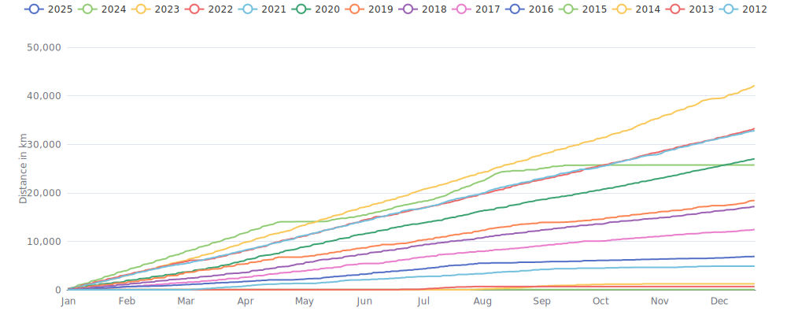

    

Since I began cycling `13 years and 1 month` ago on `06-03-2012`,
I had `2434 cycling days`. 
I recorded a total distance of `202 504 km`
(`5.05` trips around the world 🌍 and
`0.527` trips to the moon 🌕),
an elevation of `907 524 m`
(`102.6` times Mount Everest 🏔)
and a total time of `9mos 1w 2d 1h 14m` 🎉

That's a daily average of `46 km`,
a weekly average of `322 km` and a
monthly average of `1 397 km` 🐣

I burned `4448365 calories` doing so, that's about `16 475` pizza slices 🍕

---

<kbd><a href="#weekly-distances">Weekly distances</a></kbd> |
<kbd><a href="#activities">Activities</a></kbd> |
<kbd><a href="#monthly-stats">Monthly stats</a></kbd> |
<kbd><a href="#activity-intensity">Activity intensity</a></kbd> |
<kbd><a href="#stats-per-weekday">Stats per weekday</a></kbd> |
<kbd><a href="#daytime-stats">Daytime stats</a></kbd> |
<kbd><a href="#stats-per-bike">Stats per bike</a></kbd> |
<kbd><a href="#best-power-outputs-over-time">Power outputs</a></kbd> |
<kbd><a href="#eddington-chart">Eddington</a></kbd> |
<kbd><a href="#yearly-distances">Yearly distances</a></kbd> |
<kbd><a href="#distance-breakdown">Distance breakdown</a></kbd> |
<kbd><a href="#challenge-consistency">Challenge consistency</a></kbd> |
<kbd><a href="#completed-challenges">Completed challenges</a></kbd>

## Weekly distances

## Activities

<table>
    <tr>
        <th></th>
        <th></th>
        <th align="center"></th>
        <th align="center"></th>
        <th align="center"></th>
        <th align="center"></th>
        <th align="center"></th>
        <th align="center"></th>
    </tr>
            <tr>
            <td>19-03-24</td>
            <td>
                
<a href="https://www.strava.com/activities/10994788382" title="Kcal: 1844 | Gear: Canyon ">🏢 -&gt; 🏡</a>
            </td>
            <td align="center">66 km</td>
            <td align="center">258 m</td>
            <td align="center">2:00:54</td>
            <td align="center">230 w</td>
            <td align="center">32.6 km/h</td>
            <td align="center">124</td>
        </tr>
            <tr>
            <td>18-03-24</td>
            <td>
                
<a href="https://www.strava.com/activities/10987335258" title="Kcal: 1474 | Gear: Canyon ">2 uurtjes actief herstel 🧘...</a>
            </td>
            <td align="center">62 km</td>
            <td align="center">135 m</td>
            <td align="center">2:02:58</td>
            <td align="center">174 w</td>
            <td align="center">30.3 km/h</td>
            <td align="center">102</td>
        </tr>
            <tr>
            <td>17-03-24</td>
            <td>
                
<a href="https://www.strava.com/activities/10979390356" title="Kcal: 5836 | Gear: Canyon ">Rondje Spijkenisse ✅🤟</a>
            </td>
            <td align="center">250 km</td>
            <td align="center">483 m</td>
            <td align="center">7:06:49</td>
            <td align="center">202 w</td>
            <td align="center">35.2 km/h</td>
            <td align="center">124</td>
        </tr>
            <tr>
            <td>16-03-24</td>
            <td>
                
<a href="https://www.strava.com/activities/10973287828" title="Kcal: 4882 | Gear: Canyon ">Ne klimmer gade hier nie w...</a>
            </td>
            <td align="center">200 km</td>
            <td align="center">359 m</td>
            <td align="center">6:38:46</td>
            <td align="center">179 w</td>
            <td align="center">30.1 km/h</td>
            <td align="center">109</td>
        </tr>
            <tr>
            <td>15-03-24</td>
            <td>
                
<a href="https://www.strava.com/activities/10966507290" title="Kcal: 1728 | Gear: Canyon Grizl CF SLX 8 Di2 ">Op verkenning 👀 🔦</a>
            </td>
            <td align="center">62 km</td>
            <td align="center">125 m</td>
            <td align="center">2:14:46</td>
            <td align="center">187 w</td>
            <td align="center">27.4 km/h</td>
            <td align="center">102</td>
        </tr>
        </table>

    
Older activities

    <table>
        <tr>
            <th></th>
            <th></th>
            <th align="center"></th>
            <th align="center"></th>
            <th align="center"></th>
            <th align="center"></th>
            <th align="center"></th>
            <th align="center"></th>
        </tr>
                    <tr>
                <td>15-03-24</td>
                <td>
                                    
<a href="https://www.strava.com/activities/10964760840" title="Kcal: 88 | Gear: Tacx Neo Bike Smart ">Pacer Group Ride: Sprinter...</a>
                </td>
                <td align="center">6 km</td>
                <td align="center">23 m</td>
                <td align="center">10:17</td>
                <td align="center">149 w</td>
                <td align="center">36.1 km/h</td>
                <td align="center">n/a</td>
            </tr>
                    <tr>
                <td>14-03-24</td>
                <td>
                    
<a href="https://www.strava.com/activities/10959809772" title="Kcal: 2138 | Gear: Canyon ">Cruise control &amp; taxi spel...</a>
                </td>
                <td align="center">75 km</td>
                <td align="center">171 m</td>
                <td align="center">2:11:54</td>
                <td align="center">245 w</td>
                <td align="center">34.1 km/h</td>
                <td align="center">121</td>
            </tr>
                    <tr>
                <td>13-03-24</td>
                <td>
                                    
<a href="https://www.strava.com/activities/10953525802" title="Kcal: 65 | Gear: Tacx Neo Bike Smart ">Pacer Group Ride: Volcano ...</a>
                </td>
                <td align="center">7 km</td>
                <td align="center">19 m</td>
                <td align="center">18:14</td>
                <td align="center">62 w</td>
                <td align="center">23.2 km/h</td>
                <td align="center">79</td>
            </tr>
                    <tr>
                <td>13-03-24</td>
                <td>
                                    
<a href="https://www.strava.com/activities/10953400479" title="Kcal: 2155 | Gear: Tacx Neo Bike Smart ">Group Ride: 3R Steady Stat...</a>
                </td>
                <td align="center">101 km</td>
                <td align="center">544 m</td>
                <td align="center">2:38:09</td>
                <td align="center">237 w</td>
                <td align="center">38.2 km/h</td>
                <td align="center">120</td>
            </tr>
                    <tr>
                <td>13-03-24</td>
                <td>
                                    
<a href="https://www.strava.com/activities/10952123620" title="Kcal: 380 | Gear: Tacx Neo Bike Smart ">Fit &amp; Fun in Watopia</a>
                </td>
                <td align="center">17 km</td>
                <td align="center">26 m</td>
                <td align="center">24:14</td>
                <td align="center">274 w</td>
                <td align="center">42.1 km/h</td>
                <td align="center">139</td>
            </tr>
                    <tr>
                <td>12-03-24</td>
                <td>
                                    
<a href="https://www.strava.com/activities/10945632517" title="Kcal: 109 | Gear: Tacx Neo Bike Smart ">Pacer Group Ride: Volcano ...</a>
                </td>
                <td align="center">11 km</td>
                <td align="center">44 m</td>
                <td align="center">25:56</td>
                <td align="center">73 w</td>
                <td align="center">26.1 km/h</td>
                <td align="center">77</td>
            </tr>
                    <tr>
                <td>12-03-24</td>
                <td>
                                    
<a href="https://www.strava.com/activities/10945413233" title="Kcal: 1416 | Gear: Tacx Neo Bike Smart ">Group Ride: 3R PedalPlay E...</a>
                </td>
                <td align="center">68 km</td>
                <td align="center">434 m</td>
                <td align="center">1:40:32</td>
                <td align="center">245 w</td>
                <td align="center">40.4 km/h</td>
                <td align="center">121</td>
            </tr>
                    <tr>
                <td>11-03-24</td>
                <td>
                                    
<a href="https://www.strava.com/activities/10938924917" title="Kcal: 1210 | Gear: Tacx Neo Bike Smart ">Group Ride: AHDR Bacon Rol...</a>
                </td>
                <td align="center">66 km</td>
                <td align="center">292 m</td>
                <td align="center">1:46:12</td>
                <td align="center">199 w</td>
                <td align="center">37.3 km/h</td>
                <td align="center">104</td>
            </tr>
                    <tr>
                <td>10-03-24</td>
                <td>
                    
<a href="https://www.strava.com/activities/10931194396" title="Kcal: 1052 | Gear: Canyon Grizl CF SLX 8 Di2 ">Uurkenalf losrijden</a>
                </td>
                <td align="center">44 km</td>
                <td align="center">117 m</td>
                <td align="center">1:38:16</td>
                <td align="center">153 w</td>
                <td align="center">26.7 km/h</td>
                <td align="center">102</td>
            </tr>
                    <tr>
                <td>10-03-24</td>
                <td>
                    
<a href="https://www.strava.com/activities/10929108900" title="Kcal: 4257 | Gear: Canyon ">WTC Kruiskerke - Holland 🇳...</a>
                </td>
                <td align="center">163 km</td>
                <td align="center">316 m</td>
                <td align="center">4:46:54</td>
                <td align="center">222 w</td>
                <td align="center">34.1 km/h</td>
                <td align="center">120</td>
            </tr>
                    <tr>
                <td>09-03-24</td>
                <td>
                                    
<a href="https://www.strava.com/activities/10924044473" title="Kcal: 204 | Gear: Tacx Neo Bike Smart ">Pacer Group Ride: Volcano ...</a>
                </td>
                <td align="center">16 km</td>
                <td align="center">83 m</td>
                <td align="center">35:41</td>
                <td align="center">99 w</td>
                <td align="center">27.7 km/h</td>
                <td align="center">87</td>
            </tr>
                    <tr>
                <td>09-03-24</td>
                <td>
                    
<a href="https://www.strava.com/activities/10923213687" title="Kcal: 140 | Gear: Canyon ">Rondje los</a>
                </td>
                <td align="center">7 km</td>
                <td align="center">14 m</td>
                <td align="center">16:37</td>
                <td align="center">115 w</td>
                <td align="center">25.6 km/h</td>
                <td align="center">93</td>
            </tr>
                    <tr>
                <td>09-03-24</td>
                <td>
                    
<a href="https://www.strava.com/activities/10923050426" title="Kcal: 5585 | Gear: Canyon ">Vlaamse Pijl + extra lusje...</a>
                </td>
                <td align="center">214 km</td>
                <td align="center">719 m</td>
                <td align="center">6:20:06</td>
                <td align="center">220 w</td>
                <td align="center">33.7 km/h</td>
                <td align="center">125</td>
            </tr>
                    <tr>
                <td>08-03-24</td>
                <td>
                    
<a href="https://www.strava.com/activities/10918054400" title="Kcal: 1660 | Gear: Canyon ">Sunset ride 😎</a>
                </td>
                <td align="center">64 km</td>
                <td align="center">139 m</td>
                <td align="center">1:53:59</td>
                <td align="center">218 w</td>
                <td align="center">33.5 km/h</td>
                <td align="center">110</td>
            </tr>
                    <tr>
                <td>07-03-24</td>
                <td>
                                    
<a href="https://www.strava.com/activities/10912078030" title="Kcal: 210 | Gear: Tacx Neo Bike Smart ">Pacer Group Ride: Tempus F...</a>
                </td>
                <td align="center">12 km</td>
                <td align="center">20 m</td>
                <td align="center">17:50</td>
                <td align="center">204 w</td>
                <td align="center">40.8 km/h</td>
                <td align="center">108</td>
            </tr>
                    <tr>
                <td>07-03-24</td>
                <td>
                                    
<a href="https://www.strava.com/activities/10911937474" title="Kcal: 192 | Gear: Tacx Neo Bike Smart ">TTT: WTRL Team Time Trial ...</a>
                </td>
                <td align="center">9 km</td>
                <td align="center">17 m</td>
                <td align="center">11:43</td>
                <td align="center">275 w</td>
                <td align="center">44.3 km/h</td>
                <td align="center">132</td>
            </tr>
                    <tr>
                <td>07-03-24</td>
                <td>
                                    
<a href="https://www.strava.com/activities/10911689319" title="Kcal: 102 | Gear: Tacx Neo Bike Smart ">Pacer Group Ride: Volcano ...</a>
                </td>
                <td align="center">5 km</td>
                <td align="center">27 m</td>
                <td align="center">7:32</td>
                <td align="center">234 w</td>
                <td align="center">40.6 km/h</td>
                <td align="center">121</td>
            </tr>
                    <tr>
                <td>07-03-24</td>
                <td>
                    
<a href="https://www.strava.com/activities/10911116913" title="Kcal: 970 | Gear: Canyon ">New bike day 🤟</a>
                </td>
                <td align="center">34 km</td>
                <td align="center">96 m</td>
                <td align="center">1:03:04</td>
                <td align="center">231 w</td>
                <td align="center">32.8 km/h</td>
                <td align="center">112</td>
            </tr>
                    <tr>
                <td>06-03-24</td>
                <td>
                                    
<a href="https://www.strava.com/activities/10905471619" title="Kcal: 77 | Gear: Tacx Neo Bike Smart ">Pacer Group Ride: Volcano ...</a>
                </td>
                <td align="center">7 km</td>
                <td align="center">21 m</td>
                <td align="center">15:13</td>
                <td align="center">88 w</td>
                <td align="center">28.9 km/h</td>
                <td align="center">88</td>
            </tr>
                    <tr>
                <td>06-03-24</td>
                <td>
                                    
<a href="https://www.strava.com/activities/10905377507" title="Kcal: 2259 | Gear: Tacx Neo Bike Smart ">Group Ride: 3R Steady Stat...</a>
                </td>
                <td align="center">110 km</td>
                <td align="center">169 m</td>
                <td align="center">2:32:16</td>
                <td align="center">258 w</td>
                <td align="center">43.5 km/h</td>
                <td align="center">130</td>
            </tr>
                    <tr>
                <td>06-03-24</td>
                <td>
                                    
<a href="https://www.strava.com/activities/10904199282" title="Kcal: 348 | Gear: Tacx Neo Bike Smart ">Fit &amp; Fun in Watopia</a>
                </td>
                <td align="center">16 km</td>
                <td align="center">26 m</td>
                <td align="center">22:30</td>
                <td align="center">270 w</td>
                <td align="center">43.1 km/h</td>
                <td align="center">137</td>
            </tr>
                    <tr>
                <td>05-03-24</td>
                <td>
                                    
<a href="https://www.strava.com/activities/10897679704" title="Kcal: 1456 | Gear: Tacx Neo Bike Smart ">Group Ride: 3R PedalPlay E...</a>
                </td>
                <td align="center">65 km</td>
                <td align="center">671 m</td>
                <td align="center">1:42:47</td>
                <td align="center">246 w</td>
                <td align="center">38.1 km/h</td>
                <td align="center">124</td>
            </tr>
                    <tr>
                <td>04-03-24</td>
                <td>
                                    
<a href="https://www.strava.com/activities/10890244030" title="Kcal: 1081 | Gear: Tacx Neo Bike Smart ">Recovery in Watopia</a>
                </td>
                <td align="center">60 km</td>
                <td align="center">91 m</td>
                <td align="center">1:33:38</td>
                <td align="center">202 w</td>
                <td align="center">38.5 km/h</td>
                <td align="center">103</td>
            </tr>
                    <tr>
                <td>03-03-24</td>
                <td>
                                    
<a href="https://www.strava.com/activities/10882876121" title="Kcal: 1066 | Gear: Tacx Neo Bike Smart ">Group Ride: 3R Endurance S...</a>
                </td>
                <td align="center">67 km</td>
                <td align="center">344 m</td>
                <td align="center">1:49:42</td>
                <td align="center">169 w</td>
                <td align="center">36.4 km/h</td>
                <td align="center">99</td>
            </tr>
                    <tr>
                <td>03-03-24</td>
                <td>
                                    
<a href="https://www.strava.com/activities/10881781520" title="Kcal: 201 | Gear: Tacx Neo Bike Smart ">Group Ride:  BMTR Short Ad...</a>
                </td>
                <td align="center">13 km</td>
                <td align="center">58 m</td>
                <td align="center">24:41</td>
                <td align="center">141 w</td>
                <td align="center">31.8 km/h</td>
                <td align="center">96</td>
            </tr>
                    <tr>
                <td>03-03-24</td>
                <td>
                    
<a href="https://www.strava.com/activities/10880019719" title="Kcal: 3285 | Gear: Ridley Fenix SLX Disc ">WTC Kruiskerke A+B - Natte...</a>
                </td>
                <td align="center">122 km</td>
                <td align="center">184 m</td>
                <td align="center">4:01:46</td>
                <td align="center">201 w</td>
                <td align="center">30.2 km/h</td>
                <td align="center">117</td>
            </tr>
                    <tr>
                <td>02-03-24</td>
                <td>
                                    
<a href="https://www.strava.com/activities/10875189887" title="Kcal: 647 | Gear: Tacx Neo Bike Smart ">Group Ride: 3R Endurance S...</a>
                </td>
                <td align="center">41 km</td>
                <td align="center">139 m</td>
                <td align="center">1:08:17</td>
                <td align="center">164 w</td>
                <td align="center">36.1 km/h</td>
                <td align="center">103</td>
            </tr>
                    <tr>
                <td>02-03-24</td>
                <td>
                                    
<a href="https://www.strava.com/activities/10874297681" title="Kcal: 314 | Gear: Tacx Neo Bike Smart ">Group Ride: BMTR Flat 100 ...</a>
                </td>
                <td align="center">19 km</td>
                <td align="center">117 m</td>
                <td align="center">30:59</td>
                <td align="center">176 w</td>
                <td align="center">36.1 km/h</td>
                <td align="center">104</td>
            </tr>
                    <tr>
                <td>02-03-24</td>
                <td>
                    
<a href="https://www.strava.com/activities/10873412614" title="Kcal: 4163 | Gear: Ridley Fenix SLX Disc ">Kluiswind 💨</a>
                </td>
                <td align="center">151 km</td>
                <td align="center">768 m</td>
                <td align="center">4:44:55</td>
                <td align="center">218 w</td>
                <td align="center">31.8 km/h</td>
                <td align="center">130</td>
            </tr>
                    <tr>
                <td>01-03-24</td>
                <td>
                                    
<a href="https://www.strava.com/activities/10869579725" title="Kcal: 1245 | Gear: Tacx Neo Bike Smart ">90 min easy intervals in W...</a>
                </td>
                <td align="center">61 km</td>
                <td align="center">94 m</td>
                <td align="center">1:33:17</td>
                <td align="center">233 w</td>
                <td align="center">39.3 km/h</td>
                <td align="center">116</td>
            </tr>
                    <tr>
                <td>29-02-24</td>
                <td>
                                    
<a href="https://www.strava.com/activities/10863583509" title="Kcal: 46 | Gear: Tacx Neo Bike Smart ">Pacer Group Ride: Flat Rou...</a>
                </td>
                <td align="center">5 km</td>
                <td align="center">27 m</td>
                <td align="center">11:55</td>
                <td align="center">68 w</td>
                <td align="center">25.4 km/h</td>
                <td align="center">76</td>
            </tr>
                    <tr>
                <td>29-02-24</td>
                <td>
                                    
<a href="https://www.strava.com/activities/10863504387" title="Kcal: 562 | Gear: Tacx Neo Bike Smart ">TTT: WTRL Team Time Trial ...</a>
                </td>
                <td align="center">29 km</td>
                <td align="center">322 m</td>
                <td align="center">43:18</td>
                <td align="center">225 w</td>
                <td align="center">39.9 km/h</td>
                <td align="center">118</td>
            </tr>
                    <tr>
                <td>29-02-24</td>
                <td>
                                    
<a href="https://www.strava.com/activities/10863214233" title="Kcal: 261 | Gear: Tacx Neo Bike Smart ">Renewal - CED in Watopia</a>
                </td>
                <td align="center">16 km</td>
                <td align="center">26 m</td>
                <td align="center">26:05</td>
                <td align="center">175 w</td>
                <td align="center">36.8 km/h</td>
                <td align="center">109</td>
            </tr>
                    <tr>
                <td>29-02-24</td>
                <td>
                                    
<a href="https://www.strava.com/activities/10863012564" title="Kcal: 616 | Gear: Tacx Neo Bike Smart ">Race: Probike Zwift Race o...</a>
                </td>
                <td align="center">27 km</td>
                <td align="center">233 m</td>
                <td align="center">35:42</td>
                <td align="center">296 w</td>
                <td align="center">45.4 km/h</td>
                <td align="center">141</td>
            </tr>
                    <tr>
                <td>28-02-24</td>
                <td>
                                    
<a href="https://www.strava.com/activities/10857168629" title="Kcal: 39 | Gear: Tacx Neo Bike Smart ">Pacer Group Ride: Flat Rou...</a>
                </td>
                <td align="center">5 km</td>
                <td align="center">17 m</td>
                <td align="center">10:14</td>
                <td align="center">66 w</td>
                <td align="center">29.5 km/h</td>
                <td align="center">85</td>
            </tr>
                    <tr>
                <td>28-02-24</td>
                <td>
                                    
<a href="https://www.strava.com/activities/10857103092" title="Kcal: 2215 | Gear: Tacx Neo Bike Smart ">Group Ride: 3R Steady Stat...</a>
                </td>
                <td align="center">103 km</td>
                <td align="center">612 m</td>
                <td align="center">2:30:56</td>
                <td align="center">255 w</td>
                <td align="center">41.1 km/h</td>
                <td align="center">124</td>
            </tr>
                    <tr>
                <td>28-02-24</td>
                <td>
                                    
<a href="https://www.strava.com/activities/10856025170" title="Kcal: 437 | Gear: Tacx Neo Bike Smart ">Just The Basics in Watopia</a>
                </td>
                <td align="center">22 km</td>
                <td align="center">33 m</td>
                <td align="center">32:04</td>
                <td align="center">238 w</td>
                <td align="center">41.7 km/h</td>
                <td align="center">115</td>
            </tr>
                    <tr>
                <td>27-02-24</td>
                <td>
                                    
<a href="https://www.strava.com/activities/10850057895" title="Kcal: 103 | Gear: Tacx Neo Bike Smart ">Pacer Group Ride: Flat Rou...</a>
                </td>
                <td align="center">10 km</td>
                <td align="center">34 m</td>
                <td align="center">23:20</td>
                <td align="center">77 w</td>
                <td align="center">26.9 km/h</td>
                <td align="center">89</td>
            </tr>
                    <tr>
                <td>27-02-24</td>
                <td>
                                    
<a href="https://www.strava.com/activities/10849873186" title="Kcal: 1076 | Gear: Tacx Neo Bike Smart ">TTT: Zwift Racing League -...</a>
                </td>
                <td align="center">43 km</td>
                <td align="center">334 m</td>
                <td align="center">1:00:54</td>
                <td align="center">306 w</td>
                <td align="center">42.6 km/h</td>
                <td align="center">148</td>
            </tr>
                    <tr>
                <td>27-02-24</td>
                <td>
                                    
<a href="https://www.strava.com/activities/10849366348" title="Kcal: 293 | Gear: Tacx Neo Bike Smart ">Just The Basics in Watopia</a>
                </td>
                <td align="center">15 km</td>
                <td align="center">26 m</td>
                <td align="center">21:17</td>
                <td align="center">240 w</td>
                <td align="center">42.4 km/h</td>
                <td align="center">115</td>
            </tr>
                    <tr>
                <td>26-02-24</td>
                <td>
                                    
<a href="https://www.strava.com/activities/10843016186" title="Kcal: 1113 | Gear: Tacx Neo Bike Smart ">Tempus Fugit in Watopia</a>
                </td>
                <td align="center">64 km</td>
                <td align="center">98 m</td>
                <td align="center">1:32:29</td>
                <td align="center">210 w</td>
                <td align="center">41.5 km/h</td>
                <td align="center">100</td>
            </tr>
                    <tr>
                <td>25-02-24</td>
                <td>
                                    
<a href="https://www.strava.com/activities/10836131890" title="Kcal: 248 | Gear: Tacx Neo Bike Smart ">Pacer Group Ride: Flat Rou...</a>
                </td>
                <td align="center">21 km</td>
                <td align="center">120 m</td>
                <td align="center">44:09</td>
                <td align="center">98 w</td>
                <td align="center">28.7 km/h</td>
                <td align="center">79</td>
            </tr>
                    <tr>
                <td>25-02-24</td>
                <td>
                    
<a href="https://www.strava.com/activities/10835598248" title="Kcal: 1293 | Gear: Canyon Grizl CF SLX 8 Di2 ">Los ⛅ -&gt; ☁️</a>
                </td>
                <td align="center">51 km</td>
                <td align="center">225 m</td>
                <td align="center">1:53:09</td>
                <td align="center">165 w</td>
                <td align="center">27.2 km/h</td>
                <td align="center">106</td>
            </tr>
                    <tr>
                <td>25-02-24</td>
                <td>
                    
<a href="https://www.strava.com/activities/10832879472" title="Kcal: 3107 | Gear: Ridley Fenix SLX Disc ">Rustig ritje naar KBK 🚴‍♂️...</a>
                </td>
                <td align="center">128 km</td>
                <td align="center">313 m</td>
                <td align="center">4:08:36</td>
                <td align="center">182 w</td>
                <td align="center">30.9 km/h</td>
                <td align="center">111</td>
            </tr>
                    <tr>
                <td>24-02-24</td>
                <td>
                                    
<a href="https://www.strava.com/activities/10828222785" title="Kcal: 61 | Gear: Tacx Neo Bike Smart ">Pacer Group Ride: Makuri 4...</a>
                </td>
                <td align="center">7 km</td>
                <td align="center">32 m</td>
                <td align="center">15:46</td>
                <td align="center">69 w</td>
                <td align="center">26.9 km/h</td>
                <td align="center">80</td>
            </tr>
                    <tr>
                <td>24-02-24</td>
                <td>
                                    
<a href="https://www.strava.com/activities/10828082267" title="Kcal: 2155 | Gear: Tacx Neo Bike Smart ">Group Ride: BMTR Flat 100 ...</a>
                </td>
                <td align="center">121 km</td>
                <td align="center">184 m</td>
                <td align="center">3:05:22</td>
                <td align="center">202 w</td>
                <td align="center">39 km/h</td>
                <td align="center">110</td>
            </tr>
                    <tr>
                <td>24-02-24</td>
                <td>
                                    
<a href="https://www.strava.com/activities/10825655668" title="Kcal: 65 | Gear: Tacx Neo Bike Smart ">Group Ride: DIRT Badge Hun...</a>
                </td>
                <td align="center">5 km</td>
                <td align="center">6 m</td>
                <td align="center">7:59</td>
                <td align="center">137 w</td>
                <td align="center">38.1 km/h</td>
                <td align="center">98</td>
            </tr>
                    <tr>
                <td>24-02-24</td>
                <td>
                                    
<a href="https://www.strava.com/activities/10825565430" title="Kcal: 37 | Gear: Tacx Neo Bike Smart ">Pacer Group Ride: Volcano ...</a>
                </td>
                <td align="center">3 km</td>
                <td align="center">13 m</td>
                <td align="center">6:42</td>
                <td align="center">97 w</td>
                <td align="center">28.8 km/h</td>
                <td align="center">91</td>
            </tr>
                    <tr>
                <td>24-02-24</td>
                <td>
                                    
<a href="https://www.strava.com/activities/10825504421" title="Kcal: 523 | Gear: Tacx Neo Bike Smart ">Group Ride: DIRT 505 Satur...</a>
                </td>
                <td align="center">30 km</td>
                <td align="center">110 m</td>
                <td align="center">46:37</td>
                <td align="center">196 w</td>
                <td align="center">38.7 km/h</td>
                <td align="center">112</td>
            </tr>
                    <tr>
                <td>24-02-24</td>
                <td>
                                    
<a href="https://www.strava.com/activities/10825100845" title="Kcal: 1918 | Gear: Tacx Neo Bike Smart ">Group Ride: SZR  Endurance...</a>
                </td>
                <td align="center">106 km</td>
                <td align="center">794 m</td>
                <td align="center">2:46:45</td>
                <td align="center">201 w</td>
                <td align="center">38.2 km/h</td>
                <td align="center">115</td>
            </tr>
            </table>

## Monthly stats

<table>
    <thead>
    <tr>
        <th>&nbsp;&nbsp;&nbsp;&nbsp;&nbsp;</th>
        <th># of rides</th>
        <th align="center"></th>
        <th align="center"></th>
        <th align="center"></th>
        <th align="center"></th>
    </tr>
    </thead>
    <tbody>
            <tr>
            <td align="center">March 2024</td>
            <td align="center">35</td>
            <td align="center">2 291 km</td>
            <td align="center">7 143 m</td>
            <td align="center">2d 19h 31m</td>
            <td align="center">6</td>
        </tr>
            <tr>
            <td align="center">February 2024</td>
            <td align="center">82</td>
            <td align="center">3 387 km</td>
            <td align="center">14 334 m</td>
            <td align="center">3d 19h 13m</td>
            <td align="center">7</td>
        </tr>
            <tr>
            <td align="center">January 2024</td>
            <td align="center">114</td>
            <td align="center">3 841 km</td>
            <td align="center">18 123 m</td>
            <td align="center">4d 6h 46m</td>
            <td align="center">6</td>
        </tr>
            <tr>
            <td align="center">December 2023</td>
            <td align="center">90</td>
            <td align="center">3 823 km</td>
            <td align="center">14 309 m</td>
            <td align="center">4d 8h 54m</td>
            <td align="center">0</td>
        </tr>
            <tr>
            <td align="center">November 2023</td>
            <td align="center">94</td>
            <td align="center">4 087 km</td>
            <td align="center">16 273 m</td>
            <td align="center">4d 16h 52m</td>
            <td align="center">0</td>
        </tr>
            <tr>
            <td align="center">October 2023</td>
            <td align="center">87</td>
            <td align="center">3 728 km</td>
            <td align="center">16 280 m</td>
            <td align="center">4d 16h 30m</td>
            <td align="center">0</td>
        </tr>
            <tr>
            <td align="center">September 2023</td>
            <td align="center">49</td>
            <td align="center">3 439 km</td>
            <td align="center">11 468 m</td>
            <td align="center">4d 9h 53m</td>
            <td align="center">0</td>
        </tr>
            <tr>
            <td align="center">August 2023</td>
            <td align="center">45</td>
            <td align="center">3 389 km</td>
            <td align="center">14 787 m</td>
            <td align="center">4d 5h 39m</td>
            <td align="center">0</td>
        </tr>
            <tr>
            <td align="center">July 2023</td>
            <td align="center">39</td>
            <td align="center">3 539 km</td>
            <td align="center">32 069 m</td>
            <td align="center">4d 20h 6m</td>
            <td align="center">0</td>
        </tr>
            <tr>
            <td align="center">June 2023</td>
            <td align="center">40</td>
            <td align="center">3 157 km</td>
            <td align="center">11 611 m</td>
            <td align="center">4d 49m</td>
            <td align="center">0</td>
        </tr>
            <tr>
            <td align="center">May 2023</td>
            <td align="center">45</td>
            <td align="center">3 650 km</td>
            <td align="center">26 833 m</td>
            <td align="center">4d 19h 37m</td>
            <td align="center">0</td>
        </tr>
            <tr>
            <td align="center">April 2023</td>
            <td align="center">55</td>
            <td align="center">3 412 km</td>
            <td align="center">15 247 m</td>
            <td align="center">4d 9h 21m</td>
            <td align="center">0</td>
        </tr>
            <tr>
            <td align="center">March 2023</td>
            <td align="center">67</td>
            <td align="center">3 378 km</td>
            <td align="center">16 918 m</td>
            <td align="center">3d 20h 52m</td>
            <td align="center">0</td>
        </tr>
            <tr>
            <td align="center">February 2023</td>
            <td align="center">46</td>
            <td align="center">2 791 km</td>
            <td align="center">14 908 m</td>
            <td align="center">3d 5h 3m</td>
            <td align="center">0</td>
        </tr>
            <tr>
            <td align="center">January 2023</td>
            <td align="center">57</td>
            <td align="center">2 777 km</td>
            <td align="center">17 265 m</td>
            <td align="center">3d 4h 13m</td>
            <td align="center">0</td>
        </tr>
            <tr>
            <td align="center">December 2022</td>
            <td align="center">53</td>
            <td align="center">3 009 km</td>
            <td align="center">16 107 m</td>
            <td align="center">3d 6h 6m</td>
            <td align="center">0</td>
        </tr>
            <tr>
            <td align="center">November 2022</td>
            <td align="center">60</td>
            <td align="center">2 690 km</td>
            <td align="center">15 451 m</td>
            <td align="center">3d 3h 21m</td>
            <td align="center">0</td>
        </tr>
            <tr>
            <td align="center">October 2022</td>
            <td align="center">51</td>
            <td align="center">2 889 km</td>
            <td align="center">14 669 m</td>
            <td align="center">3d 13h 34m</td>
            <td align="center">0</td>
        </tr>
            <tr>
            <td align="center">September 2022</td>
            <td align="center">46</td>
            <td align="center">2 478 km</td>
            <td align="center">13 362 m</td>
            <td align="center">2d 21h</td>
            <td align="center">0</td>
        </tr>
            <tr>
            <td align="center">August 2022</td>
            <td align="center">41</td>
            <td align="center">2 895 km</td>
            <td align="center">9 454 m</td>
            <td align="center">3d 18h 37m</td>
            <td align="center">0</td>
        </tr>
            <tr>
            <td align="center">July 2022</td>
            <td align="center">43</td>
            <td align="center">2 750 km</td>
            <td align="center">12 477 m</td>
            <td align="center">3d 19h 30m</td>
            <td align="center">0</td>
        </tr>
            <tr>
            <td align="center">June 2022</td>
            <td align="center">48</td>
            <td align="center">2 519 km</td>
            <td align="center">9 963 m</td>
            <td align="center">3d 3h 24m</td>
            <td align="center">0</td>
        </tr>
            <tr>
            <td align="center">May 2022</td>
            <td align="center">51</td>
            <td align="center">3 000 km</td>
            <td align="center">13 182 m</td>
            <td align="center">4d 1h 31m</td>
            <td align="center">0</td>
        </tr>
            <tr>
            <td align="center">April 2022</td>
            <td align="center">49</td>
            <td align="center">2 939 km</td>
            <td align="center">9 928 m</td>
            <td align="center">3d 20h 8m</td>
            <td align="center">0</td>
        </tr>
            <tr>
            <td align="center">March 2022</td>
            <td align="center">46</td>
            <td align="center">2 007 km</td>
            <td align="center">7 906 m</td>
            <td align="center">2d 12h 58m</td>
            <td align="center">0</td>
        </tr>
            <tr>
            <td align="center">February 2022</td>
            <td align="center">46</td>
            <td align="center">2 428 km</td>
            <td align="center">12 346 m</td>
            <td align="center">2d 19h 41m</td>
            <td align="center">0</td>
        </tr>
            <tr>
            <td align="center">January 2022</td>
            <td align="center">61</td>
            <td align="center">2 974 km</td>
            <td align="center">19 999 m</td>
            <td align="center">3d 8h 47m</td>
            <td align="center">0</td>
        </tr>
            <tr>
            <td align="center">December 2021</td>
            <td align="center">58</td>
            <td align="center">2 680 km</td>
            <td align="center">14 437 m</td>
            <td align="center">3d 2h 19m</td>
            <td align="center">0</td>
        </tr>
            <tr>
            <td align="center">November 2021</td>
            <td align="center">69</td>
            <td align="center">2 667 km</td>
            <td align="center">15 565 m</td>
            <td align="center">3d 45m</td>
            <td align="center">0</td>
        </tr>
            <tr>
            <td align="center">October 2021</td>
            <td align="center">46</td>
            <td align="center">2 513 km</td>
            <td align="center">11 094 m</td>
            <td align="center">2d 23h 14m</td>
            <td align="center">0</td>
        </tr>
            <tr>
            <td align="center">September 2021</td>
            <td align="center">42</td>
            <td align="center">2 652 km</td>
            <td align="center">7 809 m</td>
            <td align="center">3d 6h 53m</td>
            <td align="center">0</td>
        </tr>
            <tr>
            <td align="center">August 2021</td>
            <td align="center">32</td>
            <td align="center">2 947 km</td>
            <td align="center">11 392 m</td>
            <td align="center">3d 19h 53m</td>
            <td align="center">0</td>
        </tr>
            <tr>
            <td align="center">July 2021</td>
            <td align="center">39</td>
            <td align="center">2 700 km</td>
            <td align="center">7 769 m</td>
            <td align="center">3d 10h 59m</td>
            <td align="center">0</td>
        </tr>
            <tr>
            <td align="center">June 2021</td>
            <td align="center">37</td>
            <td align="center">2 858 km</td>
            <td align="center">8 389 m</td>
            <td align="center">3d 12h 32m</td>
            <td align="center">0</td>
        </tr>
            <tr>
            <td align="center">May 2021</td>
            <td align="center">48</td>
            <td align="center">2 952 km</td>
            <td align="center">10 205 m</td>
            <td align="center">3d 9h 21m</td>
            <td align="center">0</td>
        </tr>
            <tr>
            <td align="center">April 2021</td>
            <td align="center">46</td>
            <td align="center">2 611 km</td>
            <td align="center">8 266 m</td>
            <td align="center">3d 40m</td>
            <td align="center">0</td>
        </tr>
            <tr>
            <td align="center">March 2021</td>
            <td align="center">51</td>
            <td align="center">2 544 km</td>
            <td align="center">8 544 m</td>
            <td align="center">2d 22h 14m</td>
            <td align="center">0</td>
        </tr>
            <tr>
            <td align="center">February 2021</td>
            <td align="center">54</td>
            <td align="center">2 312 km</td>
            <td align="center">13 855 m</td>
            <td align="center">2d 12h 19m</td>
            <td align="center">0</td>
        </tr>
            <tr>
            <td align="center">January 2021</td>
            <td align="center">59</td>
            <td align="center">2 830 km</td>
            <td align="center">12 827 m</td>
            <td align="center">2d 22h 56m</td>
            <td align="center">0</td>
        </tr>
            <tr>
            <td align="center">December 2020</td>
            <td align="center">60</td>
            <td align="center">2 409 km</td>
            <td align="center">9 164 m</td>
            <td align="center">2d 11h 13m</td>
            <td align="center">0</td>
        </tr>
            <tr>
            <td align="center">November 2020</td>
            <td align="center">51</td>
            <td align="center">2 342 km</td>
            <td align="center">11 147 m</td>
            <td align="center">2d 14h 38m</td>
            <td align="center">0</td>
        </tr>
            <tr>
            <td align="center">October 2020</td>
            <td align="center">44</td>
            <td align="center">2 241 km</td>
            <td align="center">10 405 m</td>
            <td align="center">2d 9h 18m</td>
            <td align="center">0</td>
        </tr>
            <tr>
            <td align="center">September 2020</td>
            <td align="center">38</td>
            <td align="center">1 924 km</td>
            <td align="center">8 980 m</td>
            <td align="center">2d 6h 39m</td>
            <td align="center">0</td>
        </tr>
            <tr>
            <td align="center">August 2020</td>
            <td align="center">51</td>
            <td align="center">2 470 km</td>
            <td align="center">11 556 m</td>
            <td align="center">3d 8h 39m</td>
            <td align="center">0</td>
        </tr>
            <tr>
            <td align="center">July 2020</td>
            <td align="center">38</td>
            <td align="center">2 070 km</td>
            <td align="center">14 947 m</td>
            <td align="center">2d 21h 53m</td>
            <td align="center">0</td>
        </tr>
            <tr>
            <td align="center">June 2020</td>
            <td align="center">41</td>
            <td align="center">2 234 km</td>
            <td align="center">11 449 m</td>
            <td align="center">2d 23h 14m</td>
            <td align="center">0</td>
        </tr>
            <tr>
            <td align="center">May 2020</td>
            <td align="center">50</td>
            <td align="center">2 748 km</td>
            <td align="center">12 215 m</td>
            <td align="center">3d 19h 4m</td>
            <td align="center">0</td>
        </tr>
            <tr>
            <td align="center">April 2020</td>
            <td align="center">40</td>
            <td align="center">2 581 km</td>
            <td align="center">10 202 m</td>
            <td align="center">3d 14h 18m</td>
            <td align="center">0</td>
        </tr>
            <tr>
            <td align="center">March 2020</td>
            <td align="center">42</td>
            <td align="center">2 170 km</td>
            <td align="center">10 608 m</td>
            <td align="center">2d 21h 51m</td>
            <td align="center">0</td>
        </tr>
            <tr>
            <td align="center">February 2020</td>
            <td align="center">30</td>
            <td align="center">1 765 km</td>
            <td align="center">10 457 m</td>
            <td align="center">2d 4h 14m</td>
            <td align="center">0</td>
        </tr>
            <tr>
            <td align="center">January 2020</td>
            <td align="center">33</td>
            <td align="center">1 617 km</td>
            <td align="center">9 485 m</td>
            <td align="center">2d 3h 36m</td>
            <td align="center">0</td>
        </tr>
            <tr>
            <td align="center">December 2019</td>
            <td align="center">29</td>
            <td align="center">1 421 km</td>
            <td align="center">5 972 m</td>
            <td align="center">1d 21h 29m</td>
            <td align="center">0</td>
        </tr>
            <tr>
            <td align="center">November 2019</td>
            <td align="center">26</td>
            <td align="center">1 345 km</td>
            <td align="center">7 087 m</td>
            <td align="center">2d 2h 19m</td>
            <td align="center">0</td>
        </tr>
            <tr>
            <td align="center">October 2019</td>
            <td align="center">27</td>
            <td align="center">1 315 km</td>
            <td align="center">6 299 m</td>
            <td align="center">1d 20h 14m</td>
            <td align="center">0</td>
        </tr>
            <tr>
            <td align="center">September 2019</td>
            <td align="center">19</td>
            <td align="center">637 km</td>
            <td align="center">6 449 m</td>
            <td align="center">22h 40m</td>
            <td align="center">0</td>
        </tr>
            <tr>
            <td align="center">August 2019</td>
            <td align="center">31</td>
            <td align="center">1 835 km</td>
            <td align="center">9 322 m</td>
            <td align="center">2d 13h 58m</td>
            <td align="center">0</td>
        </tr>
            <tr>
            <td align="center">July 2019</td>
            <td align="center">25</td>
            <td align="center">1 950 km</td>
            <td align="center">13 992 m</td>
            <td align="center">2d 20h 46m</td>
            <td align="center">0</td>
        </tr>
            <tr>
            <td align="center">June 2019</td>
            <td align="center">28</td>
            <td align="center">1 333 km</td>
            <td align="center">9 513 m</td>
            <td align="center">1d 21h 47m</td>
            <td align="center">0</td>
        </tr>
            <tr>
            <td align="center">May 2019</td>
            <td align="center">27</td>
            <td align="center">1 634 km</td>
            <td align="center">4 996 m</td>
            <td align="center">2d 8h 26m</td>
            <td align="center">0</td>
        </tr>
            <tr>
            <td align="center">April 2019</td>
            <td align="center">24</td>
            <td align="center">1 468 km</td>
            <td align="center">9 511 m</td>
            <td align="center">2d 1h 53m</td>
            <td align="center">0</td>
        </tr>
            <tr>
            <td align="center">March 2019</td>
            <td align="center">27</td>
            <td align="center">1 987 km</td>
            <td align="center">10 098 m</td>
            <td align="center">2d 16h 30m</td>
            <td align="center">0</td>
        </tr>
            <tr>
            <td align="center">February 2019</td>
            <td align="center">31</td>
            <td align="center">1 537 km</td>
            <td align="center">7 768 m</td>
            <td align="center">2d 1h 35m</td>
            <td align="center">0</td>
        </tr>
            <tr>
            <td align="center">January 2019</td>
            <td align="center">25</td>
            <td align="center">1 420 km</td>
            <td align="center">6 972 m</td>
            <td align="center">1d 22h 39m</td>
            <td align="center">0</td>
        </tr>
            <tr>
            <td align="center">December 2018</td>
            <td align="center">33</td>
            <td align="center">1 469 km</td>
            <td align="center">6 626 m</td>
            <td align="center">2d 6h 41m</td>
            <td align="center">0</td>
        </tr>
            <tr>
            <td align="center">November 2018</td>
            <td align="center">30</td>
            <td align="center">1 164 km</td>
            <td align="center">5 735 m</td>
            <td align="center">1d 19h 43m</td>
            <td align="center">0</td>
        </tr>
            <tr>
            <td align="center">October 2018</td>
            <td align="center">27</td>
            <td align="center">1 153 km</td>
            <td align="center">4 780 m</td>
            <td align="center">1d 16h 57m</td>
            <td align="center">0</td>
        </tr>
            <tr>
            <td align="center">September 2018</td>
            <td align="center">33</td>
            <td align="center">1 487 km</td>
            <td align="center">3 617 m</td>
            <td align="center">2d 3h 10m</td>
            <td align="center">0</td>
        </tr>
            <tr>
            <td align="center">August 2018</td>
            <td align="center">37</td>
            <td align="center">1 451 km</td>
            <td align="center">4 662 m</td>
            <td align="center">1d 23h 32m</td>
            <td align="center">0</td>
        </tr>
            <tr>
            <td align="center">July 2018</td>
            <td align="center">32</td>
            <td align="center">1 513 km</td>
            <td align="center">3 395 m</td>
            <td align="center">2d 9m</td>
            <td align="center">0</td>
        </tr>
            <tr>
            <td align="center">June 2018</td>
            <td align="center">33</td>
            <td align="center">1 702 km</td>
            <td align="center">7 189 m</td>
            <td align="center">2d 7h 56m</td>
            <td align="center">0</td>
        </tr>
            <tr>
            <td align="center">May 2018</td>
            <td align="center">44</td>
            <td align="center">1 809 km</td>
            <td align="center">5 865 m</td>
            <td align="center">2d 15h 11m</td>
            <td align="center">0</td>
        </tr>
            <tr>
            <td align="center">April 2018</td>
            <td align="center">44</td>
            <td align="center">1 674 km</td>
            <td align="center">7 618 m</td>
            <td align="center">2d 6h 59m</td>
            <td align="center">0</td>
        </tr>
            <tr>
            <td align="center">March 2018</td>
            <td align="center">33</td>
            <td align="center">1 193 km</td>
            <td align="center">8 585 m</td>
            <td align="center">1d 16h 30m</td>
            <td align="center">0</td>
        </tr>
            <tr>
            <td align="center">February 2018</td>
            <td align="center">28</td>
            <td align="center">1 080 km</td>
            <td align="center">5 278 m</td>
            <td align="center">1d 12h 47m</td>
            <td align="center">0</td>
        </tr>
            <tr>
            <td align="center">January 2018</td>
            <td align="center">31</td>
            <td align="center">1 054 km</td>
            <td align="center">5 974 m</td>
            <td align="center">1d 12h 5m</td>
            <td align="center">0</td>
        </tr>
            <tr>
            <td align="center">December 2017</td>
            <td align="center">28</td>
            <td align="center">852 km</td>
            <td align="center">5 511 m</td>
            <td align="center">1d 8h 8m</td>
            <td align="center">0</td>
        </tr>
            <tr>
            <td align="center">November 2017</td>
            <td align="center">29</td>
            <td align="center">861 km</td>
            <td align="center">1 984 m</td>
            <td align="center">1d 6h 42m</td>
            <td align="center">0</td>
        </tr>
            <tr>
            <td align="center">October 2017</td>
            <td align="center">22</td>
            <td align="center">743 km</td>
            <td align="center">1 992 m</td>
            <td align="center">1d 2h 20m</td>
            <td align="center">0</td>
        </tr>
            <tr>
            <td align="center">September 2017</td>
            <td align="center">33</td>
            <td align="center">1 169 km</td>
            <td align="center">2 102 m</td>
            <td align="center">1d 15h 58m</td>
            <td align="center">0</td>
        </tr>
            <tr>
            <td align="center">August 2017</td>
            <td align="center">26</td>
            <td align="center">1 050 km</td>
            <td align="center">4 237 m</td>
            <td align="center">1d 12h 8m</td>
            <td align="center">0</td>
        </tr>
            <tr>
            <td align="center">July 2017</td>
            <td align="center">38</td>
            <td align="center">1 319 km</td>
            <td align="center">4 105 m</td>
            <td align="center">1d 20h 46m</td>
            <td align="center">0</td>
        </tr>
            <tr>
            <td align="center">June 2017</td>
            <td align="center">30</td>
            <td align="center">1 089 km</td>
            <td align="center">3 372 m</td>
            <td align="center">1d 11h 49m</td>
            <td align="center">0</td>
        </tr>
            <tr>
            <td align="center">May 2017</td>
            <td align="center">34</td>
            <td align="center">1 393 km</td>
            <td align="center">4 179 m</td>
            <td align="center">2d 1h 36m</td>
            <td align="center">0</td>
        </tr>
            <tr>
            <td align="center">April 2017</td>
            <td align="center">39</td>
            <td align="center">1 449 km</td>
            <td align="center">6 824 m</td>
            <td align="center">2d 2h 58m</td>
            <td align="center">0</td>
        </tr>
            <tr>
            <td align="center">March 2017</td>
            <td align="center">26</td>
            <td align="center">902 km</td>
            <td align="center">2 142 m</td>
            <td align="center">1d 8h 57m</td>
            <td align="center">0</td>
        </tr>
            <tr>
            <td align="center">February 2017</td>
            <td align="center">20</td>
            <td align="center">783 km</td>
            <td align="center">861 m</td>
            <td align="center">22h 57m</td>
            <td align="center">0</td>
        </tr>
            <tr>
            <td align="center">January 2017</td>
            <td align="center">22</td>
            <td align="center">578 km</td>
            <td align="center">237 m</td>
            <td align="center">14h 44m</td>
            <td align="center">0</td>
        </tr>
            <tr>
            <td align="center">December 2016</td>
            <td align="center">20</td>
            <td align="center">459 km</td>
            <td align="center">649 m</td>
            <td align="center">16h 17m</td>
            <td align="center">0</td>
        </tr>
            <tr>
            <td align="center">November 2016</td>
            <td align="center">17</td>
            <td align="center">244 km</td>
            <td align="center">447 m</td>
            <td align="center">9h 59m</td>
            <td align="center">0</td>
        </tr>
            <tr>
            <td align="center">October 2016</td>
            <td align="center">9</td>
            <td align="center">278 km</td>
            <td align="center">584 m</td>
            <td align="center">11h 32m</td>
            <td align="center">0</td>
        </tr>
            <tr>
            <td align="center">September 2016</td>
            <td align="center">6</td>
            <td align="center">192 km</td>
            <td align="center">582 m</td>
            <td align="center">8h 25m</td>
            <td align="center">0</td>
        </tr>
            <tr>
            <td align="center">August 2016</td>
            <td align="center">11</td>
            <td align="center">475 km</td>
            <td align="center">2 822 m</td>
            <td align="center">17h 13m</td>
            <td align="center">0</td>
        </tr>
            <tr>
            <td align="center">July 2016</td>
            <td align="center">19</td>
            <td align="center">1 141 km</td>
            <td align="center">7 022 m</td>
            <td align="center">1d 18h 27m</td>
            <td align="center">0</td>
        </tr>
            <tr>
            <td align="center">June 2016</td>
            <td align="center">20</td>
            <td align="center">1 030 km</td>
            <td align="center">3 726 m</td>
            <td align="center">1d 13h 23m</td>
            <td align="center">0</td>
        </tr>
            <tr>
            <td align="center">May 2016</td>
            <td align="center">26</td>
            <td align="center">949 km</td>
            <td align="center">1 719 m</td>
            <td align="center">1d 7h 11m</td>
            <td align="center">0</td>
        </tr>
            <tr>
            <td align="center">April 2016</td>
            <td align="center">9</td>
            <td align="center">472 km</td>
            <td align="center">1 181 m</td>
            <td align="center">16h 25m</td>
            <td align="center">0</td>
        </tr>
            <tr>
            <td align="center">March 2016</td>
            <td align="center">18</td>
            <td align="center">597 km</td>
            <td align="center">1 671 m</td>
            <td align="center">20h 40m</td>
            <td align="center">0</td>
        </tr>
            <tr>
            <td align="center">February 2016</td>
            <td align="center">22</td>
            <td align="center">330 km</td>
            <td align="center">172 m</td>
            <td align="center">11h 36m</td>
            <td align="center">0</td>
        </tr>
            <tr>
            <td align="center">January 2016</td>
            <td align="center">31</td>
            <td align="center">620 km</td>
            <td align="center">81 m</td>
            <td align="center">18h 42m</td>
            <td align="center">0</td>
        </tr>
            <tr>
            <td align="center">January 2015</td>
            <td align="center">2</td>
            <td align="center">52 km</td>
            <td align="center">56 m</td>
            <td align="center">1h 43m</td>
            <td align="center">0</td>
        </tr>
            <tr>
            <td align="center">November 2014</td>
            <td align="center">1</td>
            <td align="center">73 km</td>
            <td align="center">184 m</td>
            <td align="center">2h 44m</td>
            <td align="center">0</td>
        </tr>
            <tr>
            <td align="center">October 2014</td>
            <td align="center">2</td>
            <td align="center">130 km</td>
            <td align="center">283 m</td>
            <td align="center">4h 52m</td>
            <td align="center">0</td>
        </tr>
            <tr>
            <td align="center">September 2014</td>
            <td align="center">12</td>
            <td align="center">522 km</td>
            <td align="center">800 m</td>
            <td align="center">19h 37m</td>
            <td align="center">0</td>
        </tr>
            <tr>
            <td align="center">August 2014</td>
            <td align="center">13</td>
            <td align="center">513 km</td>
            <td align="center">824 m</td>
            <td align="center">19h 4m</td>
            <td align="center">0</td>
        </tr>
            <tr>
            <td align="center">August 2013</td>
            <td align="center">1</td>
            <td align="center">55 km</td>
            <td align="center">383 m</td>
            <td align="center">2h</td>
            <td align="center">0</td>
        </tr>
            <tr>
            <td align="center">July 2013</td>
            <td align="center">11</td>
            <td align="center">523 km</td>
            <td align="center">1 638 m</td>
            <td align="center">19h 42m</td>
            <td align="center">0</td>
        </tr>
            <tr>
            <td align="center">June 2013</td>
            <td align="center">1</td>
            <td align="center">52 km</td>
            <td align="center">92 m</td>
            <td align="center">2h</td>
            <td align="center">0</td>
        </tr>
            <tr>
            <td align="center">January 2013</td>
            <td align="center">1</td>
            <td align="center">40 km</td>
            <td align="center">175 m</td>
            <td align="center">1h 31m</td>
            <td align="center">0</td>
        </tr>
            <tr>
            <td align="center">December 2012</td>
            <td align="center">2</td>
            <td align="center">91 km</td>
            <td align="center">222 m</td>
            <td align="center">4h 55m</td>
            <td align="center">0</td>
        </tr>
            <tr>
            <td align="center">November 2012</td>
            <td align="center">2</td>
            <td align="center">104 km</td>
            <td align="center">455 m</td>
            <td align="center">4h 51m</td>
            <td align="center">0</td>
        </tr>
            <tr>
            <td align="center">October 2012</td>
            <td align="center">4</td>
            <td align="center">164 km</td>
            <td align="center">288 m</td>
            <td align="center">7h 28m</td>
            <td align="center">0</td>
        </tr>
            <tr>
            <td align="center">September 2012</td>
            <td align="center">9</td>
            <td align="center">549 km</td>
            <td align="center">1 688 m</td>
            <td align="center">22h 41m</td>
            <td align="center">0</td>
        </tr>
            <tr>
            <td align="center">August 2012</td>
            <td align="center">14</td>
            <td align="center">761 km</td>
            <td align="center">1 903 m</td>
            <td align="center">1d 5h 51m</td>
            <td align="center">0</td>
        </tr>
            <tr>
            <td align="center">July 2012</td>
            <td align="center">10</td>
            <td align="center">555 km</td>
            <td align="center">3 611 m</td>
            <td align="center">22h 25m</td>
            <td align="center">0</td>
        </tr>
            <tr>
            <td align="center">June 2012</td>
            <td align="center">13</td>
            <td align="center">594 km</td>
            <td align="center">1 521 m</td>
            <td align="center">21h 49m</td>
            <td align="center">0</td>
        </tr>
            <tr>
            <td align="center">May 2012</td>
            <td align="center">11</td>
            <td align="center">691 km</td>
            <td align="center">1 700 m</td>
            <td align="center">1d 2h 8m</td>
            <td align="center">0</td>
        </tr>
            <tr>
            <td align="center">April 2012</td>
            <td align="center">13</td>
            <td align="center">654 km</td>
            <td align="center">1 636 m</td>
            <td align="center">1d 38m</td>
            <td align="center">0</td>
        </tr>
            <tr>
            <td align="center">March 2012</td>
            <td align="center">16</td>
            <td align="center">667 km</td>
            <td align="center">1 381 m</td>
            <td align="center">1d 55m</td>
            <td align="center">0</td>
        </tr>
        <tr>
        <td align="center"><b>Virtual/Indoor</b></td>
        <td align="center"><b>1990</td>
        <td align="center"><b>75 118 km</b></td>
        <td align="center"><b>423 431 m</b></td>
        <td align="center"><b>2mos 3w 5d 12h 46m</b></td>
        <td align="center"></td>
    </tr>
    <tr>
        <td align="center"><b>Outside</b></td>
        <td align="center"><b>2066</td>
        <td align="center"><b>127 386 km</b></td>
        <td align="center"><b>484 093 m</b></td>
        <td align="center"><b>6mos 1w 3d 12h 28m</b></td>
        <td align="center"></td>
    </tr>
    <tr>
        <td align="center"><b>Total</b></td>
        <td align="center"><b>4056</td>
        <td align="center"><b>202 504 km</b></td>
        <td align="center"><b>907 524 m</b></td>
        <td align="center"><b>9mos 1w 2d 1h 14m</b></td>
        <td align="center"></td>
    </tr>
    </tbody>
</table>

## Activity intensity

## Stats per weekday

<table>
    <thead>
    <tr>
        <th></th>
        <th># of rides</th>
        <th align="center"></th>
        <th align="center"></th>
        <th align="center"></th>
        <th align="center"></th>
    </tr>
    </thead>
    <tbody>
            <tr>
            <td align="center">Monday</td>
            <td align="center">392</td>
            <td align="center">
                                    44 km avg /
                    17 273 km total
                            </td>
            <td align="center">80 607 m</td>
            <td align="center">3w 1d 5h 38m</td>
            <td align="center">32.4 km/h</td>
        </tr>
            <tr>
            <td align="center">Tuesday</td>
            <td align="center">651</td>
            <td align="center">
                                    32 km avg /
                    20 559 km total
                            </td>
            <td align="center">109 716 m</td>
            <td align="center">3w 4d 6h 48m</td>
            <td align="center">33.9 km/h</td>
        </tr>
            <tr>
            <td align="center">Wednesday</td>
            <td align="center">505</td>
            <td align="center">
                                    55 km avg /
                    27 986 km total
                            </td>
            <td align="center">109 092 m</td>
            <td align="center">1mo 5d 1h 4m</td>
            <td align="center">35.3 km/h</td>
        </tr>
            <tr>
            <td align="center">Thursday</td>
            <td align="center">678</td>
            <td align="center">
                                    30 km avg /
                    20 400 km total
                            </td>
            <td align="center">110 922 m</td>
            <td align="center">3w 4d 8h 43m</td>
            <td align="center">33.5 km/h</td>
        </tr>
            <tr>
            <td align="center">Friday</td>
            <td align="center">382</td>
            <td align="center">
                                    42 km avg /
                    16 157 km total
                            </td>
            <td align="center">75 937 m</td>
            <td align="center">3w 4h 25m</td>
            <td align="center">31.8 km/h</td>
        </tr>
            <tr>
            <td align="center">Saturday</td>
            <td align="center">732</td>
            <td align="center">
                                    75 km avg /
                    55 219 km total
                            </td>
            <td align="center">241 090 m</td>
            <td align="center">2mos 2w 5d 9h 54m</td>
            <td align="center">30.5 km/h</td>
        </tr>
            <tr>
            <td align="center">Sunday</td>
            <td align="center">716</td>
            <td align="center">
                                    63 km avg /
                    44 909 km total
                            </td>
            <td align="center">180 162 m</td>
            <td align="center">2mos 2d 12h 39m</td>
            <td align="center">32.0 km/h</td>
        </tr>
        </tbody>
</table>

## Daytime stats

<table>
    <thead>
    <tr>
        <th></th>
        <th># of rides</th>
        <th align="center"></th>
        <th align="center"></th>
        <th align="center"></th>
        <th align="center"></th>
    </tr>
    </thead>
    <tbody>
            <tr>
            <td align="center">Morning (6h - 12h)</td>
            <td align="center">1270</td>
            <td align="center">
                                    84 km avg /
                    106 721 km total
                            </td>
            <td align="center">480 545 m</td>
            <td align="center">5mos 3d 5h 19m</td>
            <td align="center">31.0 km/h</td>
        </tr>
            <tr>
            <td align="center">Afternoon (12h - 17h)</td>
            <td align="center">599</td>
            <td align="center">
                                    37 km avg /
                    22 272 km total
                            </td>
            <td align="center">88 939 m</td>
            <td align="center">1mo 3d 17h 13m</td>
            <td align="center">29.3 km/h</td>
        </tr>
            <tr>
            <td align="center">Evening (17h - 23h)</td>
            <td align="center">2185</td>
            <td align="center">
                                    34 km avg /
                    73 416 km total
                            </td>
            <td align="center">337 491 m</td>
            <td align="center">3mos 1d 23h 8m</td>
            <td align="center">35.6 km/h</td>
        </tr>
            <tr>
            <td align="center">Night (23h - 6h)</td>
            <td align="center">2</td>
            <td align="center">
                                    48 km avg /
                    96 km total
                            </td>
            <td align="center">549 m</td>
            <td align="center">3h 33m</td>
            <td align="center">26.9 km/h</td>
        </tr>
        </tbody>
</table>

## Stats per bike

<table>
    <thead>
    <tr>
        <th></th>
        <th># of rides</th>
        <th align="center"></th>
        <th align="center"></th>
        <th align="center"></th>
        <th align="center"></th>
    </tr>
    </thead>
    <tbody>
            <tr>
            <td align="center">Ridley</td>
            <td align="center">2652</td>
            <td align="center">
                                    40 km avg /
                    106 643 km total
                            </td>
            <td align="center">512 071 m</td>
            <td align="center">4mos 3w 1d 20h 14m</td>
            <td align="center">33.0 km/h</td>
        </tr>
            <tr>
            <td align="center">Ridley Fenix SLX Disc</td>
            <td align="center">752</td>
            <td align="center">
                                    90 km avg /
                    67 420 km total
                            </td>
            <td align="center">280 064 m</td>
            <td align="center">3mos 5d 14h 45m</td>
            <td align="center">31.3 km/h</td>
        </tr>
            <tr>
            <td align="center">Tacx Neo Bike Smart</td>
            <td align="center">468</td>
            <td align="center">
                                    35 km avg /
                    16 316 km total
                            </td>
            <td align="center">72 230 m</td>
            <td align="center">2w 4d 1h 52m</td>
            <td align="center">37.6 km/h</td>
        </tr>
            <tr>
            <td align="center">Canyon Grizl CF SLX 8 Di2</td>
            <td align="center">91</td>
            <td align="center">
                                    75 km avg /
                    6 818 km total
                            </td>
            <td align="center">28 004 m</td>
            <td align="center">1w 3d 9h 12m</td>
            <td align="center">27.4 km/h</td>
        </tr>
            <tr>
            <td align="center">Canyon</td>
            <td align="center">10</td>
            <td align="center">
                                    114 km avg /
                    1 135 km total
                            </td>
            <td align="center">2 690 m</td>
            <td align="center">1d 10h 22m</td>
            <td align="center">33.0 km/h</td>
        </tr>
            <tr>
            <td align="center">Scatoo</td>
            <td align="center">1</td>
            <td align="center">
                                    67 km avg /
                    67 km total
                            </td>
            <td align="center">142 m</td>
            <td align="center">2h 57m</td>
            <td align="center">22.6 km/h</td>
        </tr>
            <tr>
            <td align="center">Other</td>
            <td align="center">82</td>
            <td align="center">
                                    50 km avg /
                    4 118 km total
                            </td>
            <td align="center">12 322 m</td>
            <td align="center">6d 13h 49m</td>
            <td align="center">26.1 km/h</td>
        </tr>
        </tbody>
</table>

## Best power outputs over time

<table>
    <tr>
        <th align="center"></th>
        <th align="center" colspan="2"></th>
        <th></th>
    </tr>
                                <tr>
            <td align="center">5 s</td>
            <td align="center">1394 w</td>
            <td align="center">18.34 w/kg</td>
            <td>
                
<a href="https://www.strava.com/activities/2579391340" title="Kcal: 1072 | Gear: None ">WTC Ruyslee B 😎</a>
            </td>
        </tr>
                            <tr>
            <td align="center">10 s</td>
            <td align="center">1315 w</td>
            <td align="center">17.3 w/kg</td>
            <td>
                
<a href="https://www.strava.com/activities/2649616443" title="Kcal: 2352 | Gear: None ">WTC Kruiskerke - Zwalm ☀️😎</a>
            </td>
        </tr>
                            <tr>
            <td align="center">30 s</td>
            <td align="center">990 w</td>
            <td align="center">13.03 w/kg</td>
            <td>
                                
<a href="https://www.strava.com/activities/5260440072" title="Kcal: 2234 | Gear: None ">3R 100 Steady Ride [~2.5w/kg avg] (C)</a>
            </td>
        </tr>
                            <tr>
            <td align="center">1 m</td>
            <td align="center">692 w</td>
            <td align="center">9.11 w/kg</td>
            <td>
                
<a href="https://www.strava.com/activities/8696976180" title="Kcal: 6714 | Gear: None ">Pijlen verschieten op de Vlaamse Pijl 🎯🌤️</a>
            </td>
        </tr>
                            <tr>
            <td align="center">5 m</td>
            <td align="center">440 w</td>
            <td align="center">5.79 w/kg</td>
            <td>
                                
<a href="https://www.strava.com/activities/4958071401" title="Kcal: 1261 | Gear: None ">EVO CC Altibajos Group Ride with hilly after party [3-4.0 w/kg avg] (B)</a>
            </td>
        </tr>
                            <tr>
            <td align="center">8 m</td>
            <td align="center">412 w</td>
            <td align="center">5.42 w/kg</td>
            <td>
                                
<a href="https://www.strava.com/activities/7797623119" title="Kcal: 812 | Gear: None ">Wahoo RGT - Moonriders Heroica 3.1 - Cap Formentor</a>
            </td>
        </tr>
                            <tr>
            <td align="center">20 m</td>
            <td align="center">382 w</td>
            <td align="center">5.03 w/kg</td>
            <td>
                                
<a href="https://www.strava.com/activities/8083695928" title="Kcal: 1149 | Gear: None ">Wahoo RGT - Moonriders Heroica 3.9 - Stelvio</a>
            </td>
        </tr>
                            <tr>
            <td align="center">1 h</td>
            <td align="center">331 w</td>
            <td align="center">4.36 w/kg</td>
            <td>
                                
<a href="https://www.strava.com/activities/4798103822" title="Kcal: 1188 | Gear: None ">Zwift Racing League | WTRL - Men&#039;s/Mixed EMEA E2 DIVISION 1 (A)</a>
            </td>
        </tr>
    </table>

## Eddington chart

> The Eddington number in the context of cycling is defined as the maximum number E such that the cyclist has cycled at least E km on at least E days.
>
> For example, an Eddington number of 70 would imply that the cyclist has cycled at least 70 km in a day on at least 70 occasions.
> Achieving a high Eddington number is difficult, since moving from, say, 70 to 75 will (probably) require more than five new long-distance rides, since any rides shorter than 75 km will no longer be included in the reckoning.

<table align="center">
    <tr>
        <th align="center">Eddington</th>
            <th align="center">173 km</th>
            <th align="center">174 km</th>
            <th align="center">175 km</th>
            <th align="center">176 km</th>
            <th align="center">177 km</th>
            <th align="center">178 km</th>
            <th align="center">179 km</th>
            <th align="center">180 km</th>
            <th align="center">181 km</th>
            <th align="center">182 km</th>
            <th align="center">183 km</th>
        </tr>
    <tr>
        <td align="center">Days needed</td>
            <td align="center">4</td>
            <td align="center">8</td>
            <td align="center">9</td>
            <td align="center">16</td>
            <td align="center">18</td>
            <td align="center">21</td>
            <td align="center">22</td>
            <td align="center">23</td>
            <td align="center">24</td>
            <td align="center">25</td>
            <td align="center">28</td>
        </tr>
</table>

## Yearly distances

<table>
    <thead>
    <tr>
        <th>Year</th>
        <th align="center"></th>
        <th>Δ prev year</th>
        <th align="center"></th>
        <th align="center"></th>
    </tr>
    </thead>
    <tbody>
            <tr>
            <td align="center">2024</td>
            <td align="center">9 520 km</td>
            <td align="center">
                                    -31 651 km
                            </td>
            <td align="center">39 600 m</td>
            <td align="center">1w 3d 21h 32m</td>
        </tr>
            <tr>
            <td align="center">2023</td>
            <td align="center">41 171 km</td>
            <td align="center">
                                    8 592 km
                            </td>
            <td align="center">207 968 m</td>
            <td align="center">1mo 3w 1d 17h 54m</td>
        </tr>
            <tr>
            <td align="center">2022</td>
            <td align="center">32 579 km</td>
            <td align="center">
                                    313 km
                            </td>
            <td align="center">154 844 m</td>
            <td align="center">1mo 1w 5d 4h 42m</td>
        </tr>
            <tr>
            <td align="center">2021</td>
            <td align="center">32 266 km</td>
            <td align="center">
                                    5 693 km
                            </td>
            <td align="center">130 152 m</td>
            <td align="center">1mo 1w 3d 10m</td>
        </tr>
            <tr>
            <td align="center">2020</td>
            <td align="center">26 573 km</td>
            <td align="center">
                                    8 691 km
                            </td>
            <td align="center">130 614 m</td>
            <td align="center">1mo 5d 14h 41m</td>
        </tr>
            <tr>
            <td align="center">2019</td>
            <td align="center">17 882 km</td>
            <td align="center">
                                    1 133 km
                            </td>
            <td align="center">97 978 m</td>
            <td align="center">3w 4d 6h 22m</td>
        </tr>
            <tr>
            <td align="center">2018</td>
            <td align="center">16 749 km</td>
            <td align="center">
                                    4 561 km
                            </td>
            <td align="center">69 324 m</td>
            <td align="center">3w 2d 21h 44m</td>
        </tr>
            <tr>
            <td align="center">2017</td>
            <td align="center">12 188 km</td>
            <td align="center">
                                    5 402 km
                            </td>
            <td align="center">37 546 m</td>
            <td align="center">2w 3d 9h 8m</td>
        </tr>
            <tr>
            <td align="center">2016</td>
            <td align="center">6 786 km</td>
            <td align="center">
                                    6 735 km
                            </td>
            <td align="center">20 656 m</td>
            <td align="center">1w 3d 1h 56m</td>
        </tr>
            <tr>
            <td align="center">2015</td>
            <td align="center">52 km</td>
            <td align="center">
                                    -1 186 km
                            </td>
            <td align="center">56 m</td>
            <td align="center">1h 43m</td>
        </tr>
            <tr>
            <td align="center">2014</td>
            <td align="center">1 238 km</td>
            <td align="center">
                                    568 km
                            </td>
            <td align="center">2 091 m</td>
            <td align="center">1d 22h 17m</td>
        </tr>
            <tr>
            <td align="center">2013</td>
            <td align="center">670 km</td>
            <td align="center">
                                    -4 159 km
                            </td>
            <td align="center">2 288 m</td>
            <td align="center">1d 1h 15m</td>
        </tr>
            <tr>
            <td align="center">2012</td>
            <td align="center">4 830 km</td>
            <td align="center">
                            </td>
            <td align="center">14 406 m</td>
            <td align="center">1w 21h 46m</td>
        </tr>
        </tbody>
</table>

## Distance breakdown

<table>
    <thead>
    <tr>
        <th></th>
        <th># of rides</th>
        <th align="center"></th>
        <th align="center"></th>
        <th align="center"></th>
        <th align="center"></th>
    </tr>
    </thead>
    <tbody>
            <tr>
            <td align="center">0 - 30 km</td>
            <td align="center">1680</td>
            <td align="center">
                                     10 km avg /
                     16 179 km total
                            </td>
            <td align="center">92 537 m</td>
            <td align="center">3w 10h 38m</td>
            <td align="center">31.4 km/h</td>
        </tr>
            <tr>
            <td align="center">30 - 60 km</td>
            <td align="center">1144</td>
            <td align="center">
                                     44 km avg /
                     50 778 km total
                            </td>
            <td align="center">239 594 m</td>
            <td align="center">2mos 1w 1d 2h 29m</td>
            <td align="center">33.0 km/h</td>
        </tr>
            <tr>
            <td align="center">60 - 90 km</td>
            <td align="center">368</td>
            <td align="center">
                                     69 km avg /
                     25 442 km total
                            </td>
            <td align="center">106 791 m</td>
            <td align="center">1mo 1w 23h 19m</td>
            <td align="center">29.5 km/h</td>
        </tr>
            <tr>
            <td align="center">90 - 120 km</td>
            <td align="center">490</td>
            <td align="center">
                                     106 km avg /
                     51 784 km total
                            </td>
            <td align="center">194 293 m</td>
            <td align="center">2mos 1w 16h 56m</td>
            <td align="center">33.9 km/h</td>
        </tr>
            <tr>
            <td align="center">120 - 150 km</td>
            <td align="center">200</td>
            <td align="center">
                                     129 km avg /
                     25 880 km total
                            </td>
            <td align="center">109 248 m</td>
            <td align="center">1mo 5d 8h 53m</td>
            <td align="center">32.3 km/h</td>
        </tr>
            <tr>
            <td align="center">150 - 180 km</td>
            <td align="center">78</td>
            <td align="center">
                                     162 km avg /
                     12 625 km total
                            </td>
            <td align="center">70 126 m</td>
            <td align="center">2w 2d 9h 45m</td>
            <td align="center">32.1 km/h</td>
        </tr>
            <tr>
            <td align="center">180 - 210 km</td>
            <td align="center">53</td>
            <td align="center">
                                     203 km avg /
                     10 742 km total
                            </td>
            <td align="center">59 809 m</td>
            <td align="center">2w 7h 24m</td>
            <td align="center">31.3 km/h</td>
        </tr>
            <tr>
            <td align="center">210 - 240 km</td>
            <td align="center">31</td>
            <td align="center">
                                     219 km avg /
                     6 798 km total
                            </td>
            <td align="center">25 108 m</td>
            <td align="center">1w 1d 18h 56m</td>
            <td align="center">32.2 km/h</td>
        </tr>
            <tr>
            <td align="center">240 - 270 km</td>
            <td align="center">8</td>
            <td align="center">
                                     249 km avg /
                     1 994 km total
                            </td>
            <td align="center">7 006 m</td>
            <td align="center">2d 11h 55m</td>
            <td align="center">33.3 km/h</td>
        </tr>
            <tr>
            <td align="center">270 - 300 km</td>
            <td align="center">1</td>
            <td align="center">
                                     283 km avg /
                     283 km total
                            </td>
            <td align="center">3 012 m</td>
            <td align="center">9h 51m</td>
            <td align="center">28.7 km/h</td>
        </tr>
        </tbody>
</table>

## Challenge consistency

<table>
    <thead>
    <tr>
        <th></th>
                <th align="center">Mar 2024</th>
                <th align="center">Feb 2024</th>
                <th align="center">Jan 2024</th>
                <th align="center">Dec 2023</th>
                <th align="center">Nov 2023</th>
                <th align="center">Oct 2023</th>
                <th align="center">Sep 2023</th>
                <th align="center">Aug 2023</th>
                <th align="center">Jul 2023</th>
                <th align="center">Jun 2023</th>
                <th align="center">May 2023</th>
                <th align="center">Apr 2023</th>
                <th align="center">Mar 2023</th>
                <th align="center">Feb 2023</th>
                <th align="center">Jan 2023</th>
                <th align="center">Dec 2022</th>
                <th align="center">Nov 2022</th>
                <th align="center">Oct 2022</th>
                <th align="center">Sep 2022</th>
                <th align="center">Aug 2022</th>
                <th align="center">Jul 2022</th>
                <th align="center">Jun 2022</th>
                <th align="center">May 2022</th>
                <th align="center">Apr 2022</th>
                <th align="center">Mar 2022</th>
                <th align="center">Feb 2022</th>
                <th align="center">Jan 2022</th>
                <th align="center">Dec 2021</th>
                <th align="center">Nov 2021</th>
                <th align="center">Oct 2021</th>
                <th align="center">Sep 2021</th>
                <th align="center">Aug 2021</th>
                <th align="center">Jul 2021</th>
                <th align="center">Jun 2021</th>
                <th align="center">May 2021</th>
                <th align="center">Apr 2021</th>
                <th align="center">Mar 2021</th>
                <th align="center">Feb 2021</th>
                <th align="center">Jan 2021</th>
                <th align="center">Dec 2020</th>
                <th align="center">Nov 2020</th>
                <th align="center">Oct 2020</th>
                <th align="center">Sep 2020</th>
                <th align="center">Aug 2020</th>
                <th align="center">Jul 2020</th>
                <th align="center">Jun 2020</th>
                <th align="center">May 2020</th>
                <th align="center">Apr 2020</th>
                <th align="center">Mar 2020</th>
                <th align="center">Feb 2020</th>
                <th align="center">Jan 2020</th>
                <th align="center">Dec 2019</th>
                <th align="center">Nov 2019</th>
                <th align="center">Oct 2019</th>
                <th align="center">Sep 2019</th>
                <th align="center">Aug 2019</th>
                <th align="center">Jul 2019</th>
                <th align="center">Jun 2019</th>
                <th align="center">May 2019</th>
                <th align="center">Apr 2019</th>
                <th align="center">Mar 2019</th>
                <th align="center">Feb 2019</th>
                <th align="center">Jan 2019</th>
                <th align="center">Dec 2018</th>
                <th align="center">Nov 2018</th>
                <th align="center">Oct 2018</th>
                <th align="center">Sep 2018</th>
                <th align="center">Aug 2018</th>
                <th align="center">Jul 2018</th>
                <th align="center">Jun 2018</th>
                <th align="center">May 2018</th>
                <th align="center">Apr 2018</th>
                <th align="center">Mar 2018</th>
                <th align="center">Feb 2018</th>
                <th align="center">Jan 2018</th>
                <th align="center">Dec 2017</th>
                <th align="center">Nov 2017</th>
                <th align="center">Oct 2017</th>
                <th align="center">Sep 2017</th>
                <th align="center">Aug 2017</th>
                <th align="center">Jul 2017</th>
                <th align="center">Jun 2017</th>
                <th align="center">May 2017</th>
                <th align="center">Apr 2017</th>
                <th align="center">Mar 2017</th>
                <th align="center">Feb 2017</th>
                <th align="center">Jan 2017</th>
                <th align="center">Dec 2016</th>
                <th align="center">Nov 2016</th>
                <th align="center">Oct 2016</th>
                <th align="center">Sep 2016</th>
                <th align="center">Aug 2016</th>
                <th align="center">Jul 2016</th>
                <th align="center">Jun 2016</th>
                <th align="center">May 2016</th>
                <th align="center">Apr 2016</th>
                <th align="center">Mar 2016</th>
                <th align="center">Feb 2016</th>
                <th align="center">Jan 2016</th>
                <th align="center">Dec 2015</th>
                <th align="center">Nov 2015</th>
                <th align="center">Oct 2015</th>
                <th align="center">Sep 2015</th>
                <th align="center">Aug 2015</th>
                <th align="center">Jul 2015</th>
                <th align="center">Jun 2015</th>
                <th align="center">May 2015</th>
                <th align="center">Apr 2015</th>
                <th align="center">Mar 2015</th>
                <th align="center">Feb 2015</th>
                <th align="center">Jan 2015</th>
                <th align="center">Dec 2014</th>
                <th align="center">Nov 2014</th>
                <th align="center">Oct 2014</th>
                <th align="center">Sep 2014</th>
                <th align="center">Aug 2014</th>
                <th align="center">Jul 2014</th>
                <th align="center">Jun 2014</th>
                <th align="center">May 2014</th>
                <th align="center">Apr 2014</th>
                <th align="center">Mar 2014</th>
                <th align="center">Feb 2014</th>
                <th align="center">Jan 2014</th>
                <th align="center">Dec 2013</th>
                <th align="center">Nov 2013</th>
                <th align="center">Oct 2013</th>
                <th align="center">Sep 2013</th>
                <th align="center">Aug 2013</th>
                <th align="center">Jul 2013</th>
                <th align="center">Jun 2013</th>
                <th align="center">May 2013</th>
                <th align="center">Apr 2013</th>
                <th align="center">Mar 2013</th>
                <th align="center">Feb 2013</th>
                <th align="center">Jan 2013</th>
                <th align="center">Dec 2012</th>
                <th align="center">Nov 2012</th>
                <th align="center">Oct 2012</th>
                <th align="center">Sep 2012</th>
                <th align="center">Aug 2012</th>
                <th align="center">Jul 2012</th>
                <th align="center">Jun 2012</th>
                <th align="center">May 2012</th>
                <th align="center">Apr 2012</th>
                <th align="center">Mar 2012</th>
            </tr>
    </thead>
    <tbody>
            <tr>
            <td align="center">Ride a total of 200km</td>
                        <td align="center">
                                    
                            </td>
                        <td align="center">
                                    
                            </td>
                        <td align="center">
                                    
                            </td>
                        <td align="center">
                                    
                            </td>
                        <td align="center">
                                    
                            </td>
                        <td align="center">
                                    
                            </td>
                        <td align="center">
                                    
                            </td>
                        <td align="center">
                                    
                            </td>
                        <td align="center">
                                    
                            </td>
                        <td align="center">
                                    
                            </td>
                        <td align="center">
                                    
                            </td>
                        <td align="center">
                                    
                            </td>
                        <td align="center">
                                    
                            </td>
                        <td align="center">
                                    
                            </td>
                        <td align="center">
                                    
                            </td>
                        <td align="center">
                                    
                            </td>
                        <td align="center">
                                    
                            </td>
                        <td align="center">
                                    
                            </td>
                        <td align="center">
                                    
                            </td>
                        <td align="center">
                                    
                            </td>
                        <td align="center">
                                    
                            </td>
                        <td align="center">
                                    
                            </td>
                        <td align="center">
                                    
                            </td>
                        <td align="center">
                                    
                            </td>
                        <td align="center">
                                    
                            </td>
                        <td align="center">
                                    
                            </td>
                        <td align="center">
                                    
                            </td>
                        <td align="center">
                                    
                            </td>
                        <td align="center">
                                    
                            </td>
                        <td align="center">
                                    
                            </td>
                        <td align="center">
                                    
                            </td>
                        <td align="center">
                                    
                            </td>
                        <td align="center">
                                    
                            </td>
                        <td align="center">
                                    
                            </td>
                        <td align="center">
                                    
                            </td>
                        <td align="center">
                                    
                            </td>
                        <td align="center">
                                    
                            </td>
                        <td align="center">
                                    
                            </td>
                        <td align="center">
                                    
                            </td>
                        <td align="center">
                                    
                            </td>
                        <td align="center">
                                    
                            </td>
                        <td align="center">
                                    
                            </td>
                        <td align="center">
                                    
                            </td>
                        <td align="center">
                                    
                            </td>
                        <td align="center">
                                    
                            </td>
                        <td align="center">
                                    
                            </td>
                        <td align="center">
                                    
                            </td>
                        <td align="center">
                                    
                            </td>
                        <td align="center">
                                    
                            </td>
                        <td align="center">
                                    
                            </td>
                        <td align="center">
                                    
                            </td>
                        <td align="center">
                                    
                            </td>
                        <td align="center">
                                    
                            </td>
                        <td align="center">
                                    
                            </td>
                        <td align="center">
                                    
                            </td>
                        <td align="center">
                                    
                            </td>
                        <td align="center">
                                    
                            </td>
                        <td align="center">
                                    
                            </td>
                        <td align="center">
                                    
                            </td>
                        <td align="center">
                                    
                            </td>
                        <td align="center">
                                    
                            </td>
                        <td align="center">
                                    
                            </td>
                        <td align="center">
                                    
                            </td>
                        <td align="center">
                                    
                            </td>
                        <td align="center">
                                    
                            </td>
                        <td align="center">
                                    
                            </td>
                        <td align="center">
                                    
                            </td>
                        <td align="center">
                                    
                            </td>
                        <td align="center">
                                    
                            </td>
                        <td align="center">
                                    
                            </td>
                        <td align="center">
                                    
                            </td>
                        <td align="center">
                                    
                            </td>
                        <td align="center">
                                    
                            </td>
                        <td align="center">
                                    
                            </td>
                        <td align="center">
                                    
                            </td>
                        <td align="center">
                                    
                            </td>
                        <td align="center">
                                    
                            </td>
                        <td align="center">
                                    
                            </td>
                        <td align="center">
                                    
                            </td>
                        <td align="center">
                                    
                            </td>
                        <td align="center">
                                    
                            </td>
                        <td align="center">
                                    
                            </td>
                        <td align="center">
                                    
                            </td>
                        <td align="center">
                                    
                            </td>
                        <td align="center">
                                    
                            </td>
                        <td align="center">
                                    
                            </td>
                        <td align="center">
                                    
                            </td>
                        <td align="center">
                                    
                            </td>
                        <td align="center">
                                    
                            </td>
                        <td align="center">
                                    
                            </td>
                        <td align="center">
                            </td>
                        <td align="center">
                                    
                            </td>
                        <td align="center">
                                    
                            </td>
                        <td align="center">
                                    
                            </td>
                        <td align="center">
                                    
                            </td>
                        <td align="center">
                                    
                            </td>
                        <td align="center">
                                    
                            </td>
                        <td align="center">
                                    
                            </td>
                        <td align="center">
                                    
                            </td>
                        <td align="center">
                            </td>
                        <td align="center">
                            </td>
                        <td align="center">
                            </td>
                        <td align="center">
                            </td>
                        <td align="center">
                            </td>
                        <td align="center">
                            </td>
                        <td align="center">
                            </td>
                        <td align="center">
                            </td>
                        <td align="center">
                            </td>
                        <td align="center">
                            </td>
                        <td align="center">
                            </td>
                        <td align="center">
                            </td>
                        <td align="center">
                            </td>
                        <td align="center">
                            </td>
                        <td align="center">
                            </td>
                        <td align="center">
                                    
                            </td>
                        <td align="center">
                                    
                            </td>
                        <td align="center">
                            </td>
                        <td align="center">
                            </td>
                        <td align="center">
                            </td>
                        <td align="center">
                            </td>
                        <td align="center">
                            </td>
                        <td align="center">
                            </td>
                        <td align="center">
                            </td>
                        <td align="center">
                            </td>
                        <td align="center">
                            </td>
                        <td align="center">
                            </td>
                        <td align="center">
                            </td>
                        <td align="center">
                            </td>
                        <td align="center">
                                    
                            </td>
                        <td align="center">
                            </td>
                        <td align="center">
                            </td>
                        <td align="center">
                            </td>
                        <td align="center">
                            </td>
                        <td align="center">
                            </td>
                        <td align="center">
                            </td>
                        <td align="center">
                            </td>
                        <td align="center">
                            </td>
                        <td align="center">
                            </td>
                        <td align="center">
                                    
                            </td>
                        <td align="center">
                                    
                            </td>
                        <td align="center">
                                    
                            </td>
                        <td align="center">
                                    
                            </td>
                        <td align="center">
                                    
                            </td>
                        <td align="center">
                                    
                            </td>
                        <td align="center">
                                    
                            </td>
                    </tr>
            <tr>
            <td align="center">Ride a total of 600km</td>
                        <td align="center">
                                    
                            </td>
                        <td align="center">
                                    
                            </td>
                        <td align="center">
                                    
                            </td>
                        <td align="center">
                                    
                            </td>
                        <td align="center">
                                    
                            </td>
                        <td align="center">
                                    
                            </td>
                        <td align="center">
                                    
                            </td>
                        <td align="center">
                                    
                            </td>
                        <td align="center">
                                    
                            </td>
                        <td align="center">
                                    
                            </td>
                        <td align="center">
                                    
                            </td>
                        <td align="center">
                                    
                            </td>
                        <td align="center">
                                    
                            </td>
                        <td align="center">
                                    
                            </td>
                        <td align="center">
                                    
                            </td>
                        <td align="center">
                                    
                            </td>
                        <td align="center">
                                    
                            </td>
                        <td align="center">
                                    
                            </td>
                        <td align="center">
                                    
                            </td>
                        <td align="center">
                                    
                            </td>
                        <td align="center">
                                    
                            </td>
                        <td align="center">
                                    
                            </td>
                        <td align="center">
                                    
                            </td>
                        <td align="center">
                                    
                            </td>
                        <td align="center">
                                    
                            </td>
                        <td align="center">
                                    
                            </td>
                        <td align="center">
                                    
                            </td>
                        <td align="center">
                                    
                            </td>
                        <td align="center">
                                    
                            </td>
                        <td align="center">
                                    
                            </td>
                        <td align="center">
                                    
                            </td>
                        <td align="center">
                                    
                            </td>
                        <td align="center">
                                    
                            </td>
                        <td align="center">
                                    
                            </td>
                        <td align="center">
                                    
                            </td>
                        <td align="center">
                                    
                            </td>
                        <td align="center">
                                    
                            </td>
                        <td align="center">
                                    
                            </td>
                        <td align="center">
                                    
                            </td>
                        <td align="center">
                                    
                            </td>
                        <td align="center">
                                    
                            </td>
                        <td align="center">
                                    
                            </td>
                        <td align="center">
                                    
                            </td>
                        <td align="center">
                                    
                            </td>
                        <td align="center">
                                    
                            </td>
                        <td align="center">
                                    
                            </td>
                        <td align="center">
                                    
                            </td>
                        <td align="center">
                                    
                            </td>
                        <td align="center">
                                    
                            </td>
                        <td align="center">
                                    
                            </td>
                        <td align="center">
                                    
                            </td>
                        <td align="center">
                                    
                            </td>
                        <td align="center">
                                    
                            </td>
                        <td align="center">
                                    
                            </td>
                        <td align="center">
                                    
                            </td>
                        <td align="center">
                                    
                            </td>
                        <td align="center">
                                    
                            </td>
                        <td align="center">
                                    
                            </td>
                        <td align="center">
                                    
                            </td>
                        <td align="center">
                                    
                            </td>
                        <td align="center">
                                    
                            </td>
                        <td align="center">
                                    
                            </td>
                        <td align="center">
                                    
                            </td>
                        <td align="center">
                                    
                            </td>
                        <td align="center">
                                    
                            </td>
                        <td align="center">
                                    
                            </td>
                        <td align="center">
                                    
                            </td>
                        <td align="center">
                                    
                            </td>
                        <td align="center">
                                    
                            </td>
                        <td align="center">
                                    
                            </td>
                        <td align="center">
                                    
                            </td>
                        <td align="center">
                                    
                            </td>
                        <td align="center">
                                    
                            </td>
                        <td align="center">
                                    
                            </td>
                        <td align="center">
                                    
                            </td>
                        <td align="center">
                                    
                            </td>
                        <td align="center">
                                    
                            </td>
                        <td align="center">
                                    
                            </td>
                        <td align="center">
                                    
                            </td>
                        <td align="center">
                                    
                            </td>
                        <td align="center">
                                    
                            </td>
                        <td align="center">
                                    
                            </td>
                        <td align="center">
                                    
                            </td>
                        <td align="center">
                                    
                            </td>
                        <td align="center">
                                    
                            </td>
                        <td align="center">
                                    
                            </td>
                        <td align="center">
                            </td>
                        <td align="center">
                            </td>
                        <td align="center">
                            </td>
                        <td align="center">
                            </td>
                        <td align="center">
                            </td>
                        <td align="center">
                            </td>
                        <td align="center">
                                    
                            </td>
                        <td align="center">
                                    
                            </td>
                        <td align="center">
                                    
                            </td>
                        <td align="center">
                            </td>
                        <td align="center">
                            </td>
                        <td align="center">
                            </td>
                        <td align="center">
                                    
                            </td>
                        <td align="center">
                            </td>
                        <td align="center">
                            </td>
                        <td align="center">
                            </td>
                        <td align="center">
                            </td>
                        <td align="center">
                            </td>
                        <td align="center">
                            </td>
                        <td align="center">
                            </td>
                        <td align="center">
                            </td>
                        <td align="center">
                            </td>
                        <td align="center">
                            </td>
                        <td align="center">
                            </td>
                        <td align="center">
                            </td>
                        <td align="center">
                            </td>
                        <td align="center">
                            </td>
                        <td align="center">
                            </td>
                        <td align="center">
                            </td>
                        <td align="center">
                            </td>
                        <td align="center">
                            </td>
                        <td align="center">
                            </td>
                        <td align="center">
                            </td>
                        <td align="center">
                            </td>
                        <td align="center">
                            </td>
                        <td align="center">
                            </td>
                        <td align="center">
                            </td>
                        <td align="center">
                            </td>
                        <td align="center">
                            </td>
                        <td align="center">
                            </td>
                        <td align="center">
                            </td>
                        <td align="center">
                            </td>
                        <td align="center">
                            </td>
                        <td align="center">
                            </td>
                        <td align="center">
                            </td>
                        <td align="center">
                            </td>
                        <td align="center">
                            </td>
                        <td align="center">
                            </td>
                        <td align="center">
                            </td>
                        <td align="center">
                            </td>
                        <td align="center">
                            </td>
                        <td align="center">
                            </td>
                        <td align="center">
                            </td>
                        <td align="center">
                                    
                            </td>
                        <td align="center">
                            </td>
                        <td align="center">
                            </td>
                        <td align="center">
                                    
                            </td>
                        <td align="center">
                                    
                            </td>
                        <td align="center">
                                    
                            </td>
                    </tr>
            <tr>
            <td align="center">Ride a total of 1250km</td>
                        <td align="center">
                                    
                            </td>
                        <td align="center">
                                    
                            </td>
                        <td align="center">
                                    
                            </td>
                        <td align="center">
                                    
                            </td>
                        <td align="center">
                                    
                            </td>
                        <td align="center">
                                    
                            </td>
                        <td align="center">
                                    
                            </td>
                        <td align="center">
                                    
                            </td>
                        <td align="center">
                                    
                            </td>
                        <td align="center">
                                    
                            </td>
                        <td align="center">
                                    
                            </td>
                        <td align="center">
                                    
                            </td>
                        <td align="center">
                                    
                            </td>
                        <td align="center">
                                    
                            </td>
                        <td align="center">
                                    
                            </td>
                        <td align="center">
                                    
                            </td>
                        <td align="center">
                                    
                            </td>
                        <td align="center">
                                    
                            </td>
                        <td align="center">
                                    
                            </td>
                        <td align="center">
                                    
                            </td>
                        <td align="center">
                                    
                            </td>
                        <td align="center">
                                    
                            </td>
                        <td align="center">
                                    
                            </td>
                        <td align="center">
                                    
                            </td>
                        <td align="center">
                                    
                            </td>
                        <td align="center">
                                    
                            </td>
                        <td align="center">
                                    
                            </td>
                        <td align="center">
                                    
                            </td>
                        <td align="center">
                                    
                            </td>
                        <td align="center">
                                    
                            </td>
                        <td align="center">
                                    
                            </td>
                        <td align="center">
                                    
                            </td>
                        <td align="center">
                                    
                            </td>
                        <td align="center">
                                    
                            </td>
                        <td align="center">
                                    
                            </td>
                        <td align="center">
                                    
                            </td>
                        <td align="center">
                                    
                            </td>
                        <td align="center">
                                    
                            </td>
                        <td align="center">
                                    
                            </td>
                        <td align="center">
                                    
                            </td>
                        <td align="center">
                                    
                            </td>
                        <td align="center">
                                    
                            </td>
                        <td align="center">
                                    
                            </td>
                        <td align="center">
                                    
                            </td>
                        <td align="center">
                                    
                            </td>
                        <td align="center">
                                    
                            </td>
                        <td align="center">
                                    
                            </td>
                        <td align="center">
                                    
                            </td>
                        <td align="center">
                                    
                            </td>
                        <td align="center">
                                    
                            </td>
                        <td align="center">
                                    
                            </td>
                        <td align="center">
                                    
                            </td>
                        <td align="center">
                                    
                            </td>
                        <td align="center">
                                    
                            </td>
                        <td align="center">
                            </td>
                        <td align="center">
                                    
                            </td>
                        <td align="center">
                                    
                            </td>
                        <td align="center">
                                    
                            </td>
                        <td align="center">
                                    
                            </td>
                        <td align="center">
                                    
                            </td>
                        <td align="center">
                                    
                            </td>
                        <td align="center">
                                    
                            </td>
                        <td align="center">
                                    
                            </td>
                        <td align="center">
                                    
                            </td>
                        <td align="center">
                            </td>
                        <td align="center">
                            </td>
                        <td align="center">
                                    
                            </td>
                        <td align="center">
                                    
                            </td>
                        <td align="center">
                                    
                            </td>
                        <td align="center">
                                    
                            </td>
                        <td align="center">
                                    
                            </td>
                        <td align="center">
                                    
                            </td>
                        <td align="center">
                            </td>
                        <td align="center">
                            </td>
                        <td align="center">
                            </td>
                        <td align="center">
                            </td>
                        <td align="center">
                            </td>
                        <td align="center">
                            </td>
                        <td align="center">
                            </td>
                        <td align="center">
                            </td>
                        <td align="center">
                                    
                            </td>
                        <td align="center">
                            </td>
                        <td align="center">
                                    
                            </td>
                        <td align="center">
                                    
                            </td>
                        <td align="center">
                            </td>
                        <td align="center">
                            </td>
                        <td align="center">
                            </td>
                        <td align="center">
                            </td>
                        <td align="center">
                            </td>
                        <td align="center">
                            </td>
                        <td align="center">
                            </td>
                        <td align="center">
                            </td>
                        <td align="center">
                            </td>
                        <td align="center">
                            </td>
                        <td align="center">
                            </td>
                        <td align="center">
                            </td>
                        <td align="center">
                            </td>
                        <td align="center">
                            </td>
                        <td align="center">
                            </td>
                        <td align="center">
                            </td>
                        <td align="center">
                            </td>
                        <td align="center">
                            </td>
                        <td align="center">
                            </td>
                        <td align="center">
                            </td>
                        <td align="center">
                            </td>
                        <td align="center">
                            </td>
                        <td align="center">
                            </td>
                        <td align="center">
                            </td>
                        <td align="center">
                            </td>
                        <td align="center">
                            </td>
                        <td align="center">
                            </td>
                        <td align="center">
                            </td>
                        <td align="center">
                            </td>
                        <td align="center">
                            </td>
                        <td align="center">
                            </td>
                        <td align="center">
                            </td>
                        <td align="center">
                            </td>
                        <td align="center">
                            </td>
                        <td align="center">
                            </td>
                        <td align="center">
                            </td>
                        <td align="center">
                            </td>
                        <td align="center">
                            </td>
                        <td align="center">
                            </td>
                        <td align="center">
                            </td>
                        <td align="center">
                            </td>
                        <td align="center">
                            </td>
                        <td align="center">
                            </td>
                        <td align="center">
                            </td>
                        <td align="center">
                            </td>
                        <td align="center">
                            </td>
                        <td align="center">
                            </td>
                        <td align="center">
                            </td>
                        <td align="center">
                            </td>
                        <td align="center">
                            </td>
                        <td align="center">
                            </td>
                        <td align="center">
                            </td>
                        <td align="center">
                            </td>
                        <td align="center">
                            </td>
                        <td align="center">
                            </td>
                        <td align="center">
                            </td>
                        <td align="center">
                            </td>
                        <td align="center">
                            </td>
                        <td align="center">
                            </td>
                        <td align="center">
                            </td>
                        <td align="center">
                            </td>
                    </tr>
            <tr>
            <td align="center">Climb a total of 7500m</td>
                        <td align="center">
                            </td>
                        <td align="center">
                                    
                            </td>
                        <td align="center">
                                    
                            </td>
                        <td align="center">
                                    
                            </td>
                        <td align="center">
                                    
                            </td>
                        <td align="center">
                                    
                            </td>
                        <td align="center">
                                    
                            </td>
                        <td align="center">
                                    
                            </td>
                        <td align="center">
                                    
                            </td>
                        <td align="center">
                                    
                            </td>
                        <td align="center">
                                    
                            </td>
                        <td align="center">
                                    
                            </td>
                        <td align="center">
                                    
                            </td>
                        <td align="center">
                                    
                            </td>
                        <td align="center">
                                    
                            </td>
                        <td align="center">
                                    
                            </td>
                        <td align="center">
                                    
                            </td>
                        <td align="center">
                                    
                            </td>
                        <td align="center">
                                    
                            </td>
                        <td align="center">
                                    
                            </td>
                        <td align="center">
                                    
                            </td>
                        <td align="center">
                                    
                            </td>
                        <td align="center">
                                    
                            </td>
                        <td align="center">
                                    
                            </td>
                        <td align="center">
                                    
                            </td>
                        <td align="center">
                                    
                            </td>
                        <td align="center">
                                    
                            </td>
                        <td align="center">
                                    
                            </td>
                        <td align="center">
                                    
                            </td>
                        <td align="center">
                                    
                            </td>
                        <td align="center">
                                    
                            </td>
                        <td align="center">
                                    
                            </td>
                        <td align="center">
                                    
                            </td>
                        <td align="center">
                                    
                            </td>
                        <td align="center">
                                    
                            </td>
                        <td align="center">
                                    
                            </td>
                        <td align="center">
                                    
                            </td>
                        <td align="center">
                                    
                            </td>
                        <td align="center">
                                    
                            </td>
                        <td align="center">
                                    
                            </td>
                        <td align="center">
                                    
                            </td>
                        <td align="center">
                                    
                            </td>
                        <td align="center">
                                    
                            </td>
                        <td align="center">
                                    
                            </td>
                        <td align="center">
                                    
                            </td>
                        <td align="center">
                                    
                            </td>
                        <td align="center">
                                    
                            </td>
                        <td align="center">
                                    
                            </td>
                        <td align="center">
                                    
                            </td>
                        <td align="center">
                                    
                            </td>
                        <td align="center">
                                    
                            </td>
                        <td align="center">
                            </td>
                        <td align="center">
                            </td>
                        <td align="center">
                            </td>
                        <td align="center">
                            </td>
                        <td align="center">
                                    
                            </td>
                        <td align="center">
                                    
                            </td>
                        <td align="center">
                                    
                            </td>
                        <td align="center">
                            </td>
                        <td align="center">
                                    
                            </td>
                        <td align="center">
                                    
                            </td>
                        <td align="center">
                                    
                            </td>
                        <td align="center">
                            </td>
                        <td align="center">
                            </td>
                        <td align="center">
                            </td>
                        <td align="center">
                            </td>
                        <td align="center">
                            </td>
                        <td align="center">
                            </td>
                        <td align="center">
                            </td>
                        <td align="center">
                            </td>
                        <td align="center">
                            </td>
                        <td align="center">
                                    
                            </td>
                        <td align="center">
                                    
                            </td>
                        <td align="center">
                            </td>
                        <td align="center">
                            </td>
                        <td align="center">
                            </td>
                        <td align="center">
                            </td>
                        <td align="center">
                            </td>
                        <td align="center">
                            </td>
                        <td align="center">
                            </td>
                        <td align="center">
                            </td>
                        <td align="center">
                            </td>
                        <td align="center">
                            </td>
                        <td align="center">
                            </td>
                        <td align="center">
                            </td>
                        <td align="center">
                            </td>
                        <td align="center">
                            </td>
                        <td align="center">
                            </td>
                        <td align="center">
                            </td>
                        <td align="center">
                            </td>
                        <td align="center">
                            </td>
                        <td align="center">
                            </td>
                        <td align="center">
                            </td>
                        <td align="center">
                            </td>
                        <td align="center">
                            </td>
                        <td align="center">
                            </td>
                        <td align="center">
                            </td>
                        <td align="center">
                            </td>
                        <td align="center">
                            </td>
                        <td align="center">
                            </td>
                        <td align="center">
                            </td>
                        <td align="center">
                            </td>
                        <td align="center">
                            </td>
                        <td align="center">
                            </td>
                        <td align="center">
                            </td>
                        <td align="center">
                            </td>
                        <td align="center">
                            </td>
                        <td align="center">
                            </td>
                        <td align="center">
                            </td>
                        <td align="center">
                            </td>
                        <td align="center">
                            </td>
                        <td align="center">
                            </td>
                        <td align="center">
                            </td>
                        <td align="center">
                            </td>
                        <td align="center">
                            </td>
                        <td align="center">
                            </td>
                        <td align="center">
                            </td>
                        <td align="center">
                            </td>
                        <td align="center">
                            </td>
                        <td align="center">
                            </td>
                        <td align="center">
                            </td>
                        <td align="center">
                            </td>
                        <td align="center">
                            </td>
                        <td align="center">
                            </td>
                        <td align="center">
                            </td>
                        <td align="center">
                            </td>
                        <td align="center">
                            </td>
                        <td align="center">
                            </td>
                        <td align="center">
                            </td>
                        <td align="center">
                            </td>
                        <td align="center">
                            </td>
                        <td align="center">
                            </td>
                        <td align="center">
                            </td>
                        <td align="center">
                            </td>
                        <td align="center">
                            </td>
                        <td align="center">
                            </td>
                        <td align="center">
                            </td>
                        <td align="center">
                            </td>
                        <td align="center">
                            </td>
                        <td align="center">
                            </td>
                        <td align="center">
                            </td>
                        <td align="center">
                            </td>
                        <td align="center">
                            </td>
                        <td align="center">
                            </td>
                        <td align="center">
                            </td>
                    </tr>
            <tr>
            <td align="center">Complete a 100km ride</td>
                        <td align="center">
                                    
                            </td>
                        <td align="center">
                                    
                            </td>
                        <td align="center">
                                    
                            </td>
                        <td align="center">
                                    
                            </td>
                        <td align="center">
                                    
                            </td>
                        <td align="center">
                                    
                            </td>
                        <td align="center">
                                    
                            </td>
                        <td align="center">
                                    
                            </td>
                        <td align="center">
                                    
                            </td>
                        <td align="center">
                                    
                            </td>
                        <td align="center">
                                    
                            </td>
                        <td align="center">
                                    
                            </td>
                        <td align="center">
                                    
                            </td>
                        <td align="center">
                                    
                            </td>
                        <td align="center">
                                    
                            </td>
                        <td align="center">
                                    
                            </td>
                        <td align="center">
                                    
                            </td>
                        <td align="center">
                                    
                            </td>
                        <td align="center">
                                    
                            </td>
                        <td align="center">
                                    
                            </td>
                        <td align="center">
                                    
                            </td>
                        <td align="center">
                                    
                            </td>
                        <td align="center">
                                    
                            </td>
                        <td align="center">
                                    
                            </td>
                        <td align="center">
                                    
                            </td>
                        <td align="center">
                                    
                            </td>
                        <td align="center">
                                    
                            </td>
                        <td align="center">
                                    
                            </td>
                        <td align="center">
                                    
                            </td>
                        <td align="center">
                                    
                            </td>
                        <td align="center">
                                    
                            </td>
                        <td align="center">
                                    
                            </td>
                        <td align="center">
                                    
                            </td>
                        <td align="center">
                                    
                            </td>
                        <td align="center">
                                    
                            </td>
                        <td align="center">
                                    
                            </td>
                        <td align="center">
                                    
                            </td>
                        <td align="center">
                                    
                            </td>
                        <td align="center">
                                    
                            </td>
                        <td align="center">
                                    
                            </td>
                        <td align="center">
                                    
                            </td>
                        <td align="center">
                                    
                            </td>
                        <td align="center">
                                    
                            </td>
                        <td align="center">
                                    
                            </td>
                        <td align="center">
                                    
                            </td>
                        <td align="center">
                                    
                            </td>
                        <td align="center">
                                    
                            </td>
                        <td align="center">
                                    
                            </td>
                        <td align="center">
                                    
                            </td>
                        <td align="center">
                                    
                            </td>
                        <td align="center">
                                    
                            </td>
                        <td align="center">
                                    
                            </td>
                        <td align="center">
                                    
                            </td>
                        <td align="center">
                                    
                            </td>
                        <td align="center">
                                    
                            </td>
                        <td align="center">
                                    
                            </td>
                        <td align="center">
                                    
                            </td>
                        <td align="center">
                                    
                            </td>
                        <td align="center">
                                    
                            </td>
                        <td align="center">
                                    
                            </td>
                        <td align="center">
                                    
                            </td>
                        <td align="center">
                                    
                            </td>
                        <td align="center">
                                    
                            </td>
                        <td align="center">
                                    
                            </td>
                        <td align="center">
                                    
                            </td>
                        <td align="center">
                                    
                            </td>
                        <td align="center">
                                    
                            </td>
                        <td align="center">
                                    
                            </td>
                        <td align="center">
                                    
                            </td>
                        <td align="center">
                                    
                            </td>
                        <td align="center">
                                    
                            </td>
                        <td align="center">
                                    
                            </td>
                        <td align="center">
                                    
                            </td>
                        <td align="center">
                                    
                            </td>
                        <td align="center">
                                    
                            </td>
                        <td align="center">
                            </td>
                        <td align="center">
                                    
                            </td>
                        <td align="center">
                                    
                            </td>
                        <td align="center">
                                    
                            </td>
                        <td align="center">
                                    
                            </td>
                        <td align="center">
                                    
                            </td>
                        <td align="center">
                                    
                            </td>
                        <td align="center">
                                    
                            </td>
                        <td align="center">
                                    
                            </td>
                        <td align="center">
                                    
                            </td>
                        <td align="center">
                                    
                            </td>
                        <td align="center">
                            </td>
                        <td align="center">
                            </td>
                        <td align="center">
                            </td>
                        <td align="center">
                            </td>
                        <td align="center">
                            </td>
                        <td align="center">
                                    
                            </td>
                        <td align="center">
                                    
                            </td>
                        <td align="center">
                                    
                            </td>
                        <td align="center">
                                    
                            </td>
                        <td align="center">
                            </td>
                        <td align="center">
                            </td>
                        <td align="center">
                            </td>
                        <td align="center">
                            </td>
                        <td align="center">
                            </td>
                        <td align="center">
                            </td>
                        <td align="center">
                            </td>
                        <td align="center">
                            </td>
                        <td align="center">
                            </td>
                        <td align="center">
                            </td>
                        <td align="center">
                            </td>
                        <td align="center">
                            </td>
                        <td align="center">
                            </td>
                        <td align="center">
                            </td>
                        <td align="center">
                            </td>
                        <td align="center">
                            </td>
                        <td align="center">
                            </td>
                        <td align="center">
                            </td>
                        <td align="center">
                            </td>
                        <td align="center">
                                    
                            </td>
                        <td align="center">
                            </td>
                        <td align="center">
                            </td>
                        <td align="center">
                            </td>
                        <td align="center">
                            </td>
                        <td align="center">
                            </td>
                        <td align="center">
                            </td>
                        <td align="center">
                            </td>
                        <td align="center">
                            </td>
                        <td align="center">
                            </td>
                        <td align="center">
                            </td>
                        <td align="center">
                            </td>
                        <td align="center">
                            </td>
                        <td align="center">
                            </td>
                        <td align="center">
                            </td>
                        <td align="center">
                            </td>
                        <td align="center">
                            </td>
                        <td align="center">
                            </td>
                        <td align="center">
                            </td>
                        <td align="center">
                            </td>
                        <td align="center">
                            </td>
                        <td align="center">
                            </td>
                        <td align="center">
                            </td>
                        <td align="center">
                            </td>
                        <td align="center">
                                    
                            </td>
                        <td align="center">
                                    
                            </td>
                        <td align="center">
                            </td>
                        <td align="center">
                            </td>
                        <td align="center">
                            </td>
                        <td align="center">
                            </td>
                        <td align="center">
                            </td>
                    </tr>
            <tr>
            <td align="center">2 days of activity for 4 weeks</td>
                        <td align="center">
                            </td>
                        <td align="center">
                                    
                            </td>
                        <td align="center">
                                    
                            </td>
                        <td align="center">
                                    
                            </td>
                        <td align="center">
                                    
                            </td>
                        <td align="center">
                                    
                            </td>
                        <td align="center">
                                    
                            </td>
                        <td align="center">
                                    
                            </td>
                        <td align="center">
                                    
                            </td>
                        <td align="center">
                                    
                            </td>
                        <td align="center">
                                    
                            </td>
                        <td align="center">
                                    
                            </td>
                        <td align="center">
                                    
                            </td>
                        <td align="center">
                                    
                            </td>
                        <td align="center">
                                    
                            </td>
                        <td align="center">
                                    
                            </td>
                        <td align="center">
                                    
                            </td>
                        <td align="center">
                                    
                            </td>
                        <td align="center">
                                    
                            </td>
                        <td align="center">
                                    
                            </td>
                        <td align="center">
                                    
                            </td>
                        <td align="center">
                                    
                            </td>
                        <td align="center">
                                    
                            </td>
                        <td align="center">
                                    
                            </td>
                        <td align="center">
                                    
                            </td>
                        <td align="center">
                                    
                            </td>
                        <td align="center">
                                    
                            </td>
                        <td align="center">
                                    
                            </td>
                        <td align="center">
                                    
                            </td>
                        <td align="center">
                                    
                            </td>
                        <td align="center">
                                    
                            </td>
                        <td align="center">
                                    
                            </td>
                        <td align="center">
                                    
                            </td>
                        <td align="center">
                                    
                            </td>
                        <td align="center">
                                    
                            </td>
                        <td align="center">
                                    
                            </td>
                        <td align="center">
                                    
                            </td>
                        <td align="center">
                                    
                            </td>
                        <td align="center">
                                    
                            </td>
                        <td align="center">
                                    
                            </td>
                        <td align="center">
                                    
                            </td>
                        <td align="center">
                                    
                            </td>
                        <td align="center">
                                    
                            </td>
                        <td align="center">
                                    
                            </td>
                        <td align="center">
                                    
                            </td>
                        <td align="center">
                                    
                            </td>
                        <td align="center">
                                    
                            </td>
                        <td align="center">
                                    
                            </td>
                        <td align="center">
                                    
                            </td>
                        <td align="center">
                                    
                            </td>
                        <td align="center">
                                    
                            </td>
                        <td align="center">
                            </td>
                        <td align="center">
                                    
                            </td>
                        <td align="center">
                                    
                            </td>
                        <td align="center">
                                    
                            </td>
                        <td align="center">
                                    
                            </td>
                        <td align="center">
                                    
                            </td>
                        <td align="center">
                            </td>
                        <td align="center">
                                    
                            </td>
                        <td align="center">
                                    
                            </td>
                        <td align="center">
                                    
                            </td>
                        <td align="center">
                                    
                            </td>
                        <td align="center">
                                    
                            </td>
                        <td align="center">
                                    
                            </td>
                        <td align="center">
                                    
                            </td>
                        <td align="center">
                                    
                            </td>
                        <td align="center">
                                    
                            </td>
                        <td align="center">
                                    
                            </td>
                        <td align="center">
                                    
                            </td>
                        <td align="center">
                                    
                            </td>
                        <td align="center">
                                    
                            </td>
                        <td align="center">
                                    
                            </td>
                        <td align="center">
                                    
                            </td>
                        <td align="center">
                                    
                            </td>
                        <td align="center">
                                    
                            </td>
                        <td align="center">
                                    
                            </td>
                        <td align="center">
                                    
                            </td>
                        <td align="center">
                            </td>
                        <td align="center">
                                    
                            </td>
                        <td align="center">
                                    
                            </td>
                        <td align="center">
                                    
                            </td>
                        <td align="center">
                                    
                            </td>
                        <td align="center">
                                    
                            </td>
                        <td align="center">
                                    
                            </td>
                        <td align="center">
                                    
                            </td>
                        <td align="center">
                                    
                            </td>
                        <td align="center">
                                    
                            </td>
                        <td align="center">
                                    
                            </td>
                        <td align="center">
                                    
                            </td>
                        <td align="center">
                            </td>
                        <td align="center">
                            </td>
                        <td align="center">
                            </td>
                        <td align="center">
                                    
                            </td>
                        <td align="center">
                                    
                            </td>
                        <td align="center">
                                    
                            </td>
                        <td align="center">
                            </td>
                        <td align="center">
                                    
                            </td>
                        <td align="center">
                                    
                            </td>
                        <td align="center">
                                    
                            </td>
                        <td align="center">
                            </td>
                        <td align="center">
                            </td>
                        <td align="center">
                            </td>
                        <td align="center">
                            </td>
                        <td align="center">
                            </td>
                        <td align="center">
                            </td>
                        <td align="center">
                            </td>
                        <td align="center">
                            </td>
                        <td align="center">
                            </td>
                        <td align="center">
                            </td>
                        <td align="center">
                            </td>
                        <td align="center">
                            </td>
                        <td align="center">
                            </td>
                        <td align="center">
                            </td>
                        <td align="center">
                            </td>
                        <td align="center">
                                    
                            </td>
                        <td align="center">
                                    
                            </td>
                        <td align="center">
                            </td>
                        <td align="center">
                            </td>
                        <td align="center">
                            </td>
                        <td align="center">
                            </td>
                        <td align="center">
                            </td>
                        <td align="center">
                            </td>
                        <td align="center">
                            </td>
                        <td align="center">
                            </td>
                        <td align="center">
                            </td>
                        <td align="center">
                            </td>
                        <td align="center">
                            </td>
                        <td align="center">
                            </td>
                        <td align="center">
                            </td>
                        <td align="center">
                            </td>
                        <td align="center">
                            </td>
                        <td align="center">
                            </td>
                        <td align="center">
                            </td>
                        <td align="center">
                            </td>
                        <td align="center">
                            </td>
                        <td align="center">
                            </td>
                        <td align="center">
                            </td>
                        <td align="center">
                            </td>
                        <td align="center">
                            </td>
                        <td align="center">
                                    
                            </td>
                        <td align="center">
                            </td>
                        <td align="center">
                                    
                            </td>
                        <td align="center">
                            </td>
                        <td align="center">
                            </td>
                        <td align="center">
                                    
                            </td>
                    </tr>
        </tbody>
</table>

## Completed challenges

## Want to have these statistics for yourself?

Follow [this tutorial](https://github.com/robiningelbrecht/strava-activities-template)
