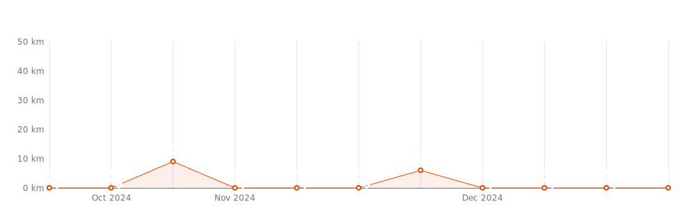
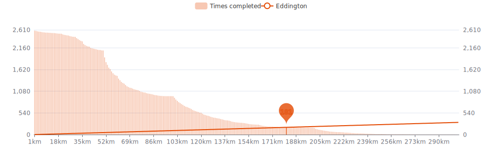

    

Since I began cycling `13 years and 6 months` ago on `06-03-2012`,
I had `2564 cycling days`. 
I recorded a total distance of `216 888 km`
(`5.41` trips around the world 🌍 and
`0.564` trips to the moon 🌕),
an elevation of `970 616 m`
(`109.7` times Mount Everest 🏔)
and a total time of `9mos 3w 6d 17h 57m` 🎉

That's a daily average of `48 km`,
a weekly average of `334 km` and a
monthly average of `1 446 km` 🐣

I burned `4829646 calories` doing so, that's about `17 888` pizza slices 🍕

---

<kbd><a href="#weekly-distances">Weekly distances</a></kbd> |
<kbd><a href="#activities">Activities</a></kbd> |
<kbd><a href="#monthly-stats">Monthly stats</a></kbd> |
<kbd><a href="#activity-intensity">Activity intensity</a></kbd> |
<kbd><a href="#stats-per-weekday">Stats per weekday</a></kbd> |
<kbd><a href="#daytime-stats">Daytime stats</a></kbd> |
<kbd><a href="#stats-per-bike">Stats per bike</a></kbd> |
<kbd><a href="#best-power-outputs-over-time">Power outputs</a></kbd> |
<kbd><a href="#eddington-chart">Eddington</a></kbd> |
<kbd><a href="#yearly-distances">Yearly distances</a></kbd> |
<kbd><a href="#distance-breakdown">Distance breakdown</a></kbd> |
<kbd><a href="#challenge-consistency">Challenge consistency</a></kbd> |
<kbd><a href="#completed-challenges">Completed challenges</a></kbd>

## Weekly distances

## Activities

<table>
    <tr>
        <th></th>
        <th></th>
        <th align="center"></th>
        <th align="center"></th>
        <th align="center"></th>
        <th align="center"></th>
        <th align="center"></th>
        <th align="center"></th>
    </tr>
            <tr>
            <td>18-08-24</td>
            <td>
                
<a href="https://www.strava.com/activities/12177856656" title="Kcal: 3240 | Gear: Canyon ">Op de koffie bij Marina ☕</a>
            </td>
            <td align="center">126 km</td>
            <td align="center">267 m</td>
            <td align="center">4:01:48</td>
            <td align="center">199 w</td>
            <td align="center">31.4 km/h</td>
            <td align="center">99</td>
        </tr>
            <tr>
            <td>17-08-24</td>
            <td>
                
<a href="https://www.strava.com/activities/12169191725" title="Kcal: 3912 | Gear: Canyon ">Pré trouwfeest VP 🌤️</a>
            </td>
            <td align="center">145 km</td>
            <td align="center">296 m</td>
            <td align="center">4:10:50</td>
            <td align="center">235 w</td>
            <td align="center">34.7 km/h</td>
            <td align="center">120</td>
        </tr>
            <tr>
            <td>16-08-24</td>
            <td>
                                
<a href="https://www.strava.com/activities/12164989330" title="Kcal: 2018 | Gear: Tacx Neo Bike Smart ">4x 10&#039; Z3 65rpm + los</a>
            </td>
            <td align="center">101 km</td>
            <td align="center">190 m</td>
            <td align="center">2:42:03</td>
            <td align="center">218 w</td>
            <td align="center">37.4 km/h</td>
            <td align="center">113</td>
        </tr>
            <tr>
            <td>15-08-24</td>
            <td>
                
<a href="https://www.strava.com/activities/12155682059" title="Kcal: 6408 | Gear: Canyon ">Schip ahoy piraatjes ⛴️🌞...</a>
            </td>
            <td align="center">237 km</td>
            <td align="center">569 m</td>
            <td align="center">7:32:22</td>
            <td align="center">211 w</td>
            <td align="center">31.4 km/h</td>
            <td align="center">111</td>
        </tr>
            <tr>
            <td>14-08-24</td>
            <td>
                
<a href="https://www.strava.com/activities/12146276782" title="Kcal: 5791 | Gear: Canyon ">Rondje Groningen 🌞 -&gt; ⛈️...</a>
            </td>
            <td align="center">213 km</td>
            <td align="center">585 m</td>
            <td align="center">6:31:31</td>
            <td align="center">222 w</td>
            <td align="center">32.6 km/h</td>
            <td align="center">112</td>
        </tr>
        </table>

    
Older activities

    <table>
        <tr>
            <th></th>
            <th></th>
            <th align="center"></th>
            <th align="center"></th>
            <th align="center"></th>
            <th align="center"></th>
            <th align="center"></th>
            <th align="center"></th>
        </tr>
                    <tr>
                <td>13-08-24</td>
                <td>
                    
<a href="https://www.strava.com/activities/12138391775" title="Kcal: 62 | Gear: Canyon ">Los</a>
                </td>
                <td align="center">4 km</td>
                <td align="center">4 m</td>
                <td align="center">10:21</td>
                <td align="center">75 w</td>
                <td align="center">20.3 km/h</td>
                <td align="center">88</td>
            </tr>
                    <tr>
                <td>13-08-24</td>
                <td>
                    
<a href="https://www.strava.com/activities/12138292147" title="Kcal: 5833 | Gear: Canyon ">Rondje Fryslan 🌡️</a>
                </td>
                <td align="center">221 km</td>
                <td align="center">362 m</td>
                <td align="center">6:32:12</td>
                <td align="center">222 w</td>
                <td align="center">33.8 km/h</td>
                <td align="center">117</td>
            </tr>
                    <tr>
                <td>12-08-24</td>
                <td>
                    
<a href="https://www.strava.com/activities/12129397310" title="Kcal: 5495 | Gear: Canyon ">Frankrijk in Nederland 🇨🇵 ...</a>
                </td>
                <td align="center">207 km</td>
                <td align="center">502 m</td>
                <td align="center">6:44:12</td>
                <td align="center">204 w</td>
                <td align="center">30.7 km/h</td>
                <td align="center">108</td>
            </tr>
                    <tr>
                <td>11-08-24</td>
                <td>
                    
<a href="https://www.strava.com/activities/12121719837" title="Kcal: 19 | Gear: Canyon ">Los</a>
                </td>
                <td align="center">1 km</td>
                <td align="center">2 m</td>
                <td align="center">3:46</td>
                <td align="center">65 w</td>
                <td align="center">17.3 km/h</td>
                <td align="center">86</td>
            </tr>
                    <tr>
                <td>11-08-24</td>
                <td>
                    
<a href="https://www.strava.com/activities/12121620166" title="Kcal: 5472 | Gear: Canyon ">Nederland 🇳🇱 = 🥰</a>
                </td>
                <td align="center">205 km</td>
                <td align="center">698 m</td>
                <td align="center">6:32:11</td>
                <td align="center">208 w</td>
                <td align="center">31.4 km/h</td>
                <td align="center">109</td>
            </tr>
                    <tr>
                <td>10-08-24</td>
                <td>
                    
<a href="https://www.strava.com/activities/12111099971" title="Kcal: 52 | Gear: Canyon ">Los</a>
                </td>
                <td align="center">3 km</td>
                <td align="center">10 m</td>
                <td align="center">11:09</td>
                <td align="center">52 w</td>
                <td align="center">17.8 km/h</td>
                <td align="center">90</td>
            </tr>
                    <tr>
                <td>10-08-24</td>
                <td>
                    
<a href="https://www.strava.com/activities/12111101046" title="Kcal: 6264 | Gear: Canyon ">VP blokjes + duurritje 🌞</a>
                </td>
                <td align="center">233 km</td>
                <td align="center">577 m</td>
                <td align="center">6:35:36</td>
                <td align="center">239 w</td>
                <td align="center">35.3 km/h</td>
                <td align="center">130</td>
            </tr>
                    <tr>
                <td>09-08-24</td>
                <td>
                    
<a href="https://www.strava.com/activities/12105529829" title="Kcal: 3060 | Gear: Canyon ">Retourtje naar Tournai 🌞💨...</a>
                </td>
                <td align="center">109 km</td>
                <td align="center">367 m</td>
                <td align="center">3:23:04</td>
                <td align="center">226 w</td>
                <td align="center">32.1 km/h</td>
                <td align="center">116</td>
            </tr>
                    <tr>
                <td>08-08-24</td>
                <td>
                    
<a href="https://www.strava.com/activities/12097740430" title="Kcal: 2656 | Gear: Canyon ">Vitesse Social Ride + H/T ...</a>
                </td>
                <td align="center">121 km</td>
                <td align="center">188 m</td>
                <td align="center">3:46:28</td>
                <td align="center">170 w</td>
                <td align="center">32.1 km/h</td>
                <td align="center">98</td>
            </tr>
                    <tr>
                <td>07-08-24</td>
                <td>
                    
<a href="https://www.strava.com/activities/12089316728" title="Kcal: 2819 | Gear: Canyon ">&quot;Nieuwe VO2max&quot; 🫁</a>
                </td>
                <td align="center">101 km</td>
                <td align="center">231 m</td>
                <td align="center">3:01:49</td>
                <td align="center">233 w</td>
                <td align="center">33.4 km/h</td>
                <td align="center">115</td>
            </tr>
                    <tr>
                <td>06-08-24</td>
                <td>
                    
<a href="https://www.strava.com/activities/12080351706" title="Kcal: 23 | Gear: Canyon ">Night Ride</a>
                </td>
                <td align="center">1 km</td>
                <td align="center">5 m</td>
                <td align="center">5:08</td>
                <td align="center">48 w</td>
                <td align="center">14.3 km/h</td>
                <td align="center">87</td>
            </tr>
                    <tr>
                <td>06-08-24</td>
                <td>
                    
<a href="https://www.strava.com/activities/12080352071" title="Kcal: 3890 | Gear: Canyon ">Poging tot vliegen met een...</a>
                </td>
                <td align="center">162 km</td>
                <td align="center">422 m</td>
                <td align="center">4:18:57</td>
                <td align="center">225 w</td>
                <td align="center">37.6 km/h</td>
                <td align="center">120</td>
            </tr>
                    <tr>
                <td>05-08-24</td>
                <td>
                    
<a href="https://www.strava.com/activities/12070956394" title="Kcal: 2790 | Gear: Canyon ">Met zin naar het Zwin 🌞🐦...</a>
                </td>
                <td align="center">105 km</td>
                <td align="center">213 m</td>
                <td align="center">3:19:08</td>
                <td align="center">208 w</td>
                <td align="center">31.8 km/h</td>
                <td align="center">107</td>
            </tr>
                    <tr>
                <td>04-08-24</td>
                <td>
                    
<a href="https://www.strava.com/activities/12062898729" title="Kcal: 20 | Gear: Canyon ">Een week afsluiten met 999...</a>
                </td>
                <td align="center">1 km</td>
                <td align="center">3 m</td>
                <td align="center">3:19</td>
                <td align="center">73 w</td>
                <td align="center">19.1 km/h</td>
                <td align="center">82</td>
            </tr>
                    <tr>
                <td>04-08-24</td>
                <td>
                    
<a href="https://www.strava.com/activities/12062313230" title="Kcal: 4890 | Gear: Canyon Grizl CF SLX 8 Di2 ">Schepdaal in de route opge...</a>
                </td>
                <td align="center">169 km</td>
                <td align="center">1 461 m</td>
                <td align="center">5:19:52</td>
                <td align="center">230 w</td>
                <td align="center">31.7 km/h</td>
                <td align="center">122</td>
            </tr>
                    <tr>
                <td>03-08-24</td>
                <td>
                    
<a href="https://www.strava.com/activities/12053854471" title="Kcal: 1777 | Gear: Canyon ">Part 2: Vlak ritje 👌</a>
                </td>
                <td align="center">70 km</td>
                <td align="center">240 m</td>
                <td align="center">2:11:46</td>
                <td align="center">200 w</td>
                <td align="center">32 km/h</td>
                <td align="center">116</td>
            </tr>
                    <tr>
                <td>03-08-24</td>
                <td>
                    
<a href="https://www.strava.com/activities/12052092906" title="Kcal: 66 | Gear: Canyon ">Lactaat wegfietsen 🙈</a>
                </td>
                <td align="center">4 km</td>
                <td align="center">23 m</td>
                <td align="center">10:15</td>
                <td align="center">83 w</td>
                <td align="center">20.7 km/h</td>
                <td align="center">99</td>
            </tr>
                    <tr>
                <td>03-08-24</td>
                <td>
                    
<a href="https://www.strava.com/activities/12051979921" title="Kcal: 4178 | Gear: Canyon ">De Eifel ontdekken 😍</a>
                </td>
                <td align="center">133 km</td>
                <td align="center">2 340 m</td>
                <td align="center">4:21:18</td>
                <td align="center">241 w</td>
                <td align="center">30.5 km/h</td>
                <td align="center">130</td>
            </tr>
                    <tr>
                <td>02-08-24</td>
                <td>
                    
<a href="https://www.strava.com/activities/12045547324" title="Kcal: 5924 | Gear: Canyon ">Team 3R September meetup r...</a>
                </td>
                <td align="center">205 km</td>
                <td align="center">2 067 m</td>
                <td align="center">6:32:25</td>
                <td align="center">226 w</td>
                <td align="center">31.4 km/h</td>
                <td align="center">129</td>
            </tr>
                    <tr>
                <td>01-08-24</td>
                <td>
                    
<a href="https://www.strava.com/activities/12037983340" title="Kcal: 1845 | Gear: Canyon ">2 uur op de kop ✅</a>
                </td>
                <td align="center">67 km</td>
                <td align="center">134 m</td>
                <td align="center">2:00:05</td>
                <td align="center">231 w</td>
                <td align="center">33.5 km/h</td>
                <td align="center">119</td>
            </tr>
                    <tr>
                <td>31-07-24</td>
                <td>
                    
<a href="https://www.strava.com/activities/12030023168" title="Kcal: 36 | Gear: Canyon ">Los</a>
                </td>
                <td align="center">2 km</td>
                <td align="center">5 m</td>
                <td align="center">8:17</td>
                <td align="center">47 w</td>
                <td align="center">16.3 km/h</td>
                <td align="center">87</td>
            </tr>
                    <tr>
                <td>31-07-24</td>
                <td>
                    
<a href="https://www.strava.com/activities/12029952856" title="Kcal: 2869 | Gear: Canyon ">52x11 blokjes 🌞</a>
                </td>
                <td align="center">104 km</td>
                <td align="center">159 m</td>
                <td align="center">3:01:57</td>
                <td align="center">237 w</td>
                <td align="center">34.2 km/h</td>
                <td align="center">121</td>
            </tr>
                    <tr>
                <td>30-07-24</td>
                <td>
                    
<a href="https://www.strava.com/activities/12021378852" title="Kcal: 3768 | Gear: Canyon ">Als een kip in een airfrye...</a>
                </td>
                <td align="center">162 km</td>
                <td align="center">414 m</td>
                <td align="center">4:18:53</td>
                <td align="center">216 w</td>
                <td align="center">37.6 km/h</td>
                <td align="center">125</td>
            </tr>
                    <tr>
                <td>29-07-24</td>
                <td>
                    
<a href="https://www.strava.com/activities/12012610649" title="Kcal: 2357 | Gear: Canyon ">Oortjes vergeten op buro 🤭</a>
                </td>
                <td align="center">84 km</td>
                <td align="center">292 m</td>
                <td align="center">2:35:38</td>
                <td align="center">227 w</td>
                <td align="center">32.3 km/h</td>
                <td align="center">114</td>
            </tr>
                    <tr>
                <td>28-07-24</td>
                <td>
                    
<a href="https://www.strava.com/activities/12004223214" title="Kcal: 651 | Gear: Canyon Grizl CF SLX 8 Di2 ">Fietsfotozoektocht 👀🕵️‍♂️...</a>
                </td>
                <td align="center">40 km</td>
                <td align="center">131 m</td>
                <td align="center">2:28:08</td>
                <td align="center">48 w</td>
                <td align="center">16.2 km/h</td>
                <td align="center">88</td>
            </tr>
                    <tr>
                <td>28-07-24</td>
                <td>
                    
<a href="https://www.strava.com/activities/12001068642" title="Kcal: 4415 | Gear: Canyon ">WTC Kruiskerke - Nieuwvlie...</a>
                </td>
                <td align="center">162 km</td>
                <td align="center">350 m</td>
                <td align="center">4:50:03</td>
                <td align="center">228 w</td>
                <td align="center">33.5 km/h</td>
                <td align="center">116</td>
            </tr>
                    <tr>
                <td>27-07-24</td>
                <td>
                    
<a href="https://www.strava.com/activities/11994229157" title="Kcal: 38 | Gear: Ridley Fenix SLX Disc ">Afternoon Ride</a>
                </td>
                <td align="center">2 km</td>
                <td align="center">7 m</td>
                <td align="center">6:39</td>
                <td align="center">69 w</td>
                <td align="center">19.4 km/h</td>
                <td align="center">97</td>
            </tr>
                    <tr>
                <td>27-07-24</td>
                <td>
                    
<a href="https://www.strava.com/activities/11994230691" title="Kcal: 6183 | Gear: Canyon ">VP + familiebezoek aan zee...</a>
                </td>
                <td align="center">228 km</td>
                <td align="center">381 m</td>
                <td align="center">6:34:11</td>
                <td align="center">236 w</td>
                <td align="center">34.7 km/h</td>
                <td align="center">131</td>
            </tr>
                    <tr>
                <td>26-07-24</td>
                <td>
                    
<a href="https://www.strava.com/activities/11988071126" title="Kcal: 2147 | Gear: Canyon ">Weeral weekend 🙌</a>
                </td>
                <td align="center">75 km</td>
                <td align="center">134 m</td>
                <td align="center">2:10:50</td>
                <td align="center">248 w</td>
                <td align="center">34.4 km/h</td>
                <td align="center">125</td>
            </tr>
                    <tr>
                <td>25-07-24</td>
                <td>
                                    
<a href="https://www.strava.com/activities/11980388721" title="Kcal: 744 | Gear: Tacx Neo Bike Smart ">10x 400W 40/20 in Watopia</a>
                </td>
                <td align="center">34 km</td>
                <td align="center">53 m</td>
                <td align="center">52:26</td>
                <td align="center">248 w</td>
                <td align="center">38.5 km/h</td>
                <td align="center">130</td>
            </tr>
                    <tr>
                <td>25-07-24</td>
                <td>
                    
<a href="https://www.strava.com/activities/11979064595" title="Kcal: 806 | Gear: Canyon ">Geen zin in regen 🫠</a>
                </td>
                <td align="center">27 km</td>
                <td align="center">147 m</td>
                <td align="center">50:33</td>
                <td align="center">241 w</td>
                <td align="center">31.7 km/h</td>
                <td align="center">111</td>
            </tr>
                    <tr>
                <td>24-07-24</td>
                <td>
                    
<a href="https://www.strava.com/activities/11970294751" title="Kcal: 5760 | Gear: Canyon ">Rondje stoplichten en open...</a>
                </td>
                <td align="center">204 km</td>
                <td align="center">501 m</td>
                <td align="center">6:35:03</td>
                <td align="center">220 w</td>
                <td align="center">30.9 km/h</td>
                <td align="center">109</td>
            </tr>
                    <tr>
                <td>23-07-24</td>
                <td>
                    
<a href="https://www.strava.com/activities/11961635451" title="Kcal: 4200 | Gear: Canyon Grizl CF SLX 8 Di2 ">Genieten met een grote G v...</a>
                </td>
                <td align="center">161 km</td>
                <td align="center">593 m</td>
                <td align="center">6:08:20</td>
                <td align="center">165 w</td>
                <td align="center">26.3 km/h</td>
                <td align="center">101</td>
            </tr>
                    <tr>
                <td>22-07-24</td>
                <td>
                    
<a href="https://www.strava.com/activities/11952434454" title="Kcal: 41 | Gear: Ridley Fenix SLX Disc ">Afternoon Ride</a>
                </td>
                <td align="center">2 km</td>
                <td align="center">8 m</td>
                <td align="center">6:38</td>
                <td align="center">79 w</td>
                <td align="center">18.7 km/h</td>
                <td align="center">93</td>
            </tr>
                    <tr>
                <td>22-07-24</td>
                <td>
                    
<a href="https://www.strava.com/activities/11952435266" title="Kcal: 6176 | Gear: Canyon ">Gemeentes afvinken 😎 🇳🇱...</a>
                </td>
                <td align="center">211 km</td>
                <td align="center">932 m</td>
                <td align="center">6:31:13</td>
                <td align="center">238 w</td>
                <td align="center">32.4 km/h</td>
                <td align="center">119</td>
            </tr>
                    <tr>
                <td>21-07-24</td>
                <td>
                    
<a href="https://www.strava.com/activities/11945420761" title="Kcal: 41 | Gear: Ridley Fenix SLX Disc ">Afternoon Ride</a>
                </td>
                <td align="center">2 km</td>
                <td align="center">9 m</td>
                <td align="center">8:08</td>
                <td align="center">59 w</td>
                <td align="center">16.9 km/h</td>
                <td align="center">94</td>
            </tr>
                    <tr>
                <td>21-07-24</td>
                <td>
                    
<a href="https://www.strava.com/activities/11945334904" title="Kcal: 6070 | Gear: Canyon ">De Veluwe 🇳🇱🌦️</a>
                </td>
                <td align="center">209 km</td>
                <td align="center">1 332 m</td>
                <td align="center">6:33:54</td>
                <td align="center">232 w</td>
                <td align="center">31.8 km/h</td>
                <td align="center">121</td>
            </tr>
                    <tr>
                <td>20-07-24</td>
                <td>
                    
<a href="https://www.strava.com/activities/11935073085" title="Kcal: 29 | Gear: Ridley Fenix SLX Disc ">Afternoon Ride</a>
                </td>
                <td align="center">2 km</td>
                <td align="center">5 m</td>
                <td align="center">5:38</td>
                <td align="center">62 w</td>
                <td align="center">16.6 km/h</td>
                <td align="center">106</td>
            </tr>
                    <tr>
                <td>20-07-24</td>
                <td>
                    
<a href="https://www.strava.com/activities/11935072964" title="Kcal: 5667 | Gear: Canyon ">VP + blokjes + duur 🌧️ -&gt; ...</a>
                </td>
                <td align="center">206 km</td>
                <td align="center">508 m</td>
                <td align="center">6:03:12</td>
                <td align="center">235 w</td>
                <td align="center">34.1 km/h</td>
                <td align="center">134</td>
            </tr>
                    <tr>
                <td>19-07-24</td>
                <td>
                    
<a href="https://www.strava.com/activities/11929436172" title="Kcal: 3040 | Gear: Canyon ">Congé = naar zee 🌞😎</a>
                </td>
                <td align="center">115 km</td>
                <td align="center">213 m</td>
                <td align="center">3:38:46</td>
                <td align="center">206 w</td>
                <td align="center">31.4 km/h</td>
                <td align="center">115</td>
            </tr>
                    <tr>
                <td>18-07-24</td>
                <td>
                    
<a href="https://www.strava.com/activities/11921840174" title="Kcal: 2324 | Gear: Canyon ">Op verplaatsing 🌡️</a>
                </td>
                <td align="center">76 km</td>
                <td align="center">70 m</td>
                <td align="center">2:10:09</td>
                <td align="center">272 w</td>
                <td align="center">35.2 km/h</td>
                <td align="center">135</td>
            </tr>
                    <tr>
                <td>17-07-24</td>
                <td>
                    
<a href="https://www.strava.com/activities/11913578830" title="Kcal: 2664 | Gear: Canyon Grizl CF SLX 8 Di2 ">WTC Ruyslee + extra uurtje</a>
                </td>
                <td align="center">101 km</td>
                <td align="center">234 m</td>
                <td align="center">3:12:08</td>
                <td align="center">205 w</td>
                <td align="center">31.6 km/h</td>
                <td align="center">115</td>
            </tr>
                    <tr>
                <td>16-07-24</td>
                <td>
                    
<a href="https://www.strava.com/activities/11904817092" title="Kcal: 3823 | Gear: Canyon ">Niet op reis, wél naar een...</a>
                </td>
                <td align="center">142 km</td>
                <td align="center">378 m</td>
                <td align="center">4:01:25</td>
                <td align="center">238 w</td>
                <td align="center">35.3 km/h</td>
                <td align="center">129</td>
            </tr>
                    <tr>
                <td>15-07-24</td>
                <td>
                                    
<a href="https://www.strava.com/activities/11896309010" title="Kcal: 1347 | Gear: Tacx Neo Bike Smart ">5x 300W 65rpm in Watopia</a>
                </td>
                <td align="center">60 km</td>
                <td align="center">91 m</td>
                <td align="center">1:32:40</td>
                <td align="center">254 w</td>
                <td align="center">39 km/h</td>
                <td align="center">129</td>
            </tr>
                    <tr>
                <td>14-07-24</td>
                <td>
                    
<a href="https://www.strava.com/activities/11885837898" title="Kcal: 5855 | Gear: Canyon ">WTC Kruiskerke + extra 🚴‍♂...</a>
                </td>
                <td align="center">207 km</td>
                <td align="center">569 m</td>
                <td align="center">6:21:24</td>
                <td align="center">230 w</td>
                <td align="center">32.6 km/h</td>
                <td align="center">128</td>
            </tr>
                    <tr>
                <td>13-07-24</td>
                <td>
                    
<a href="https://www.strava.com/activities/11879099991" title="Kcal: 3274 | Gear: Canyon ">Pré BBQ 🍖</a>
                </td>
                <td align="center">107 km</td>
                <td align="center">236 m</td>
                <td align="center">3:02:04</td>
                <td align="center">274 w</td>
                <td align="center">35.3 km/h</td>
                <td align="center">137</td>
            </tr>
                    <tr>
                <td>12-07-24</td>
                <td>
                                    
<a href="https://www.strava.com/activities/11872461769" title="Kcal: 1308 | Gear: Tacx Neo Bike Smart ">12x 30&quot; 450W in Watopia</a>
                </td>
                <td align="center">60 km</td>
                <td align="center">91 m</td>
                <td align="center">1:35:54</td>
                <td align="center">238 w</td>
                <td align="center">37.7 km/h</td>
                <td align="center">126</td>
            </tr>
                    <tr>
                <td>11-07-24</td>
                <td>
                    
<a href="https://www.strava.com/activities/11864946196" title="Kcal: 2646 | Gear: Canyon ">Sprints 😩 -&gt; Vitesse Socia...</a>
                </td>
                <td align="center">111 km</td>
                <td align="center">218 m</td>
                <td align="center">3:30:19</td>
                <td align="center">184 w</td>
                <td align="center">31.5 km/h</td>
                <td align="center">116</td>
            </tr>
                    <tr>
                <td>10-07-24</td>
                <td>
                    
<a href="https://www.strava.com/activities/11857000003" title="Kcal: 2577 | Gear: Canyon Grizl CF SLX 8 Di2 ">Voorritje + WTC Ruyslee 🌞</a>
                </td>
                <td align="center">103 km</td>
                <td align="center">285 m</td>
                <td align="center">3:16:40</td>
                <td align="center">191 w</td>
                <td align="center">31.5 km/h</td>
                <td align="center">113</td>
            </tr>
                    <tr>
                <td>08-07-24</td>
                <td>
                    
<a href="https://www.strava.com/activities/11839976305" title="Kcal: 1908 | Gear: Canyon ">De zon er maar bij gefanta...</a>
                </td>
                <td align="center">65 km</td>
                <td align="center">125 m</td>
                <td align="center">2:00:33</td>
                <td align="center">237 w</td>
                <td align="center">32.6 km/h</td>
                <td align="center">120</td>
            </tr>
            </table>

## Monthly stats

<table>
    <thead>
    <tr>
        <th>&nbsp;&nbsp;&nbsp;&nbsp;&nbsp;</th>
        <th># of rides</th>
        <th align="center"></th>
        <th align="center"></th>
        <th align="center"></th>
        <th align="center"></th>
    </tr>
    </thead>
    <tbody>
            <tr>
            <td align="center">August 2024</td>
            <td align="center">25</td>
            <td align="center">2 944 km</td>
            <td align="center">11 756 m</td>
            <td align="center">3d 18h 21m</td>
            <td align="center">10</td>
        </tr>
            <tr>
            <td align="center">July 2024</td>
            <td align="center">38</td>
            <td align="center">3 628 km</td>
            <td align="center">18 073 m</td>
            <td align="center">4d 19h 27m</td>
            <td align="center">7</td>
        </tr>
            <tr>
            <td align="center">June 2024</td>
            <td align="center">37</td>
            <td align="center">2 659 km</td>
            <td align="center">10 398 m</td>
            <td align="center">3d 9h 34m</td>
            <td align="center">8</td>
        </tr>
            <tr>
            <td align="center">May 2024</td>
            <td align="center">27</td>
            <td align="center">904 km</td>
            <td align="center">2 713 m</td>
            <td align="center">1d 4h 52m</td>
            <td align="center">0</td>
        </tr>
            <tr>
            <td align="center">April 2024</td>
            <td align="center">40</td>
            <td align="center">2 754 km</td>
            <td align="center">12 262 m</td>
            <td align="center">3d 13h 48m</td>
            <td align="center">8</td>
        </tr>
            <tr>
            <td align="center">March 2024</td>
            <td align="center">56</td>
            <td align="center">3 785 km</td>
            <td align="center">15 034 m</td>
            <td align="center">4d 18h 10m</td>
            <td align="center">7</td>
        </tr>
            <tr>
            <td align="center">February 2024</td>
            <td align="center">82</td>
            <td align="center">3 387 km</td>
            <td align="center">14 334 m</td>
            <td align="center">3d 19h 13m</td>
            <td align="center">7</td>
        </tr>
            <tr>
            <td align="center">January 2024</td>
            <td align="center">114</td>
            <td align="center">3 841 km</td>
            <td align="center">18 123 m</td>
            <td align="center">4d 6h 46m</td>
            <td align="center">6</td>
        </tr>
            <tr>
            <td align="center">December 2023</td>
            <td align="center">90</td>
            <td align="center">3 823 km</td>
            <td align="center">14 309 m</td>
            <td align="center">4d 8h 54m</td>
            <td align="center">0</td>
        </tr>
            <tr>
            <td align="center">November 2023</td>
            <td align="center">94</td>
            <td align="center">4 087 km</td>
            <td align="center">16 273 m</td>
            <td align="center">4d 16h 52m</td>
            <td align="center">0</td>
        </tr>
            <tr>
            <td align="center">October 2023</td>
            <td align="center">87</td>
            <td align="center">3 728 km</td>
            <td align="center">16 280 m</td>
            <td align="center">4d 16h 30m</td>
            <td align="center">0</td>
        </tr>
            <tr>
            <td align="center">September 2023</td>
            <td align="center">49</td>
            <td align="center">3 439 km</td>
            <td align="center">11 468 m</td>
            <td align="center">4d 9h 53m</td>
            <td align="center">0</td>
        </tr>
            <tr>
            <td align="center">August 2023</td>
            <td align="center">45</td>
            <td align="center">3 389 km</td>
            <td align="center">14 787 m</td>
            <td align="center">4d 5h 39m</td>
            <td align="center">0</td>
        </tr>
            <tr>
            <td align="center">July 2023</td>
            <td align="center">39</td>
            <td align="center">3 539 km</td>
            <td align="center">32 069 m</td>
            <td align="center">4d 20h 6m</td>
            <td align="center">0</td>
        </tr>
            <tr>
            <td align="center">June 2023</td>
            <td align="center">40</td>
            <td align="center">3 157 km</td>
            <td align="center">11 611 m</td>
            <td align="center">4d 49m</td>
            <td align="center">0</td>
        </tr>
            <tr>
            <td align="center">May 2023</td>
            <td align="center">45</td>
            <td align="center">3 650 km</td>
            <td align="center">26 833 m</td>
            <td align="center">4d 19h 37m</td>
            <td align="center">0</td>
        </tr>
            <tr>
            <td align="center">April 2023</td>
            <td align="center">55</td>
            <td align="center">3 412 km</td>
            <td align="center">15 247 m</td>
            <td align="center">4d 9h 21m</td>
            <td align="center">0</td>
        </tr>
            <tr>
            <td align="center">March 2023</td>
            <td align="center">67</td>
            <td align="center">3 378 km</td>
            <td align="center">16 918 m</td>
            <td align="center">3d 20h 52m</td>
            <td align="center">0</td>
        </tr>
            <tr>
            <td align="center">February 2023</td>
            <td align="center">46</td>
            <td align="center">2 791 km</td>
            <td align="center">14 908 m</td>
            <td align="center">3d 5h 3m</td>
            <td align="center">0</td>
        </tr>
            <tr>
            <td align="center">January 2023</td>
            <td align="center">57</td>
            <td align="center">2 777 km</td>
            <td align="center">17 265 m</td>
            <td align="center">3d 4h 13m</td>
            <td align="center">0</td>
        </tr>
            <tr>
            <td align="center">December 2022</td>
            <td align="center">53</td>
            <td align="center">3 009 km</td>
            <td align="center">16 107 m</td>
            <td align="center">3d 6h 6m</td>
            <td align="center">0</td>
        </tr>
            <tr>
            <td align="center">November 2022</td>
            <td align="center">60</td>
            <td align="center">2 690 km</td>
            <td align="center">15 451 m</td>
            <td align="center">3d 3h 21m</td>
            <td align="center">0</td>
        </tr>
            <tr>
            <td align="center">October 2022</td>
            <td align="center">51</td>
            <td align="center">2 889 km</td>
            <td align="center">14 669 m</td>
            <td align="center">3d 13h 34m</td>
            <td align="center">0</td>
        </tr>
            <tr>
            <td align="center">September 2022</td>
            <td align="center">46</td>
            <td align="center">2 478 km</td>
            <td align="center">13 362 m</td>
            <td align="center">2d 21h</td>
            <td align="center">0</td>
        </tr>
            <tr>
            <td align="center">August 2022</td>
            <td align="center">41</td>
            <td align="center">2 895 km</td>
            <td align="center">9 454 m</td>
            <td align="center">3d 18h 37m</td>
            <td align="center">0</td>
        </tr>
            <tr>
            <td align="center">July 2022</td>
            <td align="center">43</td>
            <td align="center">2 750 km</td>
            <td align="center">12 477 m</td>
            <td align="center">3d 19h 30m</td>
            <td align="center">0</td>
        </tr>
            <tr>
            <td align="center">June 2022</td>
            <td align="center">48</td>
            <td align="center">2 519 km</td>
            <td align="center">9 963 m</td>
            <td align="center">3d 3h 24m</td>
            <td align="center">0</td>
        </tr>
            <tr>
            <td align="center">May 2022</td>
            <td align="center">51</td>
            <td align="center">3 000 km</td>
            <td align="center">13 182 m</td>
            <td align="center">4d 1h 31m</td>
            <td align="center">0</td>
        </tr>
            <tr>
            <td align="center">April 2022</td>
            <td align="center">49</td>
            <td align="center">2 939 km</td>
            <td align="center">9 928 m</td>
            <td align="center">3d 20h 8m</td>
            <td align="center">0</td>
        </tr>
            <tr>
            <td align="center">March 2022</td>
            <td align="center">46</td>
            <td align="center">2 007 km</td>
            <td align="center">7 906 m</td>
            <td align="center">2d 12h 58m</td>
            <td align="center">0</td>
        </tr>
            <tr>
            <td align="center">February 2022</td>
            <td align="center">46</td>
            <td align="center">2 428 km</td>
            <td align="center">12 346 m</td>
            <td align="center">2d 19h 41m</td>
            <td align="center">0</td>
        </tr>
            <tr>
            <td align="center">January 2022</td>
            <td align="center">61</td>
            <td align="center">2 974 km</td>
            <td align="center">19 999 m</td>
            <td align="center">3d 8h 47m</td>
            <td align="center">0</td>
        </tr>
            <tr>
            <td align="center">December 2021</td>
            <td align="center">58</td>
            <td align="center">2 680 km</td>
            <td align="center">14 437 m</td>
            <td align="center">3d 2h 19m</td>
            <td align="center">0</td>
        </tr>
            <tr>
            <td align="center">November 2021</td>
            <td align="center">69</td>
            <td align="center">2 667 km</td>
            <td align="center">15 565 m</td>
            <td align="center">3d 45m</td>
            <td align="center">0</td>
        </tr>
            <tr>
            <td align="center">October 2021</td>
            <td align="center">46</td>
            <td align="center">2 513 km</td>
            <td align="center">11 094 m</td>
            <td align="center">2d 23h 14m</td>
            <td align="center">0</td>
        </tr>
            <tr>
            <td align="center">September 2021</td>
            <td align="center">42</td>
            <td align="center">2 652 km</td>
            <td align="center">7 809 m</td>
            <td align="center">3d 6h 53m</td>
            <td align="center">0</td>
        </tr>
            <tr>
            <td align="center">August 2021</td>
            <td align="center">32</td>
            <td align="center">2 947 km</td>
            <td align="center">11 392 m</td>
            <td align="center">3d 19h 53m</td>
            <td align="center">0</td>
        </tr>
            <tr>
            <td align="center">July 2021</td>
            <td align="center">39</td>
            <td align="center">2 700 km</td>
            <td align="center">7 769 m</td>
            <td align="center">3d 10h 59m</td>
            <td align="center">0</td>
        </tr>
            <tr>
            <td align="center">June 2021</td>
            <td align="center">37</td>
            <td align="center">2 858 km</td>
            <td align="center">8 389 m</td>
            <td align="center">3d 12h 32m</td>
            <td align="center">0</td>
        </tr>
            <tr>
            <td align="center">May 2021</td>
            <td align="center">48</td>
            <td align="center">2 952 km</td>
            <td align="center">10 205 m</td>
            <td align="center">3d 9h 21m</td>
            <td align="center">0</td>
        </tr>
            <tr>
            <td align="center">April 2021</td>
            <td align="center">46</td>
            <td align="center">2 611 km</td>
            <td align="center">8 266 m</td>
            <td align="center">3d 40m</td>
            <td align="center">0</td>
        </tr>
            <tr>
            <td align="center">March 2021</td>
            <td align="center">51</td>
            <td align="center">2 544 km</td>
            <td align="center">8 544 m</td>
            <td align="center">2d 22h 14m</td>
            <td align="center">0</td>
        </tr>
            <tr>
            <td align="center">February 2021</td>
            <td align="center">54</td>
            <td align="center">2 312 km</td>
            <td align="center">13 855 m</td>
            <td align="center">2d 12h 19m</td>
            <td align="center">0</td>
        </tr>
            <tr>
            <td align="center">January 2021</td>
            <td align="center">59</td>
            <td align="center">2 830 km</td>
            <td align="center">12 827 m</td>
            <td align="center">2d 22h 56m</td>
            <td align="center">0</td>
        </tr>
            <tr>
            <td align="center">December 2020</td>
            <td align="center">60</td>
            <td align="center">2 409 km</td>
            <td align="center">9 164 m</td>
            <td align="center">2d 11h 13m</td>
            <td align="center">0</td>
        </tr>
            <tr>
            <td align="center">November 2020</td>
            <td align="center">51</td>
            <td align="center">2 342 km</td>
            <td align="center">11 147 m</td>
            <td align="center">2d 14h 38m</td>
            <td align="center">0</td>
        </tr>
            <tr>
            <td align="center">October 2020</td>
            <td align="center">44</td>
            <td align="center">2 241 km</td>
            <td align="center">10 405 m</td>
            <td align="center">2d 9h 18m</td>
            <td align="center">0</td>
        </tr>
            <tr>
            <td align="center">September 2020</td>
            <td align="center">38</td>
            <td align="center">1 924 km</td>
            <td align="center">8 980 m</td>
            <td align="center">2d 6h 39m</td>
            <td align="center">0</td>
        </tr>
            <tr>
            <td align="center">August 2020</td>
            <td align="center">51</td>
            <td align="center">2 470 km</td>
            <td align="center">11 556 m</td>
            <td align="center">3d 8h 39m</td>
            <td align="center">0</td>
        </tr>
            <tr>
            <td align="center">July 2020</td>
            <td align="center">38</td>
            <td align="center">2 070 km</td>
            <td align="center">14 947 m</td>
            <td align="center">2d 21h 53m</td>
            <td align="center">0</td>
        </tr>
            <tr>
            <td align="center">June 2020</td>
            <td align="center">41</td>
            <td align="center">2 234 km</td>
            <td align="center">11 449 m</td>
            <td align="center">2d 23h 14m</td>
            <td align="center">0</td>
        </tr>
            <tr>
            <td align="center">May 2020</td>
            <td align="center">50</td>
            <td align="center">2 748 km</td>
            <td align="center">12 215 m</td>
            <td align="center">3d 19h 4m</td>
            <td align="center">0</td>
        </tr>
            <tr>
            <td align="center">April 2020</td>
            <td align="center">40</td>
            <td align="center">2 581 km</td>
            <td align="center">10 202 m</td>
            <td align="center">3d 14h 18m</td>
            <td align="center">0</td>
        </tr>
            <tr>
            <td align="center">March 2020</td>
            <td align="center">42</td>
            <td align="center">2 170 km</td>
            <td align="center">10 608 m</td>
            <td align="center">2d 21h 51m</td>
            <td align="center">0</td>
        </tr>
            <tr>
            <td align="center">February 2020</td>
            <td align="center">30</td>
            <td align="center">1 765 km</td>
            <td align="center">10 457 m</td>
            <td align="center">2d 4h 14m</td>
            <td align="center">0</td>
        </tr>
            <tr>
            <td align="center">January 2020</td>
            <td align="center">33</td>
            <td align="center">1 617 km</td>
            <td align="center">9 485 m</td>
            <td align="center">2d 3h 36m</td>
            <td align="center">0</td>
        </tr>
            <tr>
            <td align="center">December 2019</td>
            <td align="center">29</td>
            <td align="center">1 421 km</td>
            <td align="center">5 972 m</td>
            <td align="center">1d 21h 29m</td>
            <td align="center">0</td>
        </tr>
            <tr>
            <td align="center">November 2019</td>
            <td align="center">26</td>
            <td align="center">1 345 km</td>
            <td align="center">7 087 m</td>
            <td align="center">2d 2h 19m</td>
            <td align="center">0</td>
        </tr>
            <tr>
            <td align="center">October 2019</td>
            <td align="center">27</td>
            <td align="center">1 315 km</td>
            <td align="center">6 299 m</td>
            <td align="center">1d 20h 14m</td>
            <td align="center">0</td>
        </tr>
            <tr>
            <td align="center">September 2019</td>
            <td align="center">19</td>
            <td align="center">637 km</td>
            <td align="center">6 449 m</td>
            <td align="center">22h 40m</td>
            <td align="center">0</td>
        </tr>
            <tr>
            <td align="center">August 2019</td>
            <td align="center">31</td>
            <td align="center">1 835 km</td>
            <td align="center">9 322 m</td>
            <td align="center">2d 13h 58m</td>
            <td align="center">0</td>
        </tr>
            <tr>
            <td align="center">July 2019</td>
            <td align="center">25</td>
            <td align="center">1 950 km</td>
            <td align="center">13 992 m</td>
            <td align="center">2d 20h 46m</td>
            <td align="center">0</td>
        </tr>
            <tr>
            <td align="center">June 2019</td>
            <td align="center">28</td>
            <td align="center">1 333 km</td>
            <td align="center">9 513 m</td>
            <td align="center">1d 21h 47m</td>
            <td align="center">0</td>
        </tr>
            <tr>
            <td align="center">May 2019</td>
            <td align="center">27</td>
            <td align="center">1 634 km</td>
            <td align="center">4 996 m</td>
            <td align="center">2d 8h 26m</td>
            <td align="center">0</td>
        </tr>
            <tr>
            <td align="center">April 2019</td>
            <td align="center">24</td>
            <td align="center">1 468 km</td>
            <td align="center">9 511 m</td>
            <td align="center">2d 1h 53m</td>
            <td align="center">0</td>
        </tr>
            <tr>
            <td align="center">March 2019</td>
            <td align="center">27</td>
            <td align="center">1 987 km</td>
            <td align="center">10 098 m</td>
            <td align="center">2d 16h 30m</td>
            <td align="center">0</td>
        </tr>
            <tr>
            <td align="center">February 2019</td>
            <td align="center">31</td>
            <td align="center">1 537 km</td>
            <td align="center">7 768 m</td>
            <td align="center">2d 1h 35m</td>
            <td align="center">0</td>
        </tr>
            <tr>
            <td align="center">January 2019</td>
            <td align="center">25</td>
            <td align="center">1 420 km</td>
            <td align="center">6 972 m</td>
            <td align="center">1d 22h 39m</td>
            <td align="center">0</td>
        </tr>
            <tr>
            <td align="center">December 2018</td>
            <td align="center">33</td>
            <td align="center">1 469 km</td>
            <td align="center">6 626 m</td>
            <td align="center">2d 6h 41m</td>
            <td align="center">0</td>
        </tr>
            <tr>
            <td align="center">November 2018</td>
            <td align="center">30</td>
            <td align="center">1 164 km</td>
            <td align="center">5 735 m</td>
            <td align="center">1d 19h 43m</td>
            <td align="center">0</td>
        </tr>
            <tr>
            <td align="center">October 2018</td>
            <td align="center">27</td>
            <td align="center">1 153 km</td>
            <td align="center">4 780 m</td>
            <td align="center">1d 16h 57m</td>
            <td align="center">0</td>
        </tr>
            <tr>
            <td align="center">September 2018</td>
            <td align="center">33</td>
            <td align="center">1 487 km</td>
            <td align="center">3 617 m</td>
            <td align="center">2d 3h 10m</td>
            <td align="center">0</td>
        </tr>
            <tr>
            <td align="center">August 2018</td>
            <td align="center">37</td>
            <td align="center">1 451 km</td>
            <td align="center">4 662 m</td>
            <td align="center">1d 23h 32m</td>
            <td align="center">0</td>
        </tr>
            <tr>
            <td align="center">July 2018</td>
            <td align="center">32</td>
            <td align="center">1 513 km</td>
            <td align="center">3 395 m</td>
            <td align="center">2d 9m</td>
            <td align="center">0</td>
        </tr>
            <tr>
            <td align="center">June 2018</td>
            <td align="center">33</td>
            <td align="center">1 702 km</td>
            <td align="center">7 189 m</td>
            <td align="center">2d 7h 56m</td>
            <td align="center">0</td>
        </tr>
            <tr>
            <td align="center">May 2018</td>
            <td align="center">44</td>
            <td align="center">1 809 km</td>
            <td align="center">5 865 m</td>
            <td align="center">2d 15h 11m</td>
            <td align="center">0</td>
        </tr>
            <tr>
            <td align="center">April 2018</td>
            <td align="center">44</td>
            <td align="center">1 674 km</td>
            <td align="center">7 618 m</td>
            <td align="center">2d 6h 59m</td>
            <td align="center">0</td>
        </tr>
            <tr>
            <td align="center">March 2018</td>
            <td align="center">33</td>
            <td align="center">1 193 km</td>
            <td align="center">8 585 m</td>
            <td align="center">1d 16h 30m</td>
            <td align="center">0</td>
        </tr>
            <tr>
            <td align="center">February 2018</td>
            <td align="center">28</td>
            <td align="center">1 080 km</td>
            <td align="center">5 278 m</td>
            <td align="center">1d 12h 47m</td>
            <td align="center">0</td>
        </tr>
            <tr>
            <td align="center">January 2018</td>
            <td align="center">31</td>
            <td align="center">1 054 km</td>
            <td align="center">5 974 m</td>
            <td align="center">1d 12h 5m</td>
            <td align="center">0</td>
        </tr>
            <tr>
            <td align="center">December 2017</td>
            <td align="center">28</td>
            <td align="center">852 km</td>
            <td align="center">5 511 m</td>
            <td align="center">1d 8h 8m</td>
            <td align="center">0</td>
        </tr>
            <tr>
            <td align="center">November 2017</td>
            <td align="center">29</td>
            <td align="center">861 km</td>
            <td align="center">1 984 m</td>
            <td align="center">1d 6h 42m</td>
            <td align="center">0</td>
        </tr>
            <tr>
            <td align="center">October 2017</td>
            <td align="center">22</td>
            <td align="center">743 km</td>
            <td align="center">1 992 m</td>
            <td align="center">1d 2h 20m</td>
            <td align="center">0</td>
        </tr>
            <tr>
            <td align="center">September 2017</td>
            <td align="center">33</td>
            <td align="center">1 169 km</td>
            <td align="center">2 102 m</td>
            <td align="center">1d 15h 58m</td>
            <td align="center">0</td>
        </tr>
            <tr>
            <td align="center">August 2017</td>
            <td align="center">26</td>
            <td align="center">1 050 km</td>
            <td align="center">4 237 m</td>
            <td align="center">1d 12h 8m</td>
            <td align="center">0</td>
        </tr>
            <tr>
            <td align="center">July 2017</td>
            <td align="center">38</td>
            <td align="center">1 319 km</td>
            <td align="center">4 105 m</td>
            <td align="center">1d 20h 46m</td>
            <td align="center">0</td>
        </tr>
            <tr>
            <td align="center">June 2017</td>
            <td align="center">30</td>
            <td align="center">1 089 km</td>
            <td align="center">3 372 m</td>
            <td align="center">1d 11h 49m</td>
            <td align="center">0</td>
        </tr>
            <tr>
            <td align="center">May 2017</td>
            <td align="center">34</td>
            <td align="center">1 393 km</td>
            <td align="center">4 179 m</td>
            <td align="center">2d 1h 36m</td>
            <td align="center">0</td>
        </tr>
            <tr>
            <td align="center">April 2017</td>
            <td align="center">39</td>
            <td align="center">1 449 km</td>
            <td align="center">6 824 m</td>
            <td align="center">2d 2h 58m</td>
            <td align="center">0</td>
        </tr>
            <tr>
            <td align="center">March 2017</td>
            <td align="center">26</td>
            <td align="center">902 km</td>
            <td align="center">2 142 m</td>
            <td align="center">1d 8h 57m</td>
            <td align="center">0</td>
        </tr>
            <tr>
            <td align="center">February 2017</td>
            <td align="center">20</td>
            <td align="center">783 km</td>
            <td align="center">861 m</td>
            <td align="center">22h 57m</td>
            <td align="center">0</td>
        </tr>
            <tr>
            <td align="center">January 2017</td>
            <td align="center">22</td>
            <td align="center">578 km</td>
            <td align="center">237 m</td>
            <td align="center">14h 44m</td>
            <td align="center">0</td>
        </tr>
            <tr>
            <td align="center">December 2016</td>
            <td align="center">20</td>
            <td align="center">459 km</td>
            <td align="center">649 m</td>
            <td align="center">16h 17m</td>
            <td align="center">0</td>
        </tr>
            <tr>
            <td align="center">November 2016</td>
            <td align="center">17</td>
            <td align="center">244 km</td>
            <td align="center">447 m</td>
            <td align="center">9h 59m</td>
            <td align="center">0</td>
        </tr>
            <tr>
            <td align="center">October 2016</td>
            <td align="center">9</td>
            <td align="center">278 km</td>
            <td align="center">584 m</td>
            <td align="center">11h 32m</td>
            <td align="center">0</td>
        </tr>
            <tr>
            <td align="center">September 2016</td>
            <td align="center">6</td>
            <td align="center">192 km</td>
            <td align="center">582 m</td>
            <td align="center">8h 25m</td>
            <td align="center">0</td>
        </tr>
            <tr>
            <td align="center">August 2016</td>
            <td align="center">11</td>
            <td align="center">475 km</td>
            <td align="center">2 822 m</td>
            <td align="center">17h 13m</td>
            <td align="center">0</td>
        </tr>
            <tr>
            <td align="center">July 2016</td>
            <td align="center">19</td>
            <td align="center">1 141 km</td>
            <td align="center">7 022 m</td>
            <td align="center">1d 18h 27m</td>
            <td align="center">0</td>
        </tr>
            <tr>
            <td align="center">June 2016</td>
            <td align="center">20</td>
            <td align="center">1 030 km</td>
            <td align="center">3 726 m</td>
            <td align="center">1d 13h 23m</td>
            <td align="center">0</td>
        </tr>
            <tr>
            <td align="center">May 2016</td>
            <td align="center">26</td>
            <td align="center">949 km</td>
            <td align="center">1 719 m</td>
            <td align="center">1d 7h 11m</td>
            <td align="center">0</td>
        </tr>
            <tr>
            <td align="center">April 2016</td>
            <td align="center">9</td>
            <td align="center">472 km</td>
            <td align="center">1 181 m</td>
            <td align="center">16h 25m</td>
            <td align="center">0</td>
        </tr>
            <tr>
            <td align="center">March 2016</td>
            <td align="center">18</td>
            <td align="center">597 km</td>
            <td align="center">1 671 m</td>
            <td align="center">20h 40m</td>
            <td align="center">0</td>
        </tr>
            <tr>
            <td align="center">February 2016</td>
            <td align="center">22</td>
            <td align="center">330 km</td>
            <td align="center">172 m</td>
            <td align="center">11h 36m</td>
            <td align="center">0</td>
        </tr>
            <tr>
            <td align="center">January 2016</td>
            <td align="center">31</td>
            <td align="center">620 km</td>
            <td align="center">81 m</td>
            <td align="center">18h 42m</td>
            <td align="center">0</td>
        </tr>
            <tr>
            <td align="center">January 2015</td>
            <td align="center">2</td>
            <td align="center">52 km</td>
            <td align="center">56 m</td>
            <td align="center">1h 43m</td>
            <td align="center">0</td>
        </tr>
            <tr>
            <td align="center">November 2014</td>
            <td align="center">1</td>
            <td align="center">73 km</td>
            <td align="center">184 m</td>
            <td align="center">2h 44m</td>
            <td align="center">0</td>
        </tr>
            <tr>
            <td align="center">October 2014</td>
            <td align="center">2</td>
            <td align="center">130 km</td>
            <td align="center">283 m</td>
            <td align="center">4h 52m</td>
            <td align="center">0</td>
        </tr>
            <tr>
            <td align="center">September 2014</td>
            <td align="center">12</td>
            <td align="center">522 km</td>
            <td align="center">800 m</td>
            <td align="center">19h 37m</td>
            <td align="center">0</td>
        </tr>
            <tr>
            <td align="center">August 2014</td>
            <td align="center">13</td>
            <td align="center">513 km</td>
            <td align="center">824 m</td>
            <td align="center">19h 4m</td>
            <td align="center">0</td>
        </tr>
            <tr>
            <td align="center">August 2013</td>
            <td align="center">1</td>
            <td align="center">55 km</td>
            <td align="center">383 m</td>
            <td align="center">2h</td>
            <td align="center">0</td>
        </tr>
            <tr>
            <td align="center">July 2013</td>
            <td align="center">11</td>
            <td align="center">523 km</td>
            <td align="center">1 638 m</td>
            <td align="center">19h 42m</td>
            <td align="center">0</td>
        </tr>
            <tr>
            <td align="center">June 2013</td>
            <td align="center">1</td>
            <td align="center">52 km</td>
            <td align="center">92 m</td>
            <td align="center">2h</td>
            <td align="center">0</td>
        </tr>
            <tr>
            <td align="center">January 2013</td>
            <td align="center">1</td>
            <td align="center">40 km</td>
            <td align="center">175 m</td>
            <td align="center">1h 31m</td>
            <td align="center">0</td>
        </tr>
            <tr>
            <td align="center">December 2012</td>
            <td align="center">2</td>
            <td align="center">91 km</td>
            <td align="center">222 m</td>
            <td align="center">4h 55m</td>
            <td align="center">0</td>
        </tr>
            <tr>
            <td align="center">November 2012</td>
            <td align="center">2</td>
            <td align="center">104 km</td>
            <td align="center">455 m</td>
            <td align="center">4h 51m</td>
            <td align="center">0</td>
        </tr>
            <tr>
            <td align="center">October 2012</td>
            <td align="center">4</td>
            <td align="center">164 km</td>
            <td align="center">288 m</td>
            <td align="center">7h 28m</td>
            <td align="center">0</td>
        </tr>
            <tr>
            <td align="center">September 2012</td>
            <td align="center">9</td>
            <td align="center">549 km</td>
            <td align="center">1 688 m</td>
            <td align="center">22h 41m</td>
            <td align="center">0</td>
        </tr>
            <tr>
            <td align="center">August 2012</td>
            <td align="center">14</td>
            <td align="center">761 km</td>
            <td align="center">1 903 m</td>
            <td align="center">1d 5h 51m</td>
            <td align="center">0</td>
        </tr>
            <tr>
            <td align="center">July 2012</td>
            <td align="center">10</td>
            <td align="center">555 km</td>
            <td align="center">3 611 m</td>
            <td align="center">22h 25m</td>
            <td align="center">0</td>
        </tr>
            <tr>
            <td align="center">June 2012</td>
            <td align="center">13</td>
            <td align="center">594 km</td>
            <td align="center">1 521 m</td>
            <td align="center">21h 49m</td>
            <td align="center">0</td>
        </tr>
            <tr>
            <td align="center">May 2012</td>
            <td align="center">11</td>
            <td align="center">691 km</td>
            <td align="center">1 700 m</td>
            <td align="center">1d 2h 8m</td>
            <td align="center">0</td>
        </tr>
            <tr>
            <td align="center">April 2012</td>
            <td align="center">13</td>
            <td align="center">654 km</td>
            <td align="center">1 636 m</td>
            <td align="center">1d 38m</td>
            <td align="center">0</td>
        </tr>
            <tr>
            <td align="center">March 2012</td>
            <td align="center">16</td>
            <td align="center">667 km</td>
            <td align="center">1 381 m</td>
            <td align="center">1d 55m</td>
            <td align="center">0</td>
        </tr>
        <tr>
        <td align="center"><b>Virtual/Indoor</b></td>
        <td align="center"><b>2041</td>
        <td align="center"><b>76 544 km</b></td>
        <td align="center"><b>429 823 m</b></td>
        <td align="center"><b>3mos 3h 12m</b></td>
        <td align="center"></td>
    </tr>
    <tr>
        <td align="center"><b>Outside</b></td>
        <td align="center"><b>2203</td>
        <td align="center"><b>140 344 km</b></td>
        <td align="center"><b>540 793 m</b></td>
        <td align="center"><b>6mos 3w 6d 14h 45m</b></td>
        <td align="center"></td>
    </tr>
    <tr>
        <td align="center"><b>Total</b></td>
        <td align="center"><b>4244</td>
        <td align="center"><b>216 888 km</b></td>
        <td align="center"><b>970 616 m</b></td>
        <td align="center"><b>9mos 3w 6d 17h 57m</b></td>
        <td align="center"></td>
    </tr>
    </tbody>
</table>

## Activity intensity

## Stats per weekday

<table>
    <thead>
    <tr>
        <th></th>
        <th># of rides</th>
        <th align="center"></th>
        <th align="center"></th>
        <th align="center"></th>
        <th align="center"></th>
    </tr>
    </thead>
    <tbody>
            <tr>
            <td align="center">Monday</td>
            <td align="center">411</td>
            <td align="center">
                                    46 km avg /
                    18 883 km total
                            </td>
            <td align="center">86 792 m</td>
            <td align="center">3w 3d 9h 16m</td>
            <td align="center">32.3 km/h</td>
        </tr>
            <tr>
            <td align="center">Tuesday</td>
            <td align="center">678</td>
            <td align="center">
                                    33 km avg /
                    22 178 km total
                            </td>
            <td align="center">115 205 m</td>
            <td align="center">3w 6d 7h 25m</td>
            <td align="center">33.8 km/h</td>
        </tr>
            <tr>
            <td align="center">Wednesday</td>
            <td align="center">531</td>
            <td align="center">
                                    57 km avg /
                    30 140 km total
                            </td>
            <td align="center">116 247 m</td>
            <td align="center">1mo 1w 18h 24m</td>
            <td align="center">35.1 km/h</td>
        </tr>
            <tr>
            <td align="center">Thursday</td>
            <td align="center">706</td>
            <td align="center">
                                    31 km avg /
                    21 959 km total
                            </td>
            <td align="center">118 201 m</td>
            <td align="center">3w 6d 10h 29m</td>
            <td align="center">33.3 km/h</td>
        </tr>
            <tr>
            <td align="center">Friday</td>
            <td align="center">400</td>
            <td align="center">
                                    44 km avg /
                    17 702 km total
                            </td>
            <td align="center">82 909 m</td>
            <td align="center">3w 2d 4h 5m</td>
            <td align="center">31.8 km/h</td>
        </tr>
            <tr>
            <td align="center">Saturday</td>
            <td align="center">766</td>
            <td align="center">
                                    76 km avg /
                    58 119 km total
                            </td>
            <td align="center">258 464 m</td>
            <td align="center">2mos 3w 2d 3h 35m</td>
            <td align="center">30.6 km/h</td>
        </tr>
            <tr>
            <td align="center">Sunday</td>
            <td align="center">752</td>
            <td align="center">
                                    64 km avg /
                    47 907 km total
                            </td>
            <td align="center">192 798 m</td>
            <td align="center">2mos 6d 12h 39m</td>
            <td align="center">31.9 km/h</td>
        </tr>
        </tbody>
</table>

## Daytime stats

<table>
    <thead>
    <tr>
        <th></th>
        <th># of rides</th>
        <th align="center"></th>
        <th align="center"></th>
        <th align="center"></th>
        <th align="center"></th>
    </tr>
    </thead>
    <tbody>
            <tr>
            <td align="center">Morning (6h - 12h)</td>
            <td align="center">1327</td>
            <td align="center">
                                    86 km avg /
                    114 200 km total
                            </td>
            <td align="center">517 164 m</td>
            <td align="center">5mos 1w 6d 2h 55m</td>
            <td align="center">31.1 km/h</td>
        </tr>
            <tr>
            <td align="center">Afternoon (12h - 17h)</td>
            <td align="center">632</td>
            <td align="center">
                                    38 km avg /
                    23 962 km total
                            </td>
            <td align="center">99 119 m</td>
            <td align="center">1mo 5d 23h 12m</td>
            <td align="center">29.4 km/h</td>
        </tr>
            <tr>
            <td align="center">Evening (17h - 23h)</td>
            <td align="center">2283</td>
            <td align="center">
                                    34 km avg /
                    78 630 km total
                            </td>
            <td align="center">353 785 m</td>
            <td align="center">3mos 1w 1d 12h 16m</td>
            <td align="center">35.4 km/h</td>
        </tr>
            <tr>
            <td align="center">Night (23h - 6h)</td>
            <td align="center">2</td>
            <td align="center">
                                    48 km avg /
                    96 km total
                            </td>
            <td align="center">549 m</td>
            <td align="center">3h 33m</td>
            <td align="center">26.9 km/h</td>
        </tr>
        </tbody>
</table>

## Stats per bike

<table>
    <thead>
    <tr>
        <th></th>
        <th># of rides</th>
        <th align="center"></th>
        <th align="center"></th>
        <th align="center"></th>
        <th align="center"></th>
    </tr>
    </thead>
    <tbody>
            <tr>
            <td align="center">Ridley</td>
            <td align="center">2652</td>
            <td align="center">
                                    40 km avg /
                    106 643 km total
                            </td>
            <td align="center">512 071 m</td>
            <td align="center">4mos 3w 1d 20h 14m</td>
            <td align="center">33.0 km/h</td>
        </tr>
            <tr>
            <td align="center">Ridley Fenix SLX Disc</td>
            <td align="center">771</td>
            <td align="center">
                                    88 km avg /
                    68 053 km total
                            </td>
            <td align="center">281 887 m</td>
            <td align="center">3mos 6d 11h 32m</td>
            <td align="center">31.3 km/h</td>
        </tr>
            <tr>
            <td align="center">Tacx Neo Bike Smart</td>
            <td align="center">519</td>
            <td align="center">
                                    34 km avg /
                    17 742 km total
                            </td>
            <td align="center">78 622 m</td>
            <td align="center">2w 5d 16h 18m</td>
            <td align="center">37.6 km/h</td>
        </tr>
            <tr>
            <td align="center">Canyon</td>
            <td align="center">117</td>
            <td align="center">
                                    108 km avg /
                    12 694 km total
                            </td>
            <td align="center">54 250 m</td>
            <td align="center">2w 2d 12h 7m</td>
            <td align="center">32.0 km/h</td>
        </tr>
            <tr>
            <td align="center">Canyon Grizl CF SLX 8 Di2</td>
            <td align="center">101</td>
            <td align="center">
                                    75 km avg /
                    7 578 km total
                            </td>
            <td align="center">31 314 m</td>
            <td align="center">1w 4d 12h 37m</td>
            <td align="center">27.4 km/h</td>
        </tr>
            <tr>
            <td align="center">Scatoo</td>
            <td align="center">1</td>
            <td align="center">
                                    67 km avg /
                    67 km total
                            </td>
            <td align="center">142 m</td>
            <td align="center">2h 57m</td>
            <td align="center">22.6 km/h</td>
        </tr>
            <tr>
            <td align="center">Moeder eure vélo</td>
            <td align="center">1</td>
            <td align="center">
                                    5 km avg /
                    5 km total
                            </td>
            <td align="center">8 m</td>
            <td align="center">20m</td>
            <td align="center">14.6 km/h</td>
        </tr>
            <tr>
            <td align="center">Other</td>
            <td align="center">82</td>
            <td align="center">
                                    50 km avg /
                    4 118 km total
                            </td>
            <td align="center">12 322 m</td>
            <td align="center">6d 13h 49m</td>
            <td align="center">26.1 km/h</td>
        </tr>
        </tbody>
</table>

## Best power outputs over time

<table>
    <tr>
        <th align="center"></th>
        <th align="center" colspan="2"></th>
        <th></th>
    </tr>
                                <tr>
            <td align="center">5 s</td>
            <td align="center">1394 w</td>
            <td align="center">18.34 w/kg</td>
            <td>
                
<a href="https://www.strava.com/activities/2579391340" title="Kcal: 1072 | Gear: None ">WTC Ruyslee B 😎</a>
            </td>
        </tr>
                            <tr>
            <td align="center">10 s</td>
            <td align="center">1315 w</td>
            <td align="center">17.3 w/kg</td>
            <td>
                
<a href="https://www.strava.com/activities/2649616443" title="Kcal: 2352 | Gear: None ">WTC Kruiskerke - Zwalm ☀️😎</a>
            </td>
        </tr>
                            <tr>
            <td align="center">30 s</td>
            <td align="center">990 w</td>
            <td align="center">13.03 w/kg</td>
            <td>
                                
<a href="https://www.strava.com/activities/5260440072" title="Kcal: 2234 | Gear: None ">3R 100 Steady Ride [~2.5w/kg avg] (C)</a>
            </td>
        </tr>
                            <tr>
            <td align="center">1 m</td>
            <td align="center">692 w</td>
            <td align="center">9.11 w/kg</td>
            <td>
                
<a href="https://www.strava.com/activities/8696976180" title="Kcal: 6714 | Gear: None ">Pijlen verschieten op de Vlaamse Pijl 🎯🌤️</a>
            </td>
        </tr>
                            <tr>
            <td align="center">5 m</td>
            <td align="center">440 w</td>
            <td align="center">5.79 w/kg</td>
            <td>
                                
<a href="https://www.strava.com/activities/4958071401" title="Kcal: 1261 | Gear: None ">EVO CC Altibajos Group Ride with hilly after party [3-4.0 w/kg avg] (B)</a>
            </td>
        </tr>
                            <tr>
            <td align="center">8 m</td>
            <td align="center">412 w</td>
            <td align="center">5.42 w/kg</td>
            <td>
                                
<a href="https://www.strava.com/activities/7797623119" title="Kcal: 812 | Gear: None ">Wahoo RGT - Moonriders Heroica 3.1 - Cap Formentor</a>
            </td>
        </tr>
                            <tr>
            <td align="center">20 m</td>
            <td align="center">382 w</td>
            <td align="center">5.03 w/kg</td>
            <td>
                                
<a href="https://www.strava.com/activities/8083695928" title="Kcal: 1149 | Gear: None ">Wahoo RGT - Moonriders Heroica 3.9 - Stelvio</a>
            </td>
        </tr>
                            <tr>
            <td align="center">1 h</td>
            <td align="center">338 w</td>
            <td align="center">4.45 w/kg</td>
            <td>
                
<a href="https://www.strava.com/activities/11806750392" title="Kcal: 4964 | Gear: None ">Sunny Queen stage 🌞</a>
            </td>
        </tr>
    </table>

## Eddington chart

> The Eddington number in the context of cycling is defined as the maximum number E such that the cyclist has cycled at least E km on at least E days.
>
> For example, an Eddington number of 70 would imply that the cyclist has cycled at least 70 km in a day on at least 70 occasions.
> Achieving a high Eddington number is difficult, since moving from, say, 70 to 75 will (probably) require more than five new long-distance rides, since any rides shorter than 75 km will no longer be included in the reckoning.

<table align="center">
    <tr>
        <th align="center">Eddington</th>
            <th align="center">182 km</th>
            <th align="center">183 km</th>
            <th align="center">184 km</th>
            <th align="center">185 km</th>
            <th align="center">186 km</th>
            <th align="center">187 km</th>
            <th align="center">188 km</th>
            <th align="center">189 km</th>
            <th align="center">190 km</th>
            <th align="center">191 km</th>
            <th align="center">192 km</th>
        </tr>
    <tr>
        <td align="center">Days needed</td>
            <td align="center">1</td>
            <td align="center">4</td>
            <td align="center">7</td>
            <td align="center">10</td>
            <td align="center">11</td>
            <td align="center">12</td>
            <td align="center">14</td>
            <td align="center">16</td>
            <td align="center">17</td>
            <td align="center">18</td>
            <td align="center">19</td>
        </tr>
</table>

## Yearly distances

<table>
    <thead>
    <tr>
        <th>Year</th>
        <th align="center"></th>
        <th>Δ prev year</th>
        <th align="center"></th>
        <th align="center"></th>
    </tr>
    </thead>
    <tbody>
            <tr>
            <td align="center">2024</td>
            <td align="center">23 904 km</td>
            <td align="center">
                                    -17 267 km
                            </td>
            <td align="center">102 692 m</td>
            <td align="center">1mo 1d 14h 15m</td>
        </tr>
            <tr>
            <td align="center">2023</td>
            <td align="center">41 171 km</td>
            <td align="center">
                                    8 592 km
                            </td>
            <td align="center">207 968 m</td>
            <td align="center">1mo 3w 1d 17h 54m</td>
        </tr>
            <tr>
            <td align="center">2022</td>
            <td align="center">32 579 km</td>
            <td align="center">
                                    313 km
                            </td>
            <td align="center">154 844 m</td>
            <td align="center">1mo 1w 5d 4h 42m</td>
        </tr>
            <tr>
            <td align="center">2021</td>
            <td align="center">32 266 km</td>
            <td align="center">
                                    5 693 km
                            </td>
            <td align="center">130 152 m</td>
            <td align="center">1mo 1w 3d 10m</td>
        </tr>
            <tr>
            <td align="center">2020</td>
            <td align="center">26 573 km</td>
            <td align="center">
                                    8 691 km
                            </td>
            <td align="center">130 614 m</td>
            <td align="center">1mo 5d 14h 41m</td>
        </tr>
            <tr>
            <td align="center">2019</td>
            <td align="center">17 882 km</td>
            <td align="center">
                                    1 133 km
                            </td>
            <td align="center">97 978 m</td>
            <td align="center">3w 4d 6h 22m</td>
        </tr>
            <tr>
            <td align="center">2018</td>
            <td align="center">16 749 km</td>
            <td align="center">
                                    4 561 km
                            </td>
            <td align="center">69 324 m</td>
            <td align="center">3w 2d 21h 44m</td>
        </tr>
            <tr>
            <td align="center">2017</td>
            <td align="center">12 188 km</td>
            <td align="center">
                                    5 402 km
                            </td>
            <td align="center">37 546 m</td>
            <td align="center">2w 3d 9h 8m</td>
        </tr>
            <tr>
            <td align="center">2016</td>
            <td align="center">6 786 km</td>
            <td align="center">
                                    6 735 km
                            </td>
            <td align="center">20 656 m</td>
            <td align="center">1w 3d 1h 56m</td>
        </tr>
            <tr>
            <td align="center">2015</td>
            <td align="center">52 km</td>
            <td align="center">
                                    -1 186 km
                            </td>
            <td align="center">56 m</td>
            <td align="center">1h 43m</td>
        </tr>
            <tr>
            <td align="center">2014</td>
            <td align="center">1 238 km</td>
            <td align="center">
                                    568 km
                            </td>
            <td align="center">2 091 m</td>
            <td align="center">1d 22h 17m</td>
        </tr>
            <tr>
            <td align="center">2013</td>
            <td align="center">670 km</td>
            <td align="center">
                                    -4 159 km
                            </td>
            <td align="center">2 288 m</td>
            <td align="center">1d 1h 15m</td>
        </tr>
            <tr>
            <td align="center">2012</td>
            <td align="center">4 830 km</td>
            <td align="center">
                            </td>
            <td align="center">14 406 m</td>
            <td align="center">1w 21h 46m</td>
        </tr>
        </tbody>
</table>

## Distance breakdown

<table>
    <thead>
    <tr>
        <th></th>
        <th># of rides</th>
        <th align="center"></th>
        <th align="center"></th>
        <th align="center"></th>
        <th align="center"></th>
    </tr>
    </thead>
    <tbody>
            <tr>
            <td align="center">0 - 30 km</td>
            <td align="center">1737</td>
            <td align="center">
                                     10 km avg /
                     16 685 km total
                            </td>
            <td align="center">95 217 m</td>
            <td align="center">3w 1d 3h 8m</td>
            <td align="center">31.4 km/h</td>
        </tr>
            <tr>
            <td align="center">30 - 60 km</td>
            <td align="center">1175</td>
            <td align="center">
                                     44 km avg /
                     52 066 km total
                            </td>
            <td align="center">246 427 m</td>
            <td align="center">2mos 1w 2d 20h 22m</td>
            <td align="center">32.9 km/h</td>
        </tr>
            <tr>
            <td align="center">60 - 90 km</td>
            <td align="center">400</td>
            <td align="center">
                                     69 km avg /
                     27 708 km total
                            </td>
            <td align="center">118 556 m</td>
            <td align="center">1mo 1w 3d 22h 27m</td>
            <td align="center">29.7 km/h</td>
        </tr>
            <tr>
            <td align="center">90 - 120 km</td>
            <td align="center">507</td>
            <td align="center">
                                     106 km avg /
                     53 568 km total
                            </td>
            <td align="center">198 712 m</td>
            <td align="center">2mos 1w 2d 22h 26m</td>
            <td align="center">33.9 km/h</td>
        </tr>
            <tr>
            <td align="center">120 - 150 km</td>
            <td align="center">226</td>
            <td align="center">
                                     130 km avg /
                     29 330 km total
                            </td>
            <td align="center">124 240 m</td>
            <td align="center">1mo 1w 2d 20h 36m</td>
            <td align="center">32.3 km/h</td>
        </tr>
            <tr>
            <td align="center">150 - 180 km</td>
            <td align="center">84</td>
            <td align="center">
                                     162 km avg /
                     13 594 km total
                            </td>
            <td align="center">73 754 m</td>
            <td align="center">2w 3d 15h 11m</td>
            <td align="center">32.1 km/h</td>
        </tr>
            <tr>
            <td align="center">180 - 210 km</td>
            <td align="center">63</td>
            <td align="center">
                                     203 km avg /
                     12 769 km total
                            </td>
            <td align="center">69 791 m</td>
            <td align="center">2w 2d 23h 53m</td>
            <td align="center">31.3 km/h</td>
        </tr>
            <tr>
            <td align="center">210 - 240 km</td>
            <td align="center">39</td>
            <td align="center">
                                     220 km avg /
                     8 588 km total
                            </td>
            <td align="center">30 767 m</td>
            <td align="center">1w 4d 58m</td>
            <td align="center">32.4 km/h</td>
        </tr>
            <tr>
            <td align="center">240 - 270 km</td>
            <td align="center">8</td>
            <td align="center">
                                     249 km avg /
                     1 994 km total
                            </td>
            <td align="center">7 006 m</td>
            <td align="center">2d 11h 55m</td>
            <td align="center">33.3 km/h</td>
        </tr>
            <tr>
            <td align="center">270 - 300 km</td>
            <td align="center">1</td>
            <td align="center">
                                     283 km avg /
                     283 km total
                            </td>
            <td align="center">3 012 m</td>
            <td align="center">9h 51m</td>
            <td align="center">28.7 km/h</td>
        </tr>
            <tr>
            <td align="center">300 - 330 km</td>
            <td align="center">1</td>
            <td align="center">
                                     304 km avg /
                     304 km total
                            </td>
            <td align="center">3 134 m</td>
            <td align="center">10h 2m</td>
            <td align="center">30.2 km/h</td>
        </tr>
        </tbody>
</table>

## Challenge consistency

<table>
    <thead>
    <tr>
        <th></th>
                <th align="center">Aug 2024</th>
                <th align="center">Jul 2024</th>
                <th align="center">Jun 2024</th>
                <th align="center">May 2024</th>
                <th align="center">Apr 2024</th>
                <th align="center">Mar 2024</th>
                <th align="center">Feb 2024</th>
                <th align="center">Jan 2024</th>
                <th align="center">Dec 2023</th>
                <th align="center">Nov 2023</th>
                <th align="center">Oct 2023</th>
                <th align="center">Sep 2023</th>
                <th align="center">Aug 2023</th>
                <th align="center">Jul 2023</th>
                <th align="center">Jun 2023</th>
                <th align="center">May 2023</th>
                <th align="center">Apr 2023</th>
                <th align="center">Mar 2023</th>
                <th align="center">Feb 2023</th>
                <th align="center">Jan 2023</th>
                <th align="center">Dec 2022</th>
                <th align="center">Nov 2022</th>
                <th align="center">Oct 2022</th>
                <th align="center">Sep 2022</th>
                <th align="center">Aug 2022</th>
                <th align="center">Jul 2022</th>
                <th align="center">Jun 2022</th>
                <th align="center">May 2022</th>
                <th align="center">Apr 2022</th>
                <th align="center">Mar 2022</th>
                <th align="center">Feb 2022</th>
                <th align="center">Jan 2022</th>
                <th align="center">Dec 2021</th>
                <th align="center">Nov 2021</th>
                <th align="center">Oct 2021</th>
                <th align="center">Sep 2021</th>
                <th align="center">Aug 2021</th>
                <th align="center">Jul 2021</th>
                <th align="center">Jun 2021</th>
                <th align="center">May 2021</th>
                <th align="center">Apr 2021</th>
                <th align="center">Mar 2021</th>
                <th align="center">Feb 2021</th>
                <th align="center">Jan 2021</th>
                <th align="center">Dec 2020</th>
                <th align="center">Nov 2020</th>
                <th align="center">Oct 2020</th>
                <th align="center">Sep 2020</th>
                <th align="center">Aug 2020</th>
                <th align="center">Jul 2020</th>
                <th align="center">Jun 2020</th>
                <th align="center">May 2020</th>
                <th align="center">Apr 2020</th>
                <th align="center">Mar 2020</th>
                <th align="center">Feb 2020</th>
                <th align="center">Jan 2020</th>
                <th align="center">Dec 2019</th>
                <th align="center">Nov 2019</th>
                <th align="center">Oct 2019</th>
                <th align="center">Sep 2019</th>
                <th align="center">Aug 2019</th>
                <th align="center">Jul 2019</th>
                <th align="center">Jun 2019</th>
                <th align="center">May 2019</th>
                <th align="center">Apr 2019</th>
                <th align="center">Mar 2019</th>
                <th align="center">Feb 2019</th>
                <th align="center">Jan 2019</th>
                <th align="center">Dec 2018</th>
                <th align="center">Nov 2018</th>
                <th align="center">Oct 2018</th>
                <th align="center">Sep 2018</th>
                <th align="center">Aug 2018</th>
                <th align="center">Jul 2018</th>
                <th align="center">Jun 2018</th>
                <th align="center">May 2018</th>
                <th align="center">Apr 2018</th>
                <th align="center">Mar 2018</th>
                <th align="center">Feb 2018</th>
                <th align="center">Jan 2018</th>
                <th align="center">Dec 2017</th>
                <th align="center">Nov 2017</th>
                <th align="center">Oct 2017</th>
                <th align="center">Sep 2017</th>
                <th align="center">Aug 2017</th>
                <th align="center">Jul 2017</th>
                <th align="center">Jun 2017</th>
                <th align="center">May 2017</th>
                <th align="center">Apr 2017</th>
                <th align="center">Mar 2017</th>
                <th align="center">Feb 2017</th>
                <th align="center">Jan 2017</th>
                <th align="center">Dec 2016</th>
                <th align="center">Nov 2016</th>
                <th align="center">Oct 2016</th>
                <th align="center">Sep 2016</th>
                <th align="center">Aug 2016</th>
                <th align="center">Jul 2016</th>
                <th align="center">Jun 2016</th>
                <th align="center">May 2016</th>
                <th align="center">Apr 2016</th>
                <th align="center">Mar 2016</th>
                <th align="center">Feb 2016</th>
                <th align="center">Jan 2016</th>
                <th align="center">Dec 2015</th>
                <th align="center">Nov 2015</th>
                <th align="center">Oct 2015</th>
                <th align="center">Sep 2015</th>
                <th align="center">Aug 2015</th>
                <th align="center">Jul 2015</th>
                <th align="center">Jun 2015</th>
                <th align="center">May 2015</th>
                <th align="center">Apr 2015</th>
                <th align="center">Mar 2015</th>
                <th align="center">Feb 2015</th>
                <th align="center">Jan 2015</th>
                <th align="center">Dec 2014</th>
                <th align="center">Nov 2014</th>
                <th align="center">Oct 2014</th>
                <th align="center">Sep 2014</th>
                <th align="center">Aug 2014</th>
                <th align="center">Jul 2014</th>
                <th align="center">Jun 2014</th>
                <th align="center">May 2014</th>
                <th align="center">Apr 2014</th>
                <th align="center">Mar 2014</th>
                <th align="center">Feb 2014</th>
                <th align="center">Jan 2014</th>
                <th align="center">Dec 2013</th>
                <th align="center">Nov 2013</th>
                <th align="center">Oct 2013</th>
                <th align="center">Sep 2013</th>
                <th align="center">Aug 2013</th>
                <th align="center">Jul 2013</th>
                <th align="center">Jun 2013</th>
                <th align="center">May 2013</th>
                <th align="center">Apr 2013</th>
                <th align="center">Mar 2013</th>
                <th align="center">Feb 2013</th>
                <th align="center">Jan 2013</th>
                <th align="center">Dec 2012</th>
                <th align="center">Nov 2012</th>
                <th align="center">Oct 2012</th>
                <th align="center">Sep 2012</th>
                <th align="center">Aug 2012</th>
                <th align="center">Jul 2012</th>
                <th align="center">Jun 2012</th>
                <th align="center">May 2012</th>
                <th align="center">Apr 2012</th>
                <th align="center">Mar 2012</th>
            </tr>
    </thead>
    <tbody>
            <tr>
            <td align="center">Ride a total of 200km</td>
                        <td align="center">
                                    
                            </td>
                        <td align="center">
                                    
                            </td>
                        <td align="center">
                                    
                            </td>
                        <td align="center">
                                    
                            </td>
                        <td align="center">
                                    
                            </td>
                        <td align="center">
                                    
                            </td>
                        <td align="center">
                                    
                            </td>
                        <td align="center">
                                    
                            </td>
                        <td align="center">
                                    
                            </td>
                        <td align="center">
                                    
                            </td>
                        <td align="center">
                                    
                            </td>
                        <td align="center">
                                    
                            </td>
                        <td align="center">
                                    
                            </td>
                        <td align="center">
                                    
                            </td>
                        <td align="center">
                                    
                            </td>
                        <td align="center">
                                    
                            </td>
                        <td align="center">
                                    
                            </td>
                        <td align="center">
                                    
                            </td>
                        <td align="center">
                                    
                            </td>
                        <td align="center">
                                    
                            </td>
                        <td align="center">
                                    
                            </td>
                        <td align="center">
                                    
                            </td>
                        <td align="center">
                                    
                            </td>
                        <td align="center">
                                    
                            </td>
                        <td align="center">
                                    
                            </td>
                        <td align="center">
                                    
                            </td>
                        <td align="center">
                                    
                            </td>
                        <td align="center">
                                    
                            </td>
                        <td align="center">
                                    
                            </td>
                        <td align="center">
                                    
                            </td>
                        <td align="center">
                                    
                            </td>
                        <td align="center">
                                    
                            </td>
                        <td align="center">
                                    
                            </td>
                        <td align="center">
                                    
                            </td>
                        <td align="center">
                                    
                            </td>
                        <td align="center">
                                    
                            </td>
                        <td align="center">
                                    
                            </td>
                        <td align="center">
                                    
                            </td>
                        <td align="center">
                                    
                            </td>
                        <td align="center">
                                    
                            </td>
                        <td align="center">
                                    
                            </td>
                        <td align="center">
                                    
                            </td>
                        <td align="center">
                                    
                            </td>
                        <td align="center">
                                    
                            </td>
                        <td align="center">
                                    
                            </td>
                        <td align="center">
                                    
                            </td>
                        <td align="center">
                                    
                            </td>
                        <td align="center">
                                    
                            </td>
                        <td align="center">
                                    
                            </td>
                        <td align="center">
                                    
                            </td>
                        <td align="center">
                                    
                            </td>
                        <td align="center">
                                    
                            </td>
                        <td align="center">
                                    
                            </td>
                        <td align="center">
                                    
                            </td>
                        <td align="center">
                                    
                            </td>
                        <td align="center">
                                    
                            </td>
                        <td align="center">
                                    
                            </td>
                        <td align="center">
                                    
                            </td>
                        <td align="center">
                                    
                            </td>
                        <td align="center">
                                    
                            </td>
                        <td align="center">
                                    
                            </td>
                        <td align="center">
                                    
                            </td>
                        <td align="center">
                                    
                            </td>
                        <td align="center">
                                    
                            </td>
                        <td align="center">
                                    
                            </td>
                        <td align="center">
                                    
                            </td>
                        <td align="center">
                                    
                            </td>
                        <td align="center">
                                    
                            </td>
                        <td align="center">
                                    
                            </td>
                        <td align="center">
                                    
                            </td>
                        <td align="center">
                                    
                            </td>
                        <td align="center">
                                    
                            </td>
                        <td align="center">
                                    
                            </td>
                        <td align="center">
                                    
                            </td>
                        <td align="center">
                                    
                            </td>
                        <td align="center">
                                    
                            </td>
                        <td align="center">
                                    
                            </td>
                        <td align="center">
                                    
                            </td>
                        <td align="center">
                                    
                            </td>
                        <td align="center">
                                    
                            </td>
                        <td align="center">
                                    
                            </td>
                        <td align="center">
                                    
                            </td>
                        <td align="center">
                                    
                            </td>
                        <td align="center">
                                    
                            </td>
                        <td align="center">
                                    
                            </td>
                        <td align="center">
                                    
                            </td>
                        <td align="center">
                                    
                            </td>
                        <td align="center">
                                    
                            </td>
                        <td align="center">
                                    
                            </td>
                        <td align="center">
                                    
                            </td>
                        <td align="center">
                                    
                            </td>
                        <td align="center">
                                    
                            </td>
                        <td align="center">
                                    
                            </td>
                        <td align="center">
                                    
                            </td>
                        <td align="center">
                                    
                            </td>
                        <td align="center">
                            </td>
                        <td align="center">
                                    
                            </td>
                        <td align="center">
                                    
                            </td>
                        <td align="center">
                                    
                            </td>
                        <td align="center">
                                    
                            </td>
                        <td align="center">
                                    
                            </td>
                        <td align="center">
                                    
                            </td>
                        <td align="center">
                                    
                            </td>
                        <td align="center">
                                    
                            </td>
                        <td align="center">
                            </td>
                        <td align="center">
                            </td>
                        <td align="center">
                            </td>
                        <td align="center">
                            </td>
                        <td align="center">
                            </td>
                        <td align="center">
                            </td>
                        <td align="center">
                            </td>
                        <td align="center">
                            </td>
                        <td align="center">
                            </td>
                        <td align="center">
                            </td>
                        <td align="center">
                            </td>
                        <td align="center">
                            </td>
                        <td align="center">
                            </td>
                        <td align="center">
                            </td>
                        <td align="center">
                            </td>
                        <td align="center">
                                    
                            </td>
                        <td align="center">
                                    
                            </td>
                        <td align="center">
                            </td>
                        <td align="center">
                            </td>
                        <td align="center">
                            </td>
                        <td align="center">
                            </td>
                        <td align="center">
                            </td>
                        <td align="center">
                            </td>
                        <td align="center">
                            </td>
                        <td align="center">
                            </td>
                        <td align="center">
                            </td>
                        <td align="center">
                            </td>
                        <td align="center">
                            </td>
                        <td align="center">
                            </td>
                        <td align="center">
                                    
                            </td>
                        <td align="center">
                            </td>
                        <td align="center">
                            </td>
                        <td align="center">
                            </td>
                        <td align="center">
                            </td>
                        <td align="center">
                            </td>
                        <td align="center">
                            </td>
                        <td align="center">
                            </td>
                        <td align="center">
                            </td>
                        <td align="center">
                            </td>
                        <td align="center">
                                    
                            </td>
                        <td align="center">
                                    
                            </td>
                        <td align="center">
                                    
                            </td>
                        <td align="center">
                                    
                            </td>
                        <td align="center">
                                    
                            </td>
                        <td align="center">
                                    
                            </td>
                        <td align="center">
                                    
                            </td>
                    </tr>
            <tr>
            <td align="center">Ride a total of 600km</td>
                        <td align="center">
                                    
                            </td>
                        <td align="center">
                                    
                            </td>
                        <td align="center">
                                    
                            </td>
                        <td align="center">
                                    
                            </td>
                        <td align="center">
                                    
                            </td>
                        <td align="center">
                                    
                            </td>
                        <td align="center">
                                    
                            </td>
                        <td align="center">
                                    
                            </td>
                        <td align="center">
                                    
                            </td>
                        <td align="center">
                                    
                            </td>
                        <td align="center">
                                    
                            </td>
                        <td align="center">
                                    
                            </td>
                        <td align="center">
                                    
                            </td>
                        <td align="center">
                                    
                            </td>
                        <td align="center">
                                    
                            </td>
                        <td align="center">
                                    
                            </td>
                        <td align="center">
                                    
                            </td>
                        <td align="center">
                                    
                            </td>
                        <td align="center">
                                    
                            </td>
                        <td align="center">
                                    
                            </td>
                        <td align="center">
                                    
                            </td>
                        <td align="center">
                                    
                            </td>
                        <td align="center">
                                    
                            </td>
                        <td align="center">
                                    
                            </td>
                        <td align="center">
                                    
                            </td>
                        <td align="center">
                                    
                            </td>
                        <td align="center">
                                    
                            </td>
                        <td align="center">
                                    
                            </td>
                        <td align="center">
                                    
                            </td>
                        <td align="center">
                                    
                            </td>
                        <td align="center">
                                    
                            </td>
                        <td align="center">
                                    
                            </td>
                        <td align="center">
                                    
                            </td>
                        <td align="center">
                                    
                            </td>
                        <td align="center">
                                    
                            </td>
                        <td align="center">
                                    
                            </td>
                        <td align="center">
                                    
                            </td>
                        <td align="center">
                                    
                            </td>
                        <td align="center">
                                    
                            </td>
                        <td align="center">
                                    
                            </td>
                        <td align="center">
                                    
                            </td>
                        <td align="center">
                                    
                            </td>
                        <td align="center">
                                    
                            </td>
                        <td align="center">
                                    
                            </td>
                        <td align="center">
                                    
                            </td>
                        <td align="center">
                                    
                            </td>
                        <td align="center">
                                    
                            </td>
                        <td align="center">
                                    
                            </td>
                        <td align="center">
                                    
                            </td>
                        <td align="center">
                                    
                            </td>
                        <td align="center">
                                    
                            </td>
                        <td align="center">
                                    
                            </td>
                        <td align="center">
                                    
                            </td>
                        <td align="center">
                                    
                            </td>
                        <td align="center">
                                    
                            </td>
                        <td align="center">
                                    
                            </td>
                        <td align="center">
                                    
                            </td>
                        <td align="center">
                                    
                            </td>
                        <td align="center">
                                    
                            </td>
                        <td align="center">
                                    
                            </td>
                        <td align="center">
                                    
                            </td>
                        <td align="center">
                                    
                            </td>
                        <td align="center">
                                    
                            </td>
                        <td align="center">
                                    
                            </td>
                        <td align="center">
                                    
                            </td>
                        <td align="center">
                                    
                            </td>
                        <td align="center">
                                    
                            </td>
                        <td align="center">
                                    
                            </td>
                        <td align="center">
                                    
                            </td>
                        <td align="center">
                                    
                            </td>
                        <td align="center">
                                    
                            </td>
                        <td align="center">
                                    
                            </td>
                        <td align="center">
                                    
                            </td>
                        <td align="center">
                                    
                            </td>
                        <td align="center">
                                    
                            </td>
                        <td align="center">
                                    
                            </td>
                        <td align="center">
                                    
                            </td>
                        <td align="center">
                                    
                            </td>
                        <td align="center">
                                    
                            </td>
                        <td align="center">
                                    
                            </td>
                        <td align="center">
                                    
                            </td>
                        <td align="center">
                                    
                            </td>
                        <td align="center">
                                    
                            </td>
                        <td align="center">
                                    
                            </td>
                        <td align="center">
                                    
                            </td>
                        <td align="center">
                                    
                            </td>
                        <td align="center">
                                    
                            </td>
                        <td align="center">
                                    
                            </td>
                        <td align="center">
                                    
                            </td>
                        <td align="center">
                                    
                            </td>
                        <td align="center">
                                    
                            </td>
                        <td align="center">
                            </td>
                        <td align="center">
                            </td>
                        <td align="center">
                            </td>
                        <td align="center">
                            </td>
                        <td align="center">
                            </td>
                        <td align="center">
                            </td>
                        <td align="center">
                                    
                            </td>
                        <td align="center">
                                    
                            </td>
                        <td align="center">
                                    
                            </td>
                        <td align="center">
                            </td>
                        <td align="center">
                            </td>
                        <td align="center">
                            </td>
                        <td align="center">
                                    
                            </td>
                        <td align="center">
                            </td>
                        <td align="center">
                            </td>
                        <td align="center">
                            </td>
                        <td align="center">
                            </td>
                        <td align="center">
                            </td>
                        <td align="center">
                            </td>
                        <td align="center">
                            </td>
                        <td align="center">
                            </td>
                        <td align="center">
                            </td>
                        <td align="center">
                            </td>
                        <td align="center">
                            </td>
                        <td align="center">
                            </td>
                        <td align="center">
                            </td>
                        <td align="center">
                            </td>
                        <td align="center">
                            </td>
                        <td align="center">
                            </td>
                        <td align="center">
                            </td>
                        <td align="center">
                            </td>
                        <td align="center">
                            </td>
                        <td align="center">
                            </td>
                        <td align="center">
                            </td>
                        <td align="center">
                            </td>
                        <td align="center">
                            </td>
                        <td align="center">
                            </td>
                        <td align="center">
                            </td>
                        <td align="center">
                            </td>
                        <td align="center">
                            </td>
                        <td align="center">
                            </td>
                        <td align="center">
                            </td>
                        <td align="center">
                            </td>
                        <td align="center">
                            </td>
                        <td align="center">
                            </td>
                        <td align="center">
                            </td>
                        <td align="center">
                            </td>
                        <td align="center">
                            </td>
                        <td align="center">
                            </td>
                        <td align="center">
                            </td>
                        <td align="center">
                            </td>
                        <td align="center">
                            </td>
                        <td align="center">
                            </td>
                        <td align="center">
                                    
                            </td>
                        <td align="center">
                            </td>
                        <td align="center">
                            </td>
                        <td align="center">
                                    
                            </td>
                        <td align="center">
                                    
                            </td>
                        <td align="center">
                                    
                            </td>
                    </tr>
            <tr>
            <td align="center">Ride a total of 1250km</td>
                        <td align="center">
                                    
                            </td>
                        <td align="center">
                                    
                            </td>
                        <td align="center">
                                    
                            </td>
                        <td align="center">
                            </td>
                        <td align="center">
                                    
                            </td>
                        <td align="center">
                                    
                            </td>
                        <td align="center">
                                    
                            </td>
                        <td align="center">
                                    
                            </td>
                        <td align="center">
                                    
                            </td>
                        <td align="center">
                                    
                            </td>
                        <td align="center">
                                    
                            </td>
                        <td align="center">
                                    
                            </td>
                        <td align="center">
                                    
                            </td>
                        <td align="center">
                                    
                            </td>
                        <td align="center">
                                    
                            </td>
                        <td align="center">
                                    
                            </td>
                        <td align="center">
                                    
                            </td>
                        <td align="center">
                                    
                            </td>
                        <td align="center">
                                    
                            </td>
                        <td align="center">
                                    
                            </td>
                        <td align="center">
                                    
                            </td>
                        <td align="center">
                                    
                            </td>
                        <td align="center">
                                    
                            </td>
                        <td align="center">
                                    
                            </td>
                        <td align="center">
                                    
                            </td>
                        <td align="center">
                                    
                            </td>
                        <td align="center">
                                    
                            </td>
                        <td align="center">
                                    
                            </td>
                        <td align="center">
                                    
                            </td>
                        <td align="center">
                                    
                            </td>
                        <td align="center">
                                    
                            </td>
                        <td align="center">
                                    
                            </td>
                        <td align="center">
                                    
                            </td>
                        <td align="center">
                                    
                            </td>
                        <td align="center">
                                    
                            </td>
                        <td align="center">
                                    
                            </td>
                        <td align="center">
                                    
                            </td>
                        <td align="center">
                                    
                            </td>
                        <td align="center">
                                    
                            </td>
                        <td align="center">
                                    
                            </td>
                        <td align="center">
                                    
                            </td>
                        <td align="center">
                                    
                            </td>
                        <td align="center">
                                    
                            </td>
                        <td align="center">
                                    
                            </td>
                        <td align="center">
                                    
                            </td>
                        <td align="center">
                                    
                            </td>
                        <td align="center">
                                    
                            </td>
                        <td align="center">
                                    
                            </td>
                        <td align="center">
                                    
                            </td>
                        <td align="center">
                                    
                            </td>
                        <td align="center">
                                    
                            </td>
                        <td align="center">
                                    
                            </td>
                        <td align="center">
                                    
                            </td>
                        <td align="center">
                                    
                            </td>
                        <td align="center">
                                    
                            </td>
                        <td align="center">
                                    
                            </td>
                        <td align="center">
                                    
                            </td>
                        <td align="center">
                                    
                            </td>
                        <td align="center">
                                    
                            </td>
                        <td align="center">
                            </td>
                        <td align="center">
                                    
                            </td>
                        <td align="center">
                                    
                            </td>
                        <td align="center">
                                    
                            </td>
                        <td align="center">
                                    
                            </td>
                        <td align="center">
                                    
                            </td>
                        <td align="center">
                                    
                            </td>
                        <td align="center">
                                    
                            </td>
                        <td align="center">
                                    
                            </td>
                        <td align="center">
                                    
                            </td>
                        <td align="center">
                            </td>
                        <td align="center">
                            </td>
                        <td align="center">
                                    
                            </td>
                        <td align="center">
                                    
                            </td>
                        <td align="center">
                                    
                            </td>
                        <td align="center">
                                    
                            </td>
                        <td align="center">
                                    
                            </td>
                        <td align="center">
                                    
                            </td>
                        <td align="center">
                            </td>
                        <td align="center">
                            </td>
                        <td align="center">
                            </td>
                        <td align="center">
                            </td>
                        <td align="center">
                            </td>
                        <td align="center">
                            </td>
                        <td align="center">
                            </td>
                        <td align="center">
                            </td>
                        <td align="center">
                                    
                            </td>
                        <td align="center">
                            </td>
                        <td align="center">
                                    
                            </td>
                        <td align="center">
                                    
                            </td>
                        <td align="center">
                            </td>
                        <td align="center">
                            </td>
                        <td align="center">
                            </td>
                        <td align="center">
                            </td>
                        <td align="center">
                            </td>
                        <td align="center">
                            </td>
                        <td align="center">
                            </td>
                        <td align="center">
                            </td>
                        <td align="center">
                            </td>
                        <td align="center">
                            </td>
                        <td align="center">
                            </td>
                        <td align="center">
                            </td>
                        <td align="center">
                            </td>
                        <td align="center">
                            </td>
                        <td align="center">
                            </td>
                        <td align="center">
                            </td>
                        <td align="center">
                            </td>
                        <td align="center">
                            </td>
                        <td align="center">
                            </td>
                        <td align="center">
                            </td>
                        <td align="center">
                            </td>
                        <td align="center">
                            </td>
                        <td align="center">
                            </td>
                        <td align="center">
                            </td>
                        <td align="center">
                            </td>
                        <td align="center">
                            </td>
                        <td align="center">
                            </td>
                        <td align="center">
                            </td>
                        <td align="center">
                            </td>
                        <td align="center">
                            </td>
                        <td align="center">
                            </td>
                        <td align="center">
                            </td>
                        <td align="center">
                            </td>
                        <td align="center">
                            </td>
                        <td align="center">
                            </td>
                        <td align="center">
                            </td>
                        <td align="center">
                            </td>
                        <td align="center">
                            </td>
                        <td align="center">
                            </td>
                        <td align="center">
                            </td>
                        <td align="center">
                            </td>
                        <td align="center">
                            </td>
                        <td align="center">
                            </td>
                        <td align="center">
                            </td>
                        <td align="center">
                            </td>
                        <td align="center">
                            </td>
                        <td align="center">
                            </td>
                        <td align="center">
                            </td>
                        <td align="center">
                            </td>
                        <td align="center">
                            </td>
                        <td align="center">
                            </td>
                        <td align="center">
                            </td>
                        <td align="center">
                            </td>
                        <td align="center">
                            </td>
                        <td align="center">
                            </td>
                        <td align="center">
                            </td>
                        <td align="center">
                            </td>
                        <td align="center">
                            </td>
                        <td align="center">
                            </td>
                        <td align="center">
                            </td>
                        <td align="center">
                            </td>
                    </tr>
            <tr>
            <td align="center">Climb a total of 7500m</td>
                        <td align="center">
                                    
                            </td>
                        <td align="center">
                                    
                            </td>
                        <td align="center">
                                    
                            </td>
                        <td align="center">
                            </td>
                        <td align="center">
                                    
                            </td>
                        <td align="center">
                                    
                            </td>
                        <td align="center">
                                    
                            </td>
                        <td align="center">
                                    
                            </td>
                        <td align="center">
                                    
                            </td>
                        <td align="center">
                                    
                            </td>
                        <td align="center">
                                    
                            </td>
                        <td align="center">
                                    
                            </td>
                        <td align="center">
                                    
                            </td>
                        <td align="center">
                                    
                            </td>
                        <td align="center">
                                    
                            </td>
                        <td align="center">
                                    
                            </td>
                        <td align="center">
                                    
                            </td>
                        <td align="center">
                                    
                            </td>
                        <td align="center">
                                    
                            </td>
                        <td align="center">
                                    
                            </td>
                        <td align="center">
                                    
                            </td>
                        <td align="center">
                                    
                            </td>
                        <td align="center">
                                    
                            </td>
                        <td align="center">
                                    
                            </td>
                        <td align="center">
                                    
                            </td>
                        <td align="center">
                                    
                            </td>
                        <td align="center">
                                    
                            </td>
                        <td align="center">
                                    
                            </td>
                        <td align="center">
                                    
                            </td>
                        <td align="center">
                                    
                            </td>
                        <td align="center">
                                    
                            </td>
                        <td align="center">
                                    
                            </td>
                        <td align="center">
                                    
                            </td>
                        <td align="center">
                                    
                            </td>
                        <td align="center">
                                    
                            </td>
                        <td align="center">
                                    
                            </td>
                        <td align="center">
                                    
                            </td>
                        <td align="center">
                                    
                            </td>
                        <td align="center">
                                    
                            </td>
                        <td align="center">
                                    
                            </td>
                        <td align="center">
                                    
                            </td>
                        <td align="center">
                                    
                            </td>
                        <td align="center">
                                    
                            </td>
                        <td align="center">
                                    
                            </td>
                        <td align="center">
                                    
                            </td>
                        <td align="center">
                                    
                            </td>
                        <td align="center">
                                    
                            </td>
                        <td align="center">
                                    
                            </td>
                        <td align="center">
                                    
                            </td>
                        <td align="center">
                                    
                            </td>
                        <td align="center">
                                    
                            </td>
                        <td align="center">
                                    
                            </td>
                        <td align="center">
                                    
                            </td>
                        <td align="center">
                                    
                            </td>
                        <td align="center">
                                    
                            </td>
                        <td align="center">
                                    
                            </td>
                        <td align="center">
                            </td>
                        <td align="center">
                            </td>
                        <td align="center">
                            </td>
                        <td align="center">
                            </td>
                        <td align="center">
                                    
                            </td>
                        <td align="center">
                                    
                            </td>
                        <td align="center">
                                    
                            </td>
                        <td align="center">
                            </td>
                        <td align="center">
                                    
                            </td>
                        <td align="center">
                                    
                            </td>
                        <td align="center">
                                    
                            </td>
                        <td align="center">
                            </td>
                        <td align="center">
                            </td>
                        <td align="center">
                            </td>
                        <td align="center">
                            </td>
                        <td align="center">
                            </td>
                        <td align="center">
                            </td>
                        <td align="center">
                            </td>
                        <td align="center">
                            </td>
                        <td align="center">
                            </td>
                        <td align="center">
                                    
                            </td>
                        <td align="center">
                                    
                            </td>
                        <td align="center">
                            </td>
                        <td align="center">
                            </td>
                        <td align="center">
                            </td>
                        <td align="center">
                            </td>
                        <td align="center">
                            </td>
                        <td align="center">
                            </td>
                        <td align="center">
                            </td>
                        <td align="center">
                            </td>
                        <td align="center">
                            </td>
                        <td align="center">
                            </td>
                        <td align="center">
                            </td>
                        <td align="center">
                            </td>
                        <td align="center">
                            </td>
                        <td align="center">
                            </td>
                        <td align="center">
                            </td>
                        <td align="center">
                            </td>
                        <td align="center">
                            </td>
                        <td align="center">
                            </td>
                        <td align="center">
                            </td>
                        <td align="center">
                            </td>
                        <td align="center">
                            </td>
                        <td align="center">
                            </td>
                        <td align="center">
                            </td>
                        <td align="center">
                            </td>
                        <td align="center">
                            </td>
                        <td align="center">
                            </td>
                        <td align="center">
                            </td>
                        <td align="center">
                            </td>
                        <td align="center">
                            </td>
                        <td align="center">
                            </td>
                        <td align="center">
                            </td>
                        <td align="center">
                            </td>
                        <td align="center">
                            </td>
                        <td align="center">
                            </td>
                        <td align="center">
                            </td>
                        <td align="center">
                            </td>
                        <td align="center">
                            </td>
                        <td align="center">
                            </td>
                        <td align="center">
                            </td>
                        <td align="center">
                            </td>
                        <td align="center">
                            </td>
                        <td align="center">
                            </td>
                        <td align="center">
                            </td>
                        <td align="center">
                            </td>
                        <td align="center">
                            </td>
                        <td align="center">
                            </td>
                        <td align="center">
                            </td>
                        <td align="center">
                            </td>
                        <td align="center">
                            </td>
                        <td align="center">
                            </td>
                        <td align="center">
                            </td>
                        <td align="center">
                            </td>
                        <td align="center">
                            </td>
                        <td align="center">
                            </td>
                        <td align="center">
                            </td>
                        <td align="center">
                            </td>
                        <td align="center">
                            </td>
                        <td align="center">
                            </td>
                        <td align="center">
                            </td>
                        <td align="center">
                            </td>
                        <td align="center">
                            </td>
                        <td align="center">
                            </td>
                        <td align="center">
                            </td>
                        <td align="center">
                            </td>
                        <td align="center">
                            </td>
                        <td align="center">
                            </td>
                        <td align="center">
                            </td>
                        <td align="center">
                            </td>
                        <td align="center">
                            </td>
                        <td align="center">
                            </td>
                        <td align="center">
                            </td>
                        <td align="center">
                            </td>
                    </tr>
            <tr>
            <td align="center">Complete a 100km ride</td>
                        <td align="center">
                                    
                            </td>
                        <td align="center">
                                    
                            </td>
                        <td align="center">
                                    
                            </td>
                        <td align="center">
                                    
                            </td>
                        <td align="center">
                                    
                            </td>
                        <td align="center">
                                    
                            </td>
                        <td align="center">
                                    
                            </td>
                        <td align="center">
                                    
                            </td>
                        <td align="center">
                                    
                            </td>
                        <td align="center">
                                    
                            </td>
                        <td align="center">
                                    
                            </td>
                        <td align="center">
                                    
                            </td>
                        <td align="center">
                                    
                            </td>
                        <td align="center">
                                    
                            </td>
                        <td align="center">
                                    
                            </td>
                        <td align="center">
                                    
                            </td>
                        <td align="center">
                                    
                            </td>
                        <td align="center">
                                    
                            </td>
                        <td align="center">
                                    
                            </td>
                        <td align="center">
                                    
                            </td>
                        <td align="center">
                                    
                            </td>
                        <td align="center">
                                    
                            </td>
                        <td align="center">
                                    
                            </td>
                        <td align="center">
                                    
                            </td>
                        <td align="center">
                                    
                            </td>
                        <td align="center">
                                    
                            </td>
                        <td align="center">
                                    
                            </td>
                        <td align="center">
                                    
                            </td>
                        <td align="center">
                                    
                            </td>
                        <td align="center">
                                    
                            </td>
                        <td align="center">
                                    
                            </td>
                        <td align="center">
                                    
                            </td>
                        <td align="center">
                                    
                            </td>
                        <td align="center">
                                    
                            </td>
                        <td align="center">
                                    
                            </td>
                        <td align="center">
                                    
                            </td>
                        <td align="center">
                                    
                            </td>
                        <td align="center">
                                    
                            </td>
                        <td align="center">
                                    
                            </td>
                        <td align="center">
                                    
                            </td>
                        <td align="center">
                                    
                            </td>
                        <td align="center">
                                    
                            </td>
                        <td align="center">
                                    
                            </td>
                        <td align="center">
                                    
                            </td>
                        <td align="center">
                                    
                            </td>
                        <td align="center">
                                    
                            </td>
                        <td align="center">
                                    
                            </td>
                        <td align="center">
                                    
                            </td>
                        <td align="center">
                                    
                            </td>
                        <td align="center">
                                    
                            </td>
                        <td align="center">
                                    
                            </td>
                        <td align="center">
                                    
                            </td>
                        <td align="center">
                                    
                            </td>
                        <td align="center">
                                    
                            </td>
                        <td align="center">
                                    
                            </td>
                        <td align="center">
                                    
                            </td>
                        <td align="center">
                                    
                            </td>
                        <td align="center">
                                    
                            </td>
                        <td align="center">
                                    
                            </td>
                        <td align="center">
                                    
                            </td>
                        <td align="center">
                                    
                            </td>
                        <td align="center">
                                    
                            </td>
                        <td align="center">
                                    
                            </td>
                        <td align="center">
                                    
                            </td>
                        <td align="center">
                                    
                            </td>
                        <td align="center">
                                    
                            </td>
                        <td align="center">
                                    
                            </td>
                        <td align="center">
                                    
                            </td>
                        <td align="center">
                                    
                            </td>
                        <td align="center">
                                    
                            </td>
                        <td align="center">
                                    
                            </td>
                        <td align="center">
                                    
                            </td>
                        <td align="center">
                                    
                            </td>
                        <td align="center">
                                    
                            </td>
                        <td align="center">
                                    
                            </td>
                        <td align="center">
                                    
                            </td>
                        <td align="center">
                                    
                            </td>
                        <td align="center">
                                    
                            </td>
                        <td align="center">
                                    
                            </td>
                        <td align="center">
                                    
                            </td>
                        <td align="center">
                            </td>
                        <td align="center">
                                    
                            </td>
                        <td align="center">
                                    
                            </td>
                        <td align="center">
                                    
                            </td>
                        <td align="center">
                                    
                            </td>
                        <td align="center">
                                    
                            </td>
                        <td align="center">
                                    
                            </td>
                        <td align="center">
                                    
                            </td>
                        <td align="center">
                                    
                            </td>
                        <td align="center">
                                    
                            </td>
                        <td align="center">
                                    
                            </td>
                        <td align="center">
                            </td>
                        <td align="center">
                            </td>
                        <td align="center">
                            </td>
                        <td align="center">
                            </td>
                        <td align="center">
                            </td>
                        <td align="center">
                                    
                            </td>
                        <td align="center">
                                    
                            </td>
                        <td align="center">
                                    
                            </td>
                        <td align="center">
                                    
                            </td>
                        <td align="center">
                            </td>
                        <td align="center">
                            </td>
                        <td align="center">
                            </td>
                        <td align="center">
                            </td>
                        <td align="center">
                            </td>
                        <td align="center">
                            </td>
                        <td align="center">
                            </td>
                        <td align="center">
                            </td>
                        <td align="center">
                            </td>
                        <td align="center">
                            </td>
                        <td align="center">
                            </td>
                        <td align="center">
                            </td>
                        <td align="center">
                            </td>
                        <td align="center">
                            </td>
                        <td align="center">
                            </td>
                        <td align="center">
                            </td>
                        <td align="center">
                            </td>
                        <td align="center">
                            </td>
                        <td align="center">
                            </td>
                        <td align="center">
                                    
                            </td>
                        <td align="center">
                            </td>
                        <td align="center">
                            </td>
                        <td align="center">
                            </td>
                        <td align="center">
                            </td>
                        <td align="center">
                            </td>
                        <td align="center">
                            </td>
                        <td align="center">
                            </td>
                        <td align="center">
                            </td>
                        <td align="center">
                            </td>
                        <td align="center">
                            </td>
                        <td align="center">
                            </td>
                        <td align="center">
                            </td>
                        <td align="center">
                            </td>
                        <td align="center">
                            </td>
                        <td align="center">
                            </td>
                        <td align="center">
                            </td>
                        <td align="center">
                            </td>
                        <td align="center">
                            </td>
                        <td align="center">
                            </td>
                        <td align="center">
                            </td>
                        <td align="center">
                            </td>
                        <td align="center">
                            </td>
                        <td align="center">
                            </td>
                        <td align="center">
                                    
                            </td>
                        <td align="center">
                                    
                            </td>
                        <td align="center">
                            </td>
                        <td align="center">
                            </td>
                        <td align="center">
                            </td>
                        <td align="center">
                            </td>
                        <td align="center">
                            </td>
                    </tr>
            <tr>
            <td align="center">2 days of activity for 4 weeks</td>
                        <td align="center">
                            </td>
                        <td align="center">
                                    
                            </td>
                        <td align="center">
                                    
                            </td>
                        <td align="center">
                                    
                            </td>
                        <td align="center">
                                    
                            </td>
                        <td align="center">
                                    
                            </td>
                        <td align="center">
                                    
                            </td>
                        <td align="center">
                                    
                            </td>
                        <td align="center">
                                    
                            </td>
                        <td align="center">
                                    
                            </td>
                        <td align="center">
                                    
                            </td>
                        <td align="center">
                                    
                            </td>
                        <td align="center">
                                    
                            </td>
                        <td align="center">
                                    
                            </td>
                        <td align="center">
                                    
                            </td>
                        <td align="center">
                                    
                            </td>
                        <td align="center">
                                    
                            </td>
                        <td align="center">
                                    
                            </td>
                        <td align="center">
                                    
                            </td>
                        <td align="center">
                                    
                            </td>
                        <td align="center">
                                    
                            </td>
                        <td align="center">
                                    
                            </td>
                        <td align="center">
                                    
                            </td>
                        <td align="center">
                                    
                            </td>
                        <td align="center">
                                    
                            </td>
                        <td align="center">
                                    
                            </td>
                        <td align="center">
                                    
                            </td>
                        <td align="center">
                                    
                            </td>
                        <td align="center">
                                    
                            </td>
                        <td align="center">
                                    
                            </td>
                        <td align="center">
                                    
                            </td>
                        <td align="center">
                                    
                            </td>
                        <td align="center">
                                    
                            </td>
                        <td align="center">
                                    
                            </td>
                        <td align="center">
                                    
                            </td>
                        <td align="center">
                                    
                            </td>
                        <td align="center">
                                    
                            </td>
                        <td align="center">
                                    
                            </td>
                        <td align="center">
                                    
                            </td>
                        <td align="center">
                                    
                            </td>
                        <td align="center">
                                    
                            </td>
                        <td align="center">
                                    
                            </td>
                        <td align="center">
                                    
                            </td>
                        <td align="center">
                                    
                            </td>
                        <td align="center">
                                    
                            </td>
                        <td align="center">
                                    
                            </td>
                        <td align="center">
                                    
                            </td>
                        <td align="center">
                                    
                            </td>
                        <td align="center">
                                    
                            </td>
                        <td align="center">
                                    
                            </td>
                        <td align="center">
                                    
                            </td>
                        <td align="center">
                                    
                            </td>
                        <td align="center">
                                    
                            </td>
                        <td align="center">
                                    
                            </td>
                        <td align="center">
                                    
                            </td>
                        <td align="center">
                                    
                            </td>
                        <td align="center">
                            </td>
                        <td align="center">
                                    
                            </td>
                        <td align="center">
                                    
                            </td>
                        <td align="center">
                                    
                            </td>
                        <td align="center">
                                    
                            </td>
                        <td align="center">
                                    
                            </td>
                        <td align="center">
                            </td>
                        <td align="center">
                                    
                            </td>
                        <td align="center">
                                    
                            </td>
                        <td align="center">
                                    
                            </td>
                        <td align="center">
                                    
                            </td>
                        <td align="center">
                                    
                            </td>
                        <td align="center">
                                    
                            </td>
                        <td align="center">
                                    
                            </td>
                        <td align="center">
                                    
                            </td>
                        <td align="center">
                                    
                            </td>
                        <td align="center">
                                    
                            </td>
                        <td align="center">
                                    
                            </td>
                        <td align="center">
                                    
                            </td>
                        <td align="center">
                                    
                            </td>
                        <td align="center">
                                    
                            </td>
                        <td align="center">
                                    
                            </td>
                        <td align="center">
                                    
                            </td>
                        <td align="center">
                                    
                            </td>
                        <td align="center">
                                    
                            </td>
                        <td align="center">
                                    
                            </td>
                        <td align="center">
                            </td>
                        <td align="center">
                                    
                            </td>
                        <td align="center">
                                    
                            </td>
                        <td align="center">
                                    
                            </td>
                        <td align="center">
                                    
                            </td>
                        <td align="center">
                                    
                            </td>
                        <td align="center">
                                    
                            </td>
                        <td align="center">
                                    
                            </td>
                        <td align="center">
                                    
                            </td>
                        <td align="center">
                                    
                            </td>
                        <td align="center">
                                    
                            </td>
                        <td align="center">
                                    
                            </td>
                        <td align="center">
                            </td>
                        <td align="center">
                            </td>
                        <td align="center">
                            </td>
                        <td align="center">
                                    
                            </td>
                        <td align="center">
                                    
                            </td>
                        <td align="center">
                                    
                            </td>
                        <td align="center">
                            </td>
                        <td align="center">
                                    
                            </td>
                        <td align="center">
                                    
                            </td>
                        <td align="center">
                                    
                            </td>
                        <td align="center">
                            </td>
                        <td align="center">
                            </td>
                        <td align="center">
                            </td>
                        <td align="center">
                            </td>
                        <td align="center">
                            </td>
                        <td align="center">
                            </td>
                        <td align="center">
                            </td>
                        <td align="center">
                            </td>
                        <td align="center">
                            </td>
                        <td align="center">
                            </td>
                        <td align="center">
                            </td>
                        <td align="center">
                            </td>
                        <td align="center">
                            </td>
                        <td align="center">
                            </td>
                        <td align="center">
                            </td>
                        <td align="center">
                                    
                            </td>
                        <td align="center">
                                    
                            </td>
                        <td align="center">
                            </td>
                        <td align="center">
                            </td>
                        <td align="center">
                            </td>
                        <td align="center">
                            </td>
                        <td align="center">
                            </td>
                        <td align="center">
                            </td>
                        <td align="center">
                            </td>
                        <td align="center">
                            </td>
                        <td align="center">
                            </td>
                        <td align="center">
                            </td>
                        <td align="center">
                            </td>
                        <td align="center">
                            </td>
                        <td align="center">
                            </td>
                        <td align="center">
                            </td>
                        <td align="center">
                            </td>
                        <td align="center">
                            </td>
                        <td align="center">
                            </td>
                        <td align="center">
                            </td>
                        <td align="center">
                            </td>
                        <td align="center">
                            </td>
                        <td align="center">
                            </td>
                        <td align="center">
                            </td>
                        <td align="center">
                            </td>
                        <td align="center">
                                    
                            </td>
                        <td align="center">
                            </td>
                        <td align="center">
                                    
                            </td>
                        <td align="center">
                            </td>
                        <td align="center">
                            </td>
                        <td align="center">
                                    
                            </td>
                    </tr>
        </tbody>
</table>

## Completed challenges

## Want to have these statistics for yourself?

Follow [this tutorial](https://github.com/robiningelbrecht/strava-activities-template)
